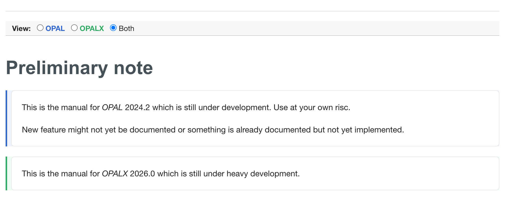

# OPAL and OPALX User Manual

## Introduction

Since version 2 the _OPAL_ manual is written in Asciidoc. AsciiDoc is a 
human-readable document format, semantically equivalent to DocBook XML. 
Documents written in Asciidoc can be converted to other formats like HTML, PDF,
EPUB and others. 

For more information about Asciidoc see

* https://en.wikipedia.org/wiki/AsciiDoc
* http://asciidoc.org
* https://asciidoctor.org

In the project OPAL/Documentation/manual2x> we provide scripts to translate the
_OPAL_ manual to HTML and PDF. Instructions about how to install these scripts 
and their requirements are documented in the projects README.

HTML versions of the _OPAL_ manual are published here:

* Achimm needs to fix this 

Gitlab displays the translated content of Asciidoc files. You can use Gitlab
to preview your changes. Unfortunately Gitlab does not support all features of
Asciidoc, thus the preview in Gitlab is pretty useful but is not identical to
the published version.

## OPAL and OPALX Manual in the same Place
Since 2023 there has been an effort to make OPAL performance-portable and
exascale-ready. Our aim is to keep the transition as smooth as possible for
users, with minimal input-file changes where feasible.

The manual therefore documents OPAL and OPALX in the same place, and the
rendered HTML lets the reader switch between:

* `OPAL`
* `OPALX`
* `Both`

Use section roles when an entire section belongs to one variant:

```text
[.feature-opal]
=== OPAL-only section

[.feature-opalx]
=== OPALX-only section
```

Use explicit markers for feature-gated body content:

```text
opal-begin
...
opal-end

opalx-begin
...
opalx-end
```

These body markers are interpreted by the Asciidoctor extension
`extensions/feature_blocks.rb`. In the web browser, the toggle selects which
variant is shown.



## Workflow

The workflow for changes in the manual is the same as for OPAL software 
development:

* open an issue
* create branch and merge request
* edit in the new branch
* apply the merge request. For the time being no approvers are required.

> Note: The branch `master` and all branches matching `Manual-*` are protected! Pushing to these branches is not possible.

For real small changes like fixing typos it is OK to edit the file in the 
Web GUI/IDE without opening an issue. Anyway a merge request is required!

## Guidelines

To get good results for HTML and PDF output, you have to follow some simple rules.

### Files

The master document of the _OPAL_ manual is `Manual.asciidoc`. It contains
* Title
* Authors
* Global Asciidoc setting/definitions
* The abstract
* Include statements per chapter

Each chapter is represented by one single file which is included by the master document.

### Chapters and section

* Use one-line titles
* Define an anchor before the title
* Include the base file name in the anchor name to avoid duplicate anchor names.
* Start the anchor name for a chapter with `chp.`.
* Use `sec.` for sections
* Use `==`, `===` etc. for titles of chapters, sections etc.

Examples:
The file `introduction.asciidoc` contains the chapter "Introduction" of the manual. Anchor and title are defined as
```
[[chp.introduction]]
== Introduction
```
for section it must be like
```
[[sec.introduction.aim-of-opal-and-history]]
=== Aim of _OPAL_ and History
```

### Figures and Tables

The tool-chain to create PDFs enumerates figures and tables chapter wise
by default. Unfortunately the tool-chain to create HTML does *not* support 
enumeration of figures and tables at all.

Asciidoc supports counters. In the manual counters are used to enumerate figures,
tables and bibliographic references.

#### Figures

* Use anchors of the form `[[...]]`.
* Prefix anchor names with `fig_`.
* Use `Figure {counter:fig-cnt}` as reference label.
* Define an anchor even if this is nowhere referenced! Otherwise the enumeration
  will be screwed up.
* To define the width of a figure for PDF output use `scaledwidth` and specify
  the width in centimeter.
* To define the width for HTML output use `width` and specify the width in
  percent.

Example:
```
.Parallel efficiency and particles pushed per latexmath:[\mu s] as a function of cores
[[fig_walldrift,Figure {counter:fig-cnt}]]
image::figures/drift2c1.png[scaledwidth=10cm,width=60%]
```

> **Note:** In anchor names underscores (instead of dots) are used for historic
reasons. In old versions of the manual, the short form was used and for unknown
reasons dots are not allowed in this form.

#### Tables

* Use anchors of the form `[[...]]`.
* Prefix anchor names with `tab_`.
* Use `Table {counter:tab-cnt}` as reference label.
* Define an anchor even if this is nowhere referenced! Otherwise the enumeration
  will be screwed up.
* Column widths must be specified as relative values.
 
Examples:
Table with default column widths:
```
.Parameters Parallel Performance Example
[[tab_pex1,Table {counter:tab-cnt}]]
|===
|Distribution | Particles | Mesh | Greens Function | Time steps

|Gauss 3D | latexmath:[10^8] | latexmath:[1024^3] | Integrated | 10
|===
```

Table with relative column width:
```
[[tab_distattrflattopinj,Table {counter:tab-cnt}]]
[cols="<2,^1,^1,<4",options="header",]
|=======================================================================
|Attribute Name |Default Value |Units |Description
|`SIGMAX` |0.0 |m |Hard edge width in latexmath:[x] direction.

|`SIGMAY` |0.0 |m |Hard edge width in latexmath:[y] direction.

|`SIGMAR` |0.0 |m |Hard edge radius. If nonzero `SIGMAR` overrides
`SIGMAX` and `SIGMAY`.

|`SIGMAZ` |0.0 |m |Hard edge length in latexmath:[z] direction.
|=======================================================================
```

> **Note:** The first line of a table is rendered as header by default.

### Bibliography lists

With bibliographic references we have the same enumeration problems as with
figures and tables. Using Asciidoc's bibliography list works well for PDF output 
but not for HTML. The tool-chain to translate into HTML does not enumerate the
references and uses the anchor name as reference label.

For bibliography references follow these rules (see example below):
* Use the macro form to define an anchor.
* Prefix the anchor name with `bib.`.
* Use `[{counter:bib-cnt}\]` as reference label. The closing square bracket must
  be escaped!
* The bibliography list is the last section of a chapter.

Example:
```
[[sec.introduction.bibliography]]
=== References

anchor:bib.classic[[{counter:bib-cnt}\]]
<<bib.classic>> F. C. Iselin, https://cds.cern.ch/record/311682/files/sl-96-061.pdf[_The classic project_], tech. rep. CERN/SL/96-061 (CERN, 1996).
...
```

### LaTeX Math

The implementation of LaTeX Math in Gitlab has a minor error requiring a workaround
to get LaTeX formulas rendered correct in Gitlab and with our tool-chain. According
to the Asciidoc documentation LaTeX in-line formulas must be enclosed in dollars,
as in the following example: 
```
This is an inline formula: latexmath:[$y=x^2$]!
```
In Gitlab the formula must be written *without* surrounding dollars:
```
This is an inline formula: latexmath:[y=x^2]!
```
A similar issue we have with block formulas. According to the Asciidoc
documentation, block-formulas must be written like:
```
[latexmath] 
++++++++++++ 
\[ 
y = x^2 
\] 
++++++++++++ 
```
The same for block-formula in Gitlab's flavoured Asciidoc:
```
[latexmath] 
++++++++++++ 
y = x^2 
++++++++++++ 
```
To be able to preview LaTeX formulas in Gitlab, we write them in the Gitlab
flavoured variant. In our tool chain to translate the manual, we preprocess all
formulas to get them in the correct form.

> **Note** inline math must be written on one line! Otherwise our pre-processor fails!

## Translating the manual to HTML and PDF

Assuming the scripts of the project OPAL/Documentation/manual2x> are installed and in your `PATH`, the hole procedure is something like
* clone the _OPAL_ manual with
  ```
  git clone git@gitlab.psi.ch:OPAL/documentation/manual.git
  ```
  or
  ```
  git clone https://gitlab.psi.ch/OPAL/documentation/manual.git
  ```
* change directory to cloned repository
* translate to HTML
  ```
  manual2html
  ```
  translate to PDF
  ```
  manual2pdf
  ```
