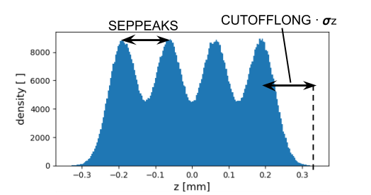

ifdef::env-gitlab[]
include::Manual.attributes[]
include::env-gitlab.attributes[]
{link_home}

toc::[]
endif::[]

[[chp.distribution]]
== Distribution Command
include::stylesheets/Toggle[]

.Possible distribution types.
[[tab_disttypes,Table {counter:tab-cnt}]]
[cols="<2,<4",options="header",]
|=======================================================================
|Distribution Type |Description
|<<sec.distribution.fromfiledisttype,`FROMFILE`>> |Initial distribution read in from text file provided by
user.

|<<sec.distribution.gaussdisttype,`GAUSS`>> |Initial distribution generated using Gaussian distribution(s).

|<<sec.distribution.flattopdisttype,`FLATTOP`>> |Initial distribution generated using flattop distribution(s).

|<<sec.distribution.binomialdisttype,`BINOMIAL`>> |Initial distribution generated using binomial
distribution(s).

|<<sec.distribution.gaussmatchedtype,`GAUSSMATCHED`>> | Initial distribution generated using matched Gaussian distribution(s).

|<<sec.distribution.gungaussflattopthdisttype,`GUNGAUSSFLATTOPTH`>> |Legacy. Special case of `FLATTOP` distribution.

|<<sec.distribution.astraflattopthdisttype,`ASTRAFLATTOPTH`>> |Legacy. Special case of `FLATTOP` distribution.
|=======================================================================

The distribution command is used to introduce particles into an _OPAL_
simulation. Like other _OPAL_ commands (see Chapter <<chp.format,Command Format>>),
the distribution command is of the form:

----
Name:DISTRIBUTION, TYPE = DISTRIBUTION_TYPE,
                   ATTRIBUTE #1 =,
                   ATTRIBUTE #2 =,
                   .
                   .
                   .
                   ATTRIBUTE #N =;
----

The distribution is given a name (which is used to reference the
distribution in the _OPAL_ input file), a distribution type, and a list
of attributes. The types of distributions that are supported are listed
in <<tab_disttypes>>. The attributes that follow the distribution type
further define the particle distribution. Some attributes are universal,
while others are specific to the distribution type. In the following
sections we will define the distribution attributes, starting with the
general, or universal attributes. (Note that, in general, if a
distribution type does not support a particular attribute, defining a
value for it does no harm. That attribute just gets ignored.)

[[sec.distribution.unitsdistattributes]]
=== Units

The internal units used by _OPAL-t_ and _OPAL-cycl_ are described in
<<sec.opalt.variablesopalt,_OPAL-t_ variables>> and <<sec.opalcycl.variables,_OPAL-cycl_ variables>>.
When defining a
distribution, both _OPAL-t_ and _OPAL-cycl_ use meters for length and
seconds for time. However, there are different options for the units
used to input the momentum. This is controlled with the
<<tab_distattrinputmounits,`INPUTMOUNITS`>> attribute.

.Definition of `INPUTMOUNITS` attribute.
[[tab_distattrinputmounits,Table {counter:tab-cnt}]]
[cols="<2,^2,<4",options="header",]
|=======================================================================
| Attribute Name | Value | Description

| `INPUTMOUNITS` |`NONE` (default for _OPAL-t_) |Use no units for the
input momentum (latexmath:[p_{x}], latexmath:[p_{y}],
latexmath:[p_{z}]). Momentum is given as
latexmath:[\beta_{x} \gamma], latexmath:[\beta_{y} \gamma] and
latexmath:[\beta_{z} \gamma], as in <<sec.opalt.variablesopalt,_OPAL-t_ variables>>.

|`INPUTMOUNITS` |`EVOVERC` (default for _OPAL-cycl_) |Use the units eV/c for
the input momentum (latexmath:[p_{x}], latexmath:[p_{y}],
latexmath:[p_{z}]).
|=======================================================================

[[sec.distribution.note-unit-conversion-of-momentum-in-opal-t-and-opal-cycl]]
==== Unit conversion of momentum in _OPAL-t_ and _OPAL-cycl_

Convert latexmath:[\beta_x \gamma] [dimensionless] to [mrad],

[latexmath]
++++
(\beta\gamma)_{\text{ref}}=\frac{P}{m_0c}=\frac{Pc}{m_0c^2}
++++

[latexmath]
++++
P_x[{mrad}]=1000\times\frac{(\beta_x\gamma)}{(\beta\gamma)_{\text{ref}}}
++++

Convert from [eV/c] to latexmath:[\beta_x\gamma] [dimensionless],

[latexmath]
++++
(\beta_x\gamma)=\frac{P_x[{eV/c}]}{m_0c}=\frac{P_x[{eV/c}]c}{m_0c^2}
++++

This may be deduced by analogy for the latexmath:[y] and
latexmath:[z] directions.

[[sec.distribution.gendistattributes]]
=== General Distribution Attributes

Once the distribution type is chosen, the next attribute to specify is
the <<tab_distattremitted,`EMITTED`>> attribute.
The `EMITTED` attribute controls whether a distribution is _injected_ or
_emitted_. An _injected_ distribution is placed in its entirety into the
simulation space at the start of the simulation. An _emitted_ beam is
emitted into the simulation over time as the simulation progresses (e.g.
from a cathode in a photoinjector simulation). Currently, only _OPAL-t_
supports _emitted_ distributions. The default is an _injected_
distribution.

.Definition of `EMITTED` attribute.
[[tab_distattremitted,Table {counter:tab-cnt}]]
[cols="<2,^2,<4",options="header",]
|=======================================================================
| Attribute Name | Value | Description
| `EMITTED` | `FALSE` (default) | The distribution is injected into the
simulation in its entirety at the start of the simulation. The particle
coordinates for an injected distribution are defined as in
<<sec.opalt.variablesopalt,_OPAL-t_ variables>> and <<sec.opalcycl.variables,_OPAL-cycl_ variables>>.
Note that in _OPAL-t_ the
entire distribution will automatically be shifted to ensure that the
latexmath:[z] coordinate will be greater than zero for all particles.

|`EMITTED` |`TRUE` |The distribution is emitted into the simulation over
time as the simulation progresses. Currently only _OPAL-t_ supports this
type of distribution. In this case, the longitudinal coordinate, as
defined by <<sec.opalt.variablesopalt,_OPAL-t_ variables>>, is given in seconds instead of
meters. Early times are emitted first.
|=======================================================================

Depending on the `EMITTED` attribute, we can specify several other
attributes that do not depend on the distribution type. These are
defined in
<<sec.distribution.universaldistattributes, Universal Attributes>>, <<sec.distribution.injecteddistattributes, Injected Distribution Attributes>> and <<sec.distribution.emitteddistattributes, Emitted Distribution Attributes>>.

[[sec.distribution.universaldistattributes]]
==== Universal Attributes

.Definition of universal distribution attributes. Any distribution type can use these and they are the same whether the beam is _injected_ or _emitted_.
[[tab_distattruniversal,Table {counter:tab-cnt}]]
[cols="<2,^1,^1,<4",options="header",]
|=======================================================================
| Attribute Name | Default Value | Units | Description
|`WRITETOFILE` |`FALSE` |None |Echo initial distribution to text file
_data/<basename >_ DIST.dat_.

|`SCALABLE` |`FALSE` |None |Makes the generation scalable with respect
of number of particles. The result depends on the number of cores used.

|`WEIGHT` |1.0 |None |Weight of distribution when used in a distribution
list (see <<sec.distribution.distlist>>).

|`NBIN` |0 |None |The distribution (beam) will be broken up into `NBIN`
energy bins. This has consequences for the space charge solver
(see <<sec.fieldsolvers.FSENBINS,Energy Bins>>).

|`SBIN` |100| None| Number of sample bins to use per energy bin.

|`XMULT` |1.0 |None |Value used to scale the latexmath:[x] positions
of the distribution particles. Applied after the distribution is
generated (or read in).

|`YMULT` |1.0 |None |Value used to scale the latexmath:[y] positions
of the distribution particles. Applied after the distribution is
generated (or read in).

|`PXMULT` |1.0 |None |Value used to scale the x momentum,
latexmath:[p_{x}], of the distribution particles. Applied after the
distribution is generated (or read in).

|`PYMULT` |1.0 |None |Value used to scale the y momentum,
latexmath:[p_{y}], of the distribution particles. Applied after the
distribution is generated (or read in).

|`PZMULT` |1.0 |None |Value use to scale the z momentum,
latexmath:[p_{z}], of the distribution particles. Applied after the
distribution is generated (or read in).

|`OFFSETX` |0.0 |m |Distribution is shifted in latexmath:[x] by this
amount after the distribution is generated (or read in). Same as the
average latexmath:[x] position, latexmath:[\bar{x}].

|`OFFSETY` |0.0 |m |Distribution is shifted in latexmath:[y] by this
amount after the distribution is generated (or read in). Same as the
average latexmath:[y] position, latexmath:[\bar{y}].

|`OFFSETPX` |0.0 |<<sec.distribution.unitsdistattributes>> |Distribution is shifted
in latexmath:[p_{x}] by this amount after the distribution is
generated (or read in). Same as the average latexmath:[p_{x}] value,
latexmath:[\bar{p}_{x}].

|`OFFSETPY` |0.0 |<<sec.distribution.unitsdistattributes>> |Distribution is shifted
in latexmath:[p_{y}] by this amount after the distribution is
generated (or read in). Same as the average latexmath:[p_{y}] value,
latexmath:[\bar{p}_{y}].

|`OFFSETPZ` |0.0 |<<sec.distribution.unitsdistattributes>> |Distribution is shifted
in latexmath:[p_{z}] by this amount after the distribution is
generated (or read in). Same as the average latexmath:[p_{z}] value,
latexmath:[\bar{p}_{z}].

|`ID1` |{0.0, 0.0, 0.0, 0.0, 0.0, 0.0} |<<sec.distribution.unitsdistattributes>> |Tracer particle which is
written also into _data/track_orbit.dat_. Expects an array with 6 items, latexmath:[x,\; y,\; z,\; p_x,\; p_y,\; p_z]. Not supported in  _OPAL-t_.

|`ID2` |{0.0, 0.0, 0.0, 0.0, 0.0, 0.0} |<<sec.distribution.unitsdistattributes>> |Tracer particle which is
written also into _data/track_orbit.dat_. Expects an array with 6 items, latexmath:[x,\; y,\; z,\; p_x,\; p_y,\; p_z]. Not supported in _OPAL-t_.
|=======================================================================

[[sec.distribution.injecteddistattributes]]
==== Injected Distribution Attributes

.Definition of distribution attributes that only affect _injected_ beams.
[[tab_distribution_attributes_injected_beams,Table {counter:tab-cnt}]]
[cols="<2,^1,^1,<4",options="header",]
|=======================================================================
|Attribute Name |Default Value |Units |Description
|`ZMULT` |1.0 |None |Value used to scale the latexmath:[z] positions
of the distribution particles. Applied after the distribution is
generated (or read in).

|`OFFSETZ` |0.0 |m |Distribution is shifted in latexmath:[z] by this
amount relative to the reference particle. Same as the average
latexmath:[z] position, latexmath:[\bar{z}]. To shift the position 
where the particles are injected please use `ZSTART` in the
<<chp.track,track command>>.
|=======================================================================

[[sec.distribution.emitteddistattributes]]
==== Emitted Distribution Attributes

.Definition of distribution attributes that only affect _emitted_ beams.
[[tab_distattremitteddist,Table {counter:tab-cnt}]]
[cols="<2,^1,^1,<4",options="header",]
|=======================================================================
|Attribute Name |Default Value |Units |Description
|`TMULT` |1.0 |None |Value used to scale the latexmath:[t] values of
the distribution particles. Applied after the distribution is generated
(or read in).

|`OFFSETT` |0.0 |s |Distribution is emitted later by this amount
relative to the reference particle.

|`EMISSIONSTEPS` |1 |None |Number of time steps to take during emission.
The simulation time step will be adjusted during emission to ensure that
this many time steps will be required to emit the entire distribution.

|`EMISSIONMODEL` |None |None |Emission model to use when emitting
particles from cathode (see <<sec.distribution.emissionmodel>>).
|=======================================================================

[[sec.distribution.opaldisttype]]
=== Distribution Types

[[sec.distribution.fromfiledisttype]]
==== `FROMFILE` Distribution Type

The most versatile distribution type is to use a user generated text
file as input to _OPAL_. This allows the user to generate their own
distribution, if the built in options in _OPAL_ are insufficient, and
have it either _injected_ or _emitted_ into the simulation. In
<<tab_distattrfromfile>> we list the single attribute specific to this
type of distribution type.

.Definition of distribution attributes for a `FROMFILE` distribution type.
[[tab_distattrfromfile,Table {counter:tab-cnt}]]
[cols="<2,^1,^1,<4",options="header",]
|=======================================================================
|Attribute Name |Default Value |Units |Description
|`FNAME` |None |None |File name for text file containing distribution
particle coordinates.
|=======================================================================

An example of an _injected_ `FROMFILE` distribution definition is:

----
Name:DISTRIBUTION, TYPE=FROMFILE,
                   FNAME="text file name";
----

an example of an _emitted_ `FROMFILE` distribution definition is:

----
Name:DISTRIBUTION, TYPE=FROMFILE,
                   FNAME="text file name",
                   EMITTED=TRUE,
                   EMISSIONMODEL=None;
----

The text input file for the `FROMFILE` distribution type has a
slightly different format, depending on whether the distribution is to
be _injected_ or _emitted_. The _injected_ file format is defined in
<<tab_fromfileinjfileformat>>. The particle coordinates are defined in <<sec.opalt.variablesopalt,_OPAL-t_ variables>> and <<sec.opalcycl.variables,_OPAL-cycl_ variables>>. The _emitted_ file format is defined in
<<tab_fromfileemitfileformat>>. The particle coordinates are defined in <<sec.opalt.variablesopalt,_OPAL-t_ variables>> except that latexmath:[z], in meters, is replaced by latexmath:[t] in seconds.
[cols="<,<,<,<,<,<",]

.File format for _injected_ `FROMFILE` distribution type. N is the number of particles in the file. 
[[tab_fromfileinjfileformat,Table {counter:tab-cnt}]]
[cols="<,<,<,<,<,<",]
|=======================================================================
|N | | | | |
|latexmath:[x_{1}] |latexmath:[p_{x1}] |latexmath:[y_{1}]
|latexmath:[p_{y1}] |latexmath:[z_{1}] |latexmath:[p_{z1}]
|latexmath:[x_{2}] |latexmath:[p_{x2}] |latexmath:[y_{2}]
|latexmath:[p_{y2}] |latexmath:[z_{2}] |latexmath:[p_{z2}]
|. | | | | |
|. | | | | |
|latexmath:[x_{N}] |latexmath:[p_{xN}] |latexmath:[y_{N}]
|latexmath:[p_{yN}] |latexmath:[z_{N}] |latexmath:[p_{zN}]
|=======================================================================

.File format for _emitted_ `FROMFILE` distribution type. N is the number of particles in the file. 
[[tab_fromfileemitfileformat,Table {counter:tab-cnt}]]
|=======================================================================
|N | | | | |
|latexmath:[x_{1}] |latexmath:[p_{x1}] |latexmath:[y_{1}]
|latexmath:[p_{y1}] |latexmath:[t_{1}] |latexmath:[p_{z1}]
|latexmath:[x_{2}] |latexmath:[p_{x2}] |latexmath:[y_{2}]
|latexmath:[p_{y2}] |latexmath:[t_{2}] |latexmath:[p_{z2}]
|. | | | | |
|. | | | | |
|latexmath:[x_{N}] |latexmath:[p_{xN}] |latexmath:[y_{N}]
|latexmath:[p_{yN}] |latexmath:[t_{N}] |latexmath:[p_{zN}]
|=======================================================================

Note that for an _emitted_ `FROMFILE` distribution, all of the
particle’s time, latexmath:[t], coordinates will be shifted to
negative time (if they are not there already). The simulation clock will
then start at latexmath:[t = 0] and distribution particles will be
emitted into the simulation as the simulation progresses. Also note
that, as the particles are emitted, they will be modified according to
the type of emission model used. This is defined by the attribute
`EMISSIONMODEL`, which is described in <<sec.distribution.emissionmodel>>. A choice
of `NONE` for the `EMISSIONMODEL` (which is the default) can be defined
so as not to affect the distribution coordinates at all.

To maintain consistency, latexmath:[N] and `NPART` from the `BEAM` command
(see Chapter <<chp.beam-command,Beam Command>>) must be equal.
In the same way, when using a `FROMFILE` type distribution, the average
momentum of the distribution must coincide with the momentum specified in the
`BEAM` command by means of `GAMMA`, `ENERGY` or `PC` attributes
(see Section <<sec.beam-command.beam-energy,Beam Energy>>),
according to the parameter `MOMENTUMTOLERANCE`.
In _OPAL-t_, the given momentum in the `BEAM` command must coincide with the
z-component of the momentum of the particle distribution in the file.
On the other hand, in _OPAL-cycl_ the given momentum must coincide with the
total momentum of the particle distribution, taking into account that the
initial distribution in _OPAL-cycl_ is always specified in the
<<sec.opalcycl.localframe,local reference frame>>.

[[sec.distribution.gaussdisttype]]
==== `GAUSS` Distribution Type

As the name implies, the `GAUSS` distribution type can generate
distributions with a general Gaussian shape (here we show a
one-dimensional example):

[latexmath]
++++
f(x) = \frac{1}{\sqrt{2 \pi}} e^{-\frac{(x - \bar{x})^{2}}{2 \sigma_{x}^{2}}}
++++

where latexmath:[\bar{x}] is the average value of latexmath:[x].
However, the `GAUSS` distribution can also be used to generate an
emitted beam with a flat top time profile. We will go over the various
options for the `GAUSS` distribution type in this section.

[[simple-gauss-distribution-type]]
===== Simple `GAUSS` Distribution Type

We will begin by describing how to create a simple `GAUSS` distribution
type. That is, a simple 6-dimensional distribution with a Gaussian
distribution in all dimensions.

.Definition of the basic distribution attributes for a `GAUSS` distribution type.
[[tab_distattrgauss,Table {counter:tab-cnt}]]
[cols="<2,^1,^1,<4",options="header",]
|=======================================================================
|Attribute Name |Default Value |Units |Description
|`SIGMAX` |0.0 |m |RMS width, latexmath:[\sigma_{x}], in transverse
latexmath:[x] direction.

|`SIGMAY` |0.0 |m |RMS width, latexmath:[\sigma_{y}], in transverse
latexmath:[y] direction.

|`SIGMAR` |0.0 |m |RMS radius, latexmath:[\sigma_{r}], in radial
direction. If nonzero `SIGMAR` overrides `SIGMAX` and `SIGMAY`.

|`SIGMAZ` |0.0 |m or s |RMS length, latexmath:[\sigma_{z}], of the Gaussian
in longitudinal (z) direction. `SIGMAZ` overrides `SIGMAT`.
Use seconds for an emitted bunch, and meters for an injected one.

|`SIGMAT` |0.0 |m or s |RMS length, latexmath:[\sigma_{t}], of the Gaussian
in longitudinal (z) direction. `SIGMAZ` overrides `SIGMAT`.
Use seconds for an emitted bunch, and meters for an injected one.

|`SIGMAPX` |0.0 |<<sec.distribution.unitsdistattributes>> |Parameter
latexmath:[\sigma_{px}] for defining distribution.

|`SIGMAPY` |0.0 |<<sec.distribution.unitsdistattributes>> |Parameter
latexmath:[\sigma_{py}] for defining distribution.

|`SIGMAPZ` |0.0 |<<sec.distribution.unitsdistattributes>> |Parameter
latexmath:[\sigma_{pz}] for defining distribution.

|`CUTOFFX` |3.0 |None |Defines transverse distribution cutoff in the
latexmath:[x] direction in units of latexmath:[\sigma_{x}]. If
`CUTOFFX` latexmath:[= 0] then actual cutoff in latexmath:[x] is set
to infinity.

|`CUTOFFY` |3.0 |None |Defines transverse distribution cutoff in the
latexmath:[y] direction in units of latexmath:[\sigma_{y}]. If
`CUTOFFY` latexmath:[= 0] then actual cutoff in latexmath:[y] is set
to infinity.

|`CUTOFFR` |3.0 |None |Defines transverse distribution cutoff in the
latexmath:[r] direction in units of latexmath:[\sigma_{r}]. If
`CUTOFFR` latexmath:[= 0] then actual cutoff in latexmath:[r] is set
to infinity. `CUTOFFR` is only used if `SIGMAR` latexmath:[>0].

|`CUTOFFLONG` |3.0 |None |Defines longitudinal distribution cutoff in
the latexmath:[z] or latexmath:[t] direction (_injected_ or
_emitted_) in units of latexmath:[\sigma_{z}] or
latexmath:[\sigma_{t}]. `CUTOFFLONG` is different from other
dimensions in that a value of 0.0 does not imply a cutoff value of
infinity.

|`CUTOFFPX` |3.0 |None |Defines cutoff in latexmath:[p_{x}] dimension
in units of latexmath:[\sigma_{px}]. If `CUTOFFPX` latexmath:[= 0]
then actual cutoff in latexmath:[p_{x}] is set to infinity.

|`CUTOFFPY` |3.0 |None |Defines cutoff in latexmath:[p_{y}] dimension
in units of latexmath:[\sigma_{py}]. If `CUTOFFPY` latexmath:[= 0]
then actual cutoff in latexmath:[p_{y}] is set to infinity.

|`CUTOFFPZ` |3.0 |None |Defines cutoff in latexmath:[p_{z}] dimension
in units of latexmath:[\sigma_{pz}]. If `CUTOFFPZ` latexmath:[= 0]
then actual cutoff is latexmath:[p_{z}] is set to infinity.
|=======================================================================

In <<tab_distattrgauss>> we list the basic attributes available for a
`GAUSS` distribution. We can use these to create a very simple `GAUSS`
distribution:

----
Name:DISTRIBUTION, TYPE       = GAUSS,
                   SIGMAX     = 0.001,
                   SIGMAY     = 0.003,
                   SIGMAZ     = 0.002,
                   SIGMAPX    = 0.0,
                   SIGMAPY    = 0.0,
                   SIGMAPZ    = 0.0,
                   CUTOFFX    = 2.0,
                   CUTOFFY    = 2.0,
                   CUTOFFLONG = 4.0,
                   OFFSETX    = 0.001,
                   OFFSETY    = -0.002,
                   OFFSETZ    = 0.01,
                   OFFSETPZ   = 1200.0;
----

This creates a Gaussian shaped distribution with zero transverse
emittance, zero energy spread, latexmath:[\sigma_{x} = {1.0} \mathrm{mm}],
latexmath:[\sigma_{y} = {3.0} \mathrm{mm}],
latexmath:[\sigma_{z} = {2.0} \mathrm{mm}] and an average energy of:

[latexmath]
++++
W = {1.2}\mathrm{MeV}
++++

In the latexmath:[x] direction, the Gaussian distribution is cutoff at
latexmath:[x = 2.0 \times \sigma_{x} = {2.0} \mathrm{mm}]. In the
latexmath:[y] direction it is cutoff at
latexmath:[y = 2.0 \times \sigma_{y} = {6.0} \mathrm{mm}]. This distribution
is _injected_ into the simulation at an average position of
latexmath:[(\bar{x},\bar{y},\bar{z})=({1.0} \mathrm{mm}, {-2.0} \mathrm{mm}, {10.0} \mathrm{mm})].

[[sec.distribution.gaussdisttypephotoinjector]]
===== `GAUSS` Distribution for Photoinjector

.Definition of additional distribution attributes for an _emitted_ `GAUSS` distribution type. These are used to generate a distribution with a time profile as illustrated in <<fig_flattop>>.
[[tab_distattremittedgauss,Table {counter:tab-cnt}]]
[cols="<2,^1,^1,<4",options="header",]
|=======================================================================
|Attribute Name |Default Value |Units |Description
|`TPULSEFWHM` |0.0 |s |Flat top time (see <<fig_flattop>>).

|`TRISE` |0.0 |s |Rise time (see <<fig_flattop>>). If defined will
override `SIGMAT`.

|`TFALL` |0.0 |s |Fall time (see <<fig_flattop>>). If defined will
override `SIGMAT`.

|`FTOSCAMPLITUDE` |0 |None |Sinusoidal oscillations can imposed on the
flat top in <<fig_flattop>>. This defines the amplitude of those
oscillations in percent of the average flat top amplitude.

|`FTOSCPERIODS` |0 |None |Defines the number of oscillation periods
imposed on the flat top, latexmath:[t_\mathrm{flattop}], in
<<fig_flattop>>.
|=======================================================================

._OPAL_ emitted `GAUSS` distribution with flat top.
[[fig_flattop,Figure {counter:fig-cnt}]]
image::./figures/distribution/flattop.png[scaledwidth=12cm,width=60%]

A useful feature of the `GAUSS` distribution type is the ability to
mimic the initial distribution from a photoinjector. For this purpose we
have the distribution attributes listed in <<tab_distattremittedgauss>>.
Using them, we can create a distribution with the time structure shown
in <<fig_flattop>>. This is a half Gaussian rise plus a uniform
flat-top plus a half Gaussian fall. To make it more convenient to mimic
measured laser profiles, `TRISE` and `TFALL` from
<<tab_distattremittedgauss>> do not define RMS quantities, but instead
are given by (See also <<fig_flattop>>):

[latexmath]
++++
\begin{aligned}
  \mathrm{TRISE} = t_{R} &= \left(\sqrt{2 \ln(10)} - \sqrt{2 \ln \left(\frac{10}{9} \right)} \right) \sigma_{R}\\
  & = 1.6869 \sigma_{R} \\
  \mathrm{TFALL} = t_{F} &= \left(\sqrt{2 \ln(10)} - \sqrt{2 \ln \left(\frac{10}{9} \right)} \right) \sigma_{F}\\
  & = 1.6869 \sigma_{F}\end{aligned}
++++

where latexmath:[\sigma_{R}] and latexmath:[\sigma_{F}] are the
Gaussian, RMS rise and fall times respectively. The flat-top portion of
the profile, `TPULSEFWHM`, is defined as (See also <<fig_flattop>>):

[latexmath]
++++
\mathrm{TPULSEFWHM} = \mathrm{FWHM}_{P} = t_\mathrm{flattop} + \sqrt{2 \ln 2} \left( \sigma_{R} + \sigma_{F} \right)
++++

Total emission time, latexmath:[t_{E}], of this distribution, is a
function of the longitudinal cutoff, `CUTOFFLONG`
(see <<tab_distattrgauss>>), and is given by:

[latexmath]
++++
\begin{aligned}
  t_{E}(\mathrm{CUTOFFLONG}) &= \mathrm{FWHM}_{P} - \frac{1}{2} (\mathrm{FWHM}_{R} + \mathrm{FWHM}_{F})
  + \mathrm{CUTOFFLONG} (\sigma_{R} + \sigma_{F}) \\
  &= \mathrm{FWHM}_{P} + \frac{\mathrm{CUTOFFLONG} - \sqrt{2 \ln 2}}{1.6869} (\mathrm{TRISE} + \mathrm{TFALL})\end{aligned}
++++

Finally, we can also impose oscillations over the flat-top portion of
the laser pulse in <<fig_flattop>>, latexmath:[t_\mathrm{flattop}].
This is defined by the attributes `FTOSCAMPLITUDE` and `FTOSCPERIODS`
from <<tab_distattremittedgauss>>. `FTOSCPERIODS` defines how many
oscillation periods will be present during the
latexmath:[t_\mathrm{flattop}] portion of the pulse. `FTOSCAMPLITUDE`
defines the amplitude of those oscillations in percentage of the average
profile amplitude during latexmath:[t_\mathrm{flattop}]. So, for
example, if we set latexmath:[\mathrm{FTOSCAMPLITUDE} = 5], and the
amplitude of the profile is equal to latexmath:[1.0] during
latexmath:[t_\mathrm{flattop}], the amplitude of the oscillation will
be latexmath:[0.05].

[[correlations-for-gauss-distribution-experimental]]
===== Correlations for `GAUSS` Distribution (Experimental)

.Definition of additional distribution attributes for a `GAUSS` distribution type for generating correlations in the beam.
[[tab_additional_distribution_attributes,Table {counter:tab-cnt}]]
[cols="<2,^1,^1,<4",options="header",]
|=======================================================================
|Attribute Name |Default Value |Units |Description
|`R`| | | All 15 correlations in a single array (latexmath:[R_{12}, R_{13}, .. , R_{56}]).

|`CORRX` |0.0 |<<sec.distribution.unitsdistattributes>> |latexmath:[x],
latexmath:[p_x] correlation. (latexmath:[R_{12}] in transport
notation.)

|`CORRY` |0.0 |<<sec.distribution.unitsdistattributes>> |latexmath:[y],
latexmath:[p_y] correlation. (latexmath:[R_{34}] in transport
notation.)

|`CORRZ` |0.0 |<<sec.distribution.unitsdistattributes>> |latexmath:[z],
latexmath:[p_z] correlation. (latexmath:[R_{56}] in transport
notation.)

|`CORRT` |0.0 |<<sec.distribution.unitsdistattributes>> |
same as and overwritten by `CORRZ`.

|`R51` |0.0 |<<sec.distribution.unitsdistattributes>> |latexmath:[x],
latexmath:[z] correlation. (latexmath:[R_{51}] in transport
notation.)

|`R52` |0.0 |<<sec.distribution.unitsdistattributes>> |latexmath:[p_x],
latexmath:[z] correlation. (latexmath:[R_{52}] in transport
notation.)

|`R61` |0.0 |<<sec.distribution.unitsdistattributes>> |latexmath:[x],
latexmath:[p_z] correlation. (latexmath:[R_{61}] in transport
notation.)

|`R62` |0.0 |<<sec.distribution.unitsdistattributes>> |latexmath:[p_x],
latexmath:[p_z] correlation. (latexmath:[R_{62}] in transport
notation.)
|=======================================================================

To generate Gaussian initial distribution with dispersion, first we
generate the uncorrelated Gaussian inputs matrix
latexmath:[R=(R_1,...,R_n)]. The mean of latexmath:[R_i] is
latexmath:[0] and the standard deviation squared is 1. Then we
correlate latexmath:[R]. The correlation coefficient matrix
latexmath:[\sigma] in latexmath:[x], latexmath:[p_x],
latexmath:[z], latexmath:[p_z] phase space reads:

[latexmath]
++++
\sigma= \left[
\begin{array}{cccc}
1    &c_x  &R51    &R61\\
c_x  &1    &R52    &R62\\
R51  &R52  &1      &c_t\\
R61  &R62  &c_t    &1
\end{array}
\right]
++++

The Cholesky decomposition of the symmetric positive-definite matrix
latexmath:[\sigma] is latexmath:[\sigma=C^{\mathbf{T}}C], then the
correlated distribution is latexmath:[C^{\mathbf{T}}R].

*Note*: Correlations work for the moment only with the Gaussian
distribution and are experimental, so there are no guarantees as to its
efficacy or accuracy. Also, these correlations will work, in principle,
for an _emitted_ beam. However, recall that in this case,
latexmath:[z] in meters is replaced by latexmath:[t] in seconds, so
take care.

As an example of defining a correlated beam, let the initial correlation
coefficient matrix be:

[latexmath]
++++
\sigma= \left[
\begin{array}{cccc}
1      &0.756  &0.023    &0.496\\
0.756  &1      &0.385    &-0.042\\
0.023  &0.385  &1        &-0.834\\
0.496  &-0.042 &-0.834   &1
\end{array}
\right]
++++

then the corresponding distribution command will read:

----
Dist:DISTRIBUTION, TYPE     = GAUSS,
                   SIGMAX   = 4.796e-03,
                   SIGMAPX  = 231.0585,
                   CORRX    = 0.756,
                   SIGMAY   = 23.821e-03,
                   SIGMAPY  = 1.6592e+03,
                   CORRY    = -0.999,
                   SIGMAZ   = 0.466e-02,
                   SIGMAPZ  = 74.7,
                   CORRZ    = -0.834,
                   OFFSETZ  = 0.466e-02,
                   OFFSETPZ = 72e6,
                   R61      = 0.496,
                   R62      = -0.042,
                   R51      = 0.023,
                   R52      = 0.385;
----

[[sec.distribution.flattopdisttype]]
==== `FLATTOP` Distribution Type

The `FLATTOP` distribution type is used to define hard edge beam
distributions. Hard edge, in this case, means a more or less uniformly
filled cylinder of charge, although as we will see this is not always
the case. The main purpose of the `FLATTOP` is to mimic laser pulses in
photoinjectors, and so we usually will make this an _emitted_
distribution. However it can be _injected_ as well.

[[injected-flattop]]
===== Injected `FLATTOP`

The attributes for an _injected_ `FLATTOP` distribution are defined in
<<tab_distattrflattopinj>> and <<tab_distattruniversal>>. At the moment, we cannot
define a spread in the beam momentum, so an _injected_ `FLATTOP`
distribution will currently have zero emittance. An _injected_ `FLATTOP`
will be a uniformly filled ellipse transversely with a uniform
distribution in latexmath:[z]. (Basically a cylinder with an
elliptical cross section.)

.Definition of the basic distribution attributes for an _injected_ `FLATTOP` distribution type.
[[tab_distattrflattopinj,Table {counter:tab-cnt}]]
[cols="<2,^1,^1,<4",options="header",]
|=======================================================================
|Attribute Name |Default Value |Units |Description
|`SIGMAX` |0.0 |m |Hard edge width in latexmath:[x] direction.

|`SIGMAY` |0.0 |m |Hard edge width in latexmath:[y] direction.

|`SIGMAR` |0.0 |m |Hard edge radius. If nonzero `SIGMAR` overrides
`SIGMAX` and `SIGMAY`.

|`SIGMAZ` |0.0 |m |Hard edge length in latexmath:[z] direction.
|=======================================================================

[[emitted-flattop]]
===== Emitted `FLATTOP`

.Definition of the basic distribution attributes for an _emitted_ `FLATTOP` distribution type.
[[tab_distattrflattopemit,Table {counter:tab-cnt}]]
[cols="<2,^1,^1,<4",options="header",]
|=======================================================================
|Attribute Name |Default Value |Units |Description
|`SIGMAX` |0.0 |m |Hard edge width in latexmath:[x] direction.

|`SIGMAY` |0.0 |m |Hard edge width in latexmath:[y] direction.

|`SIGMAR` |0.0 |m |Hard edge radius. If nonzero `SIGMAR` overrides
`SIGMAX` and `SIGMAY`.

|`SIGMAT` |0.0 |s |RMS rise and fall of half Gaussian in flat top
defined in in <<fig_flattop>>.

|`TPULSEFWHM` |0.0 |s |Flat top time (see <<fig_flattop>>).

|`TRISE` |0.0 |s |Rise time (see <<fig_flattop>>). If defined will
override `SIGMAT`.

|`TFALL` |0.0 |s |Fall time (see <<fig_flattop>>). If defined will
override `SIGMAT`.

|`FTOSCAMPLITUDE` |0 |None |Sinusoidal oscillations can imposed on the
flat top in <<fig_flattop>>. This defines the amplitude of those
oscillations in percent of the average flat top amplitude.

|`FTOSCPERIODS` |0 |None |Defines the number of oscillation periods
imposed on the flat top, latexmath:[t_\mathrm{flattop}], in
<<fig_flattop>>.

|`LASERPROFFN` | |None |File name containing measured laser image.

|`IMAGENAME` | |None |Used for h5 files. Name of the groups containing the laser image, see https://github.com/OPALX-project/regression-tests/blob/master/RegressionTests/LaserEmission-1/LaserEmission-1.in[regression test].

|`INTENSITYCUT` |0.0 |None |Parameter defining floor of the background
to be subtracted from the laser image in percent of the maximum
intensity.

|`FLIPX` |`FALSE` | |Flip the laser profile in horizontal direction.

|`FLIPY` |`FALSE` | |Flip the laser profile in vertical direction.

|`ROTATE90` |`FALSE` | |Rotate the laser profile
90latexmath:[^{\circ}] in counterclockwise direction.

|`ROTATE180` |`FALSE` | |Rotate the laser profile
180latexmath:[^{\circ}].

|`ROTATE270` |`FALSE` | |Rotate the laser profile
270latexmath:[^{\circ}] in counterclockwise direction.
|=======================================================================

The attributes of an _emitted_ `FLATTOP` distribution are defined in
<<tab_distattrflattopemit>> and <<tab_distattruniversal>>. The `FLATTOP`
distribution was really intended for this mode of operation in order to
mimic common laser pulses in photoinjectors. The basic characteristic of
a `FLATTOP` is a uniform, elliptical transverse distribution and a
longitudinal (time) distribution with a Gaussian rise and fall time as
described in <<sec.distribution.gaussdisttypephotoinjector>>. Below we show an
example of a `FLATTOP` distribution command with an elliptical cross
section of 1 mm by 2 mm and a flat top, in time, 10 ps long with a 0.5 ps
rise and fall time as defined in <<fig_flattop>>.

----
Dist:DISTRIBUTION, TYPE = FLATTOP,
                   SIGMAX = 0.001,
                   SIGMAY = 0.002,
                   TRISE = 0.5e-12,
                   TFALL = 0.5e-12,
                   TPULSEFWHM = 10.0e-12,
                   CUTOFFLONG = 4.0,
                   NBIN = 5,
                   EMISSIONSTEPS = 100,
                   EMISSIONMODEL = ASTRA,
                   EKIN = 0.5,
                   EMITTED = TRUE;
----

[[transverse-distribution-from-laser-profile-under-development]]
===== Transverse Distribution from Laser Profile (Under Development)

An alternative to using a uniform, elliptical transverse profile is to
define the `LASERPROFFN`, `IMAGENAME` and `INTENSITYCUT` attributes from
<<tab_distattrflattopemit>>. Then, _OPAL-t_ will use the laser image as
the basis to sample the transverse distribution.

*_This distribution option is not yet available._*

[[sec.distribution.gungaussflattopthdisttype]]
===== `GUNGAUSSFLATTOPTH` Distribution Type

This is a legacy distribution type. A `GUNGAUSSFLATTOPTH` is the
equivalent of a `FLATTOP` distribution, except that the `EMITTED`
attribute will set to `TRUE` automatically and the `EMISSIONMODEL` will
be automatically set to `ASTRA`.

[[sec.distribution.astraflattopthdisttype]]
===== `ASTRAFLATTOPTH` Distribution Type

This is a legacy distribution type. A `ASTRAFLATTOPTH` is the equivalent
of a `FLATTOP` distribution, except that the `EMITTED` attribute will
set to `TRUE` automatically and the `EMISSIONMODEL` will be
automatically set to `ASTRA`. There are a few other differences with how
the longitudinal time profile of the distribution is generated.

[[sec.distribution.binomialdisttype]]
==== `BINOMIAL` Distribution Type

The `BINOMIAL` type of distribution is based on <<bib.JohoDist>>. The shape of
the binomial distribution is governed by one parameter latexmath:[m].
By varying this single parameter one obtains the most commonly used
distributions for our type of simulations, as listed in
<<tab_binomdist>> and shown in <<fig_binomialproperties>>.

.Different distributions specified by a single parameter latexmath:[m]
[[tab_binomdist,Table {counter:tab-cnt}]]
[cols="<1,<1,<3,<3",options="header",]
|=======================================================================
|latexmath:[m] |Distribution |Density |Profile
|0.0 |Hollow shell |latexmath:[\frac{1}{\pi}\delta(1-r^2)]
|latexmath:[\frac{1}{\pi}(1-x^2)^{-0.5}]

|0.5 |Flat profile |latexmath:[\frac{1}{2\pi}(1-r^2)^{-0.5}]
|latexmath:[\frac{1}{2}]

|1.0 |Uniform |latexmath:[\frac{1}{\pi}]
|latexmath:[\frac{2}{\pi}(1-x^2)^{0.5}]

|1.5 |Elliptical |latexmath:[\frac{3}{2\pi}(1-r^2)^{0.5}]
|latexmath:[\frac{1}{4}(1-x^2)]

|2.0 |Parabolic |latexmath:[\frac{2}{\pi}(1-r^2)]
|latexmath:[\frac{3}{8\pi}(1-x^2)^{1.5}]

|latexmath:[\rightarrow \infty (> 10000)] |Gaussian
|latexmath:[\frac{1}{2\pi\sigma_x\sigma_y}exp(-\frac{x^2}{2\sigma_x^2} -\frac{y^2}{2\sigma_y^2})]
|latexmath:[\frac{1}{\sqrt{2\pi} \sigma_x}exp(-\frac{x^2}{2\sigma_x^2}) ]
|=======================================================================

.Properties of binomial Phase Space Distributions (taken from  <<bib.JohoDist>>).
[[fig_binomialproperties,Figure {counter:fig-cnt}]]
image::./figures/distribution/BinomialProperties.png[scaledwidth=18cm,width=80%]

The attributes of a `BINOMIAL` distribution are defined in <<tab_distattrbinomial>>.

.Definition of the basic distribution attributes for a `BINOMIAL` distribution type.
[[tab_distattrbinomial,Table {counter:tab-cnt}]]
[cols="<2,^1,^1,<4",options="header",]
|=======================================================================
|Attribute Name |Default Value |Units |Description
|`MX` |10001 | |Defines parameter latexmath:[m] for the binomial distribution in latexmath:[x]
|`MY` |10001 | |Defines parameter latexmath:[m] for the binomial distribution in latexmath:[y]
|`MT` |10001 | |Defines parameter latexmath:[m] for the binomial distribution in latexmath:[z]
|`MZ` |10001 | |Same as and overwritten by `MT`.
|=======================================================================

The width and the (latexmath:[x,p_x]) phase space is given by the usual `SIGMAX` (latexmath:[\sigma_x]),
`SIGMAXP` (latexmath:[\sigma_{xp}]) and `CORRX` (latexmath:[\sigma_{12}])
and defined as follows (similarly for the other dimensions):

[latexmath]
++++
\epsilon_x = \sigma_x \sigma_{xp} \cos{( \arcsin{(\sigma_{12}) }) }
++++

[latexmath]
++++
\begin{aligned}
\beta_x  &=& \frac{\sigma_x^2}{\epsilon_x} \\
\gamma_x &=& \frac{\sigma_{xp}^2}{\epsilon_x} \\
\alpha_x &=& -\sigma_{12} \sqrt{(\beta_x \gamma_x)}
\end{aligned}
++++

Example:

----
Dist:DISTRIBUTION, TYPE    = BINOMIAL,
                   SIGMAX  = 2.15e-03,
                   SIGMAPX = 1E-6,
                   CORRX   = 0.0,
                   MX      = 0.01,
                   SIGMAY  = 0.50*23.e-03,
                   SIGMAPY = 28.0,
                   CORRY   = 0.5,
                   MY      = 990.0,
                   SIGMAT  = 1.0e-1,
                   SIGMAPT = 11.96,
                   CORRT   = -0.5,
                   MT      = 2.0,
----

[[sec.distribution.gaussmatchedtype]]
==== `GAUSSMATCHED` Matched Gauss Distribution Type

The attributes of a `GAUSSMATCHED` distribution are defined in <<tab_distattrgaussmatched>>.
`Limitation:` Does not consider Trimcoil field maps!

.Definition of the basic distribution attributes for a `GAUSSMATCHED` distribution type.
[[tab_distattrgaussmatched,Table {counter:tab-cnt}]]
[cols="<2,^1,^1,<4",options="header",]
|=======================================================================
|Attribute Name |Default Value |Units |Description
|`DENERGY`   |1E-3 | GeV   | Energy step size for closed orbit finder
|`EX`        |1E-6 | m rad | Projected normalized emittance in latexmath:[x]
|`EY`        |1E-6 | m rad | Projected normalized emittance in latexmath:[y]
|`ET`        |1E-6 | m rad | Projected normalized emittance in latexmath:[t]
|`NSTEPS`    |720  |       | Number of integration steps of closed orbit finder
|`NSECTORS`  |1    |       | Number of sectors to average field for closed orbit finder
|`SECTOR`    |TRUE |       | Match using single sector (true) or all sectors (false)
|`ORDERMAPS` |7    |       | Order used in the field expansion
|`RGUESS`    |-1   |       | Guess value of radius (m) for closed orbit finder
|`RESIDUUM`  |1E-8 |       | Residuum for the closed orbit finder and sigma matrix generator
|`MAXSTEPSCO`|100  |       | Maximum steps used to find closed orbit
|`MAXSTEPSSI`|500  |       | Maximum steps used to find matched distribution
|=======================================================================

[[sec.distribution.multigausstype]]
==== `MULTIGAUSS` Distribution type
The purpose of this distribution is to mimic photoinjectors in which the laser beam consists of a train of Gaussian pulses <<bib.laserPulseShaping>>. 
Therefore this distribution has a uniform elliptical transverse distribution, and a train of equally spaced normal distributions along the z or t axis.

This distribution can be emitted or injected. 
When emitted, each particle acquires momentum according to the emission model.
When injected, the momentum follows a normal distribution, and the user can specify latexmath:[ (\sigma_{px}, \sigma_{py}, \sigma_{pz})].

.Definition of the basic distribution attributes for a `MULTIGAUSS` distribution type.
[[tab_distattrmultigauss,Table {counter:tab-cnt}]]
[cols="<2,^1,^1,<4",options="header",]
|=======================================================================
|Attribute Name |Default Value |Units |Description
|`SIGMAX` |0.0 |m |Laser radius in transverse
latexmath:[x] direction.

|`SIGMAY` |0.0 |m |Laser radius in transverse
latexmath:[y] direction.

|`SIGMAR` |0.0 |m |Laser radius, latexmath:[\sigma_{r}], in radial
direction. If nonzero `SIGMAR` overrides `SIGMAX` and `SIGMAY`.

|`SIGMAZ` |0.0 |m or s |RMS length of each Gaussian pulse 
in longitudinal (z) direction. `SIGMAZ` overrides `SIGMAT`. 
Use seconds for an emitted bunch, and meters for an injected one.

|`SIGMAT` |0.0 |m or s |RMS length of each Gaussian pulse
in longitudinal (z) direction. `SIGMAZ` overrides `SIGMAT`.
Use seconds for an emitted bunch, and meters for an injected one.

|`SEPPEAKS` |0.0 |m or s |Peak-to-peak distance between the 
Gaussian pulses in longitudinal (z) direction.
Use seconds for an emitted bunch, and meters for an injected one.

|`NPEAKS` |1 |None |Number of pulses along the longitudinal 
(z) direction.

|`CUTOFFLONG` |3.0 |None |Cutoff distance from the center of the 
first and last Gaussian pulses in the latexmath:[z] or
latexmath:[t] direction (_injected_ or _emitted_) in units of 
latexmath:[\sigma_{z}] or latexmath:[\sigma_{t}]. `CUTOFFLONG` is different from other
dimensions in that a value of 0.0 does not imply a cutoff value of
infinity.

|`SIGMAPX` |0.0 |<<sec.distribution.unitsdistattributes>> |Parameter
latexmath:[\sigma_{px}] for the normal distribution of the momentum.
This parameter is ignored for an emitted bunch.

|`SIGMAPY` |0.0 |<<sec.distribution.unitsdistattributes>> |Parameter
latexmath:[\sigma_{py}] for the normal distribution of the momentum.
This parameter is ignored for an emitted bunch.

|`SIGMAPZ` |0.0 |<<sec.distribution.unitsdistattributes>> |Parameter
latexmath:[\sigma_{pz}] for the normal distribution of the momentum.
This parameter is ignored for an emitted bunch.

|`CUTOFFPX` |3.0 |None |Defines cutoff in latexmath:[p_{x}] dimension
in units of latexmath:[\sigma_{px}]. If `CUTOFFPX` latexmath:[= 0]
then actual cutoff in latexmath:[p_{x}] is set to infinity.
This parameter is ignored for an emitted bunch.

|`CUTOFFPY` |3.0 |None |Defines cutoff in latexmath:[p_{y}] dimension
in units of latexmath:[\sigma_{py}]. If `CUTOFFPY` latexmath:[= 0]
then actual cutoff in latexmath:[p_{y}] is set to infinity.
This parameter is ignored for an emitted bunch.

|`CUTOFFPZ` |3.0 |None |Defines cutoff in latexmath:[p_{z}] dimension
in units of latexmath:[\sigma_{pz}]. If `CUTOFFPZ` latexmath:[= 0]
then actual cutoff is latexmath:[p_{z}] is set to infinity.
This parameter is ignored for an emitted bunch.
|=======================================================================

In <<tab_distattrmultigauss>> the basic attributes available for a
`MULTIGAUSS` distribution are listed. 

.Example of an injected `MULTIGAUSS` distribution.
[[fig_multiGaussInjected,{counter:fig-cnt}]]

An example (Figure <<fig_multiGaussInjected>>) of a `MULTIGAUSS` injected bunch could be:

----
Dist: DISTRIBUTION, TYPE = MULTIGAUSS,
                    SIGMAPX = 1e-2, SIGMAPY = 1e-2, SIGMAPZ = 1e-2,  // In units of betaGamma
                    CUTOFFPX = 4.0, CUTOFFPY = 4.0, CUTOFFPZ = 4.0,  // In units of SIGMAP
                    SIGMAR = 340e-6,
                    SIGMAZ = 90e-6 / 2.355, // FWHM  = 2.355 * sigma
                    CUTOFFLONG = 4.0,  // In units of SIGMAZ
                    SEPPEAKS = 126e-6,
                    NPEAKS = 4,
                    EMITTED = FALSE;
----

[[sec.distribution.emissionmodel]]
=== Emission Models

When emitting a distribution from a cathode, there are several ways in
which we can model the emission process in order to calculate the
thermal emittance of the beam. In this section we discuss the various
options available.

[[emission-model-none-default]]
==== Emission Model: `NONE` (default)

The emission model `NONE` is the default emission model used in
_OPAL-t_. It has a single attribute, listed in
<<tab_distattremitmodelnoneastra>>. The `NONE` emission model is very
simplistic. It merely adds the amount of energy defined by the attribute
`EKIN` to the longitudinal momentum, latexmath:[p_{z}], for each
particle in the distribution as it leaves the cathode.

.Attributes for the `NONE` and `ASTRA` emission models.
[[tab_distattremitmodelnoneastra,Table {counter:tab-cnt}]]
[cols="<2,^1,^1,<4",options="header",]
|==============================================================
|Attribute Name |Default Value |Units |Description
|`EKIN` |1.0 |eV |Thermal energy added to beam during emission.
|==============================================================

An example of using the `NONE` emission model is given below. This
option allows us to emit transversely cold (zero x and y emittance)
beams into our simulation. We must add some z momentum to ensure that
the particles drift into the simulation space. If in this example one
were to specify `EKIN = 0`, then you would likely get strange results as
the particles would not move off the cathode, causing all of the emitted
charge to pile up at latexmath:[z = 0] in the first half time step
before the beam space charge is calculated.

----
Dist:DISTRIBUTION, TYPE = FLATTOP,
                   SIGMAX = 0.001,
                   SIGMAY = 0.002,
                   TRISE = 0.5e-12,
                   TFALL = 0.5e-12,
                   TPULSEFWHM = 10.0e-12,
                   CUTOFFLONG = 4.0,
                   NBIN = 5,
                   EMISSIONSTEPS = 100,
                   EMISSIONMODEL = NONE,
                   EKIN = 0.5,
                   EMITTED = TRUE;
----

One thing to note, it may be that if you are emitting your own
distribution using the `TYPE = FROMFILE` option, you may want to set
`EKIN = 0` if you have already added some amount of momentum,
latexmath:[p_{z}], to the particles.

[[emission-model-astra]]
==== Emission Model: `ASTRA`

The `ASTRA` emittance model uses the same single parameter as the `NONE`
option as listed in <<tab_distattremitmodelnoneastra>>. However, in this
case, the energy defined by the `EKIN` attribute is added to each
emitted particle’s momentum in a random way:

[latexmath]
++++
\begin{aligned}
    p_{total} &= \sqrt{\left(\frac{\mathrm{EKIN}}{mc^{2}} + 1\right)^{2} - 1} \\
    p_{x} &= p_\text{total} \sin(\theta) \cos(\phi) \\
    p_{y} &= p_\text{total} \sin(\theta) \sin(\phi) \\
    p_{z} &= p_\text{total} |{\cos(\theta)}|
  \end{aligned}
++++

where latexmath:[\theta] is a random angle between latexmath:[0] and
latexmath:[\pi], and latexmath:[\phi] is given by

[latexmath]
++++
\phi = 2.0 \arccos \left( \sqrt{x} \right)
++++

with latexmath:[x] a random number between latexmath:[0] and
latexmath:[1].

[[emission-model-nonequil]]
==== Emission Model: `NONEQUIL`

The `NONEQUIL` emission model is based on an actual physical model of
particle emission as described in <<bib.flo97>>, <<bib.clen2000>>, <<bib.dowe2009>>. The
attributes needed by this emission model are listed in
<<tab_distattremitmodelnonequil>>.

.Attributes for the `NONEQUIL` emission models.
[[tab_distattremitmodelnonequil,Table {counter:tab-cnt}]]
[cols="<2,^1,^1,<4",options="header",]
|=======================================================================
|Attribute Name |Default Value |Units |Description
|`ELASER` |4.86 |eV |Photoinjector drive laser energy. (Default is 255nm
light.)

|`W` |4.31 |eV |Photocathode work function. (Default is atomically clean
copper.)

|`FE` |7.0 |eV |Fermi energy of photocathode. (Default is atomically
clean copper.)

|`CATHTEMP` |300.0 |K |Operating temperature of photocathode.
|=======================================================================

An example of using the `NONEQUIL` emission model is given below. This
model is relevant for metal cathodes and cathodes such as `CsTe`.

----
Dist:DISTRIBUTION, TYPE = GAUSS,
                   SIGMAX = 0.001,
                   SIGMAY = 0.002,
                   TRISE = 1.0e-12,
                   TFALL = 1.0e-12,
                   TPULSEFWHM = 15.0e-12,
                   CUTOFFLONG = 3.0,
                   NBIN = 10,
                   EMISSIONSTEPS = 100,
                   EMISSIONMODEL = NONEQUIL,
                   ELASER = 6.48,
                   W = 4.1,
                   FE = 7.0,
                   CATHTEMP = 325,
                   EMITTED = TRUE;
----

[[sec.distribution.distlist]]
=== Distribution List

It is possible to use multiple distributions in the same simulation. We
do this be using a distribution list in the `RUN` command
(see Chapter <<chp.track,Tracking>>). Assume we have defined
several distributions: `DIST1`, `DIST2` and `DIST3`. If we want to use
just one of these distributions in a simulation, we would use the following
`RUN` command to start the simulation:

----
RUN, METHOD = "PARALLEL-T",
     BEAM = beam_name,
     FIELDSOLVER = field_solver_name,
     DISTRIBUTION = DIST1;
----

If we want to use all the distributions at the same time, then the
command would instead be:

----
RUN, METHOD = "PARALLEL-T",
     BEAM = beam_name,
     FIELDSOLVER = field_solver_name,
     DISTRIBUTION = {DIST1, DIST2, DIST3};
----

In this second case, the first distribution (`DIST1`) is the master
distribution. The main consequence of this is that all distributions in
the list will be forced to the same `EMITTED` condition as `DIST1`. So,
if `DIST1` is to be _emitted_, then all other distributions in the list
will be forced to this same condition. If `DIST1` is to be _injected_,
then all other distribution is the list will also be _injected_.

The number of particles in the simulation is defined in the `BEAM`
command see Chapter <<chp.beam-command,Beam Command>>.
The number of particles in each distribution in a distribution list is
determined by this number and the `WEIGHT` attribute of each distribution
(<<tab_distattruniversal>>). If all distributions have the same `WEIGHT`
value, then the number of particles will be divided up evenly among them.
If, however we have a distribution list consisting of two distributions, and
one has twice the `WEIGHT` of the other, then it will have twice the particles
as its partner. The exception here is any `FROMFILE` distribution type. In
this case, the `WEIGHT` attribute and the number of particles in the `BEAM`
command are ignored. The number of particles in any `FROMFILE` distribution
type is defined by the text file containing the distribution particle
coordinates. (<<sec.distribution.fromfiledisttype>>).

[[sec.distribution.bibliography]]
=== References

anchor:bib.JohoDist[[{counter:bib-cnt}\]]
<<bib.JohoDist>> W. Joho, https://indico.psi.ch/event/3484/attachments/5948/7502/TM-11-14.pdf[_Representation of beam ellipses for transport calculations_], PSI Internal Report TM-11-14, Paul Scherrer Institute (1980).

anchor:bib.laserPulseShaping[[{counter:bib-cnt}\]]
<<bib.laserPulseShaping>> J. G. Power and C. Jing, https://doi.org/10.1063/1.3080991[_Temporal Laser Pulse Shaping for RF Photocathode Guns: The Cheap and Easy way using UV Birefringent Crystals_], AIP Conf. Proc. 1086, 689 (2009).

anchor:bib.flo97[[{counter:bib-cnt}\]]
<<bib.flo97>> K. Flöttmann, _Note on the thermal emittance of electrons emitted by Cesium Telluride photo cathodes_, Tech. Rep. DESY-TESLA-FEL-97-01, Deutsches Elektronen-Synchrotron (1997).

anchor:bib.clen2000[[{counter:bib-cnt}\]]
<<bib.clen2000>> J. E. Clendenin et al., https://www.sciencedirect.com/science/article/pii/S0168900200007312[_Reduction of thermal emittance of RF guns_], Nucl. Instrum. Methods A 455, 198 (2000).

anchor:bib.dowe2009[[{counter:bib-cnt}\]]
<<bib.dowe2009>> D. H. Dowell and J. F. Schmerge, https://journals.aps.org/prab/pdf/10.1103/PhysRevSTAB.12.074201[_Quantum efficiency and thermal emittance of metal photocathodes_], Phys. Rev. ST Accel. Beams 12, 074201 (2009).

// EOF
