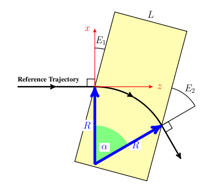
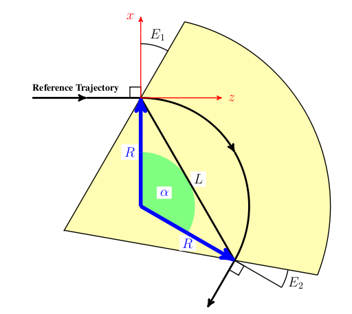
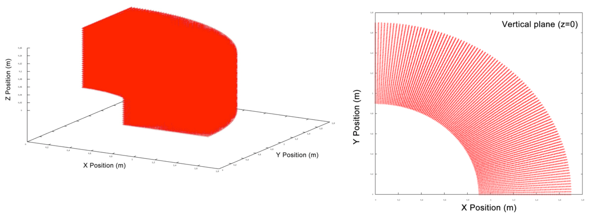
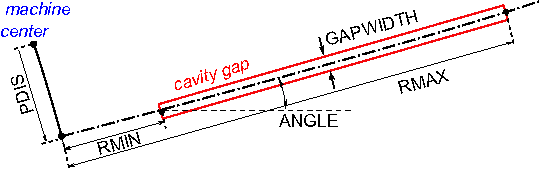
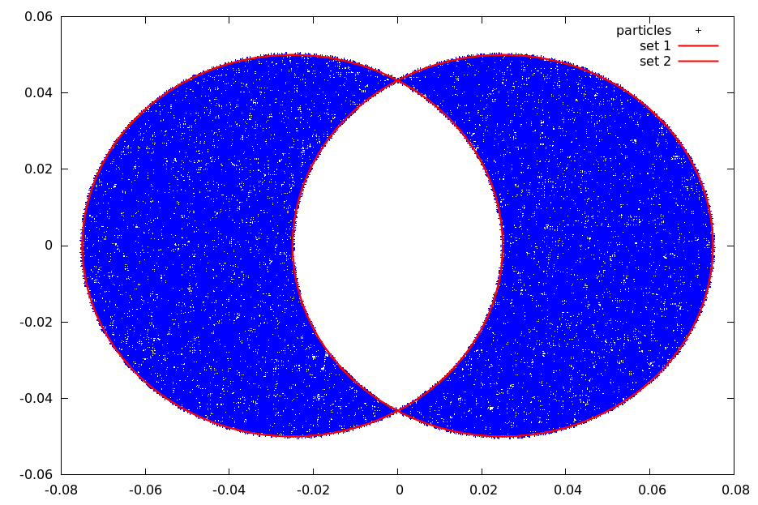
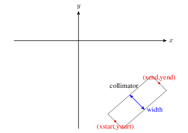

ifdef::env-gitlab[]
include::Manual.attributes[]
include::env-gitlab.attributes[]
{link_home}

toc::[]
endif::[]

ifdef::backend-docbook5[:fig-width-default: scaledwidth=10cm]
ifdef::backend-html5,env-gitlab[:fig-width-default: width=50%]

[[chp.elements]]
== Elements
include::stylesheets/Toggle[]

[[sec.elements.input-format]]
=== Element Input Format

All physical elements are defined by statements of the form

----
label:keyword, attribute,..., attribute
----

where

label::
  Is the name to be given to the element (in the example QF), it is an
  identifier (see <<sec.format.label,Identifiers or Labels>>).
keyword::
  Is a keyword (see <<sec.format.label,Identifiers or Labels>>),
  it is an element type keyword (in the example `QUADRUPOLE`),
attribute::
  normally has the form
+
----
attribute-name=attribute-value
----
attribute-name::
  selects the attribute from the list defined for the element type
  `keyword` (in the example `L` and `K1`). It must be an identifier
  (see <<sec.format.label,Identifiers or Labels>>).
attribute-value::
  gives it a value (see <<sec.format.attribute,Command Attribute Types>>)
  (in the example `1.8` and `0.015832`).

Omitted attributes are assigned a default value, normally zero.

Example:

----
QF: QUADRUPOLE, L=1.8, K1=0.015832;
----

[[sec.elements.common]]
=== Common Attributes for all Elements

The following attributes are allowed on all elements:

TYPE::
  A string value (see <<sec.format.astring,String Attributes>>).
  It specifies an "engineering type" and can be used for element selection.
APERTURE::
  A string value (see <<sec.format.astring,String Attributes>>) which
  describes the element aperture. All but the last attribute of the aperture
  have units of meter, the last one is optional and is a positive real number.
  Possible choices are
+
  * `APERTURE`="SQUARE(a,f)" has a square shape of width and
  height `a`,
  * `APERTURE`="RECTANGLE(a,b,f)" has a rectangular shape of width
  `a` and height `b`,
  * `APERTURE`="CIRCLE(d,f)" has a circular shape of diameter `d`,
  * `APERTURE`="ELLIPSE(a,b,f)" has an elliptical shape of major
  `a` and minor `b`.
+
The option `SQUARE`(`a,f`) is equivalent to `RECTANGLE`(`a,a,f`) and
`CIRCLE`(`d,f`) is equivalent to `ELLIPSE`(`d,d,f`). The size of the
exit aperture is scaled by a factor latexmath:[f]. For
latexmath:[f < 1] the exit aperture is smaller than the entrance
aperture, for latexmath:[f = 1] they are the same and for
latexmath:[f > 1] the exit aperture is bigger.
+
Dipoles have `GAP` and `HGAP` which define an aperture and hence do
not recognise `APERTURE`. The aperture of the dipoles has rectangular
shape of height `GAP` and width `HGAP`. In longitudinal direction it
is bent such that its center coincides with the circular segment of
the reference particle when ignoring fringe fields. Between the
beginning of the fringe field and the entrance face and between the
exit face and the end of the exit fringe field the rectangular shape
has width and height that are twice of what they are inside the
dipole.
+
Default aperture for all other elements is a circle of 1E6 m.
L::
  The length of the element (default: 0m).
opalx-begin
The nominal body length of the element (default: 0m). This length is
    used for geometric placement, ports, and visualization. In general the
    field-support extent of an element may differ from its nominal body
    length, for example due to fringe fields or finite field-map support.
opalx-end

ELEMEDGE::
  The edge of an element is specified in s coordinates in meters. This
  edge corresponds to the origin of the local coordinate system and is
  the physical start of the element. (Note that in general the fields
  will extend in front of this position.) The physical end of the
  element is determined by `ELEMEDGE` and its physical length. (Note
  again that in general the fields will extend past the physical end of
  the element.)
opalx-begin
Legacy placement attribute specifying the body entrance of an element
    in reference-coordinate `s` (meters). This attribute remains supported
    for backward compatibility. For new input files, explicit 3D placement
    with `X`, `Y`, `Z`, `THETA`, `PHI`, and `PSI` is preferred. In general
    the fields may extend in front of or beyond the body extent specified
    by `ELEMEDGE` and `L`.
opalx-end

X::
  X-component of the position of the element relative to the position of the first
  beamline which it is part of and which uses absolute positioning.
Y::
  Y-component of the position of the element relative to the position of the first
  beamline which it is part of and which uses absolute positioning.
Z::
  Z-component of the position of the element relative to the position of the first
  beamline which it is part of and which uses absolute positioning.
THETA::
  Rotation angle of the element about the y-axis relative to the orientation
  of the first beamline which it is part of and which uses absolute positioning.
PHI::
  Rotation angle of the element about the x-axis relative to the orientation
  of the first beamline which it is part of and which uses absolute positioning.
PSI::
  Rotation angle of the element about the z-axis relative to the orientation
  of the first beamline which it is part of and which uses absolute positioning.
////
ORIGIN::
  3D position vector. An alternative to using `X`, `Y` and `Z` to
  position the element. Can’t be combined with `THETA` and `PHI`. Use
  `ORIENTATION` instead.
ORIENTATION::
  Vector of Tait-Bryan angles <<bib.tait-bryan_elements,bib.tait-bryan>>. An alternative to rotate
  the element instead of using `THETA`, `PHI` and `PSI`. Can’t be
  combined with `X`, `Y` and `Z`, use `ORIGIN` instead.
////
DX::
  Error on x-component of position of element. Doesn’t affect the design
  trajectory.
DY::
  Error on y-component of position of element. Doesn’t affect the design
  trajectory.
DZ::
  Error on z-component of position of element. Doesn’t affect the design
  trajectory.
DTHETA::
  Error on angle `THETA`. Doesn’t affect the design trajectory.
DPHI::
  Error on angle `PHI`. Doesn’t affect the design trajectory.
DPSI::
  Error on angle `PSI`. Doesn’t affect the design trajectory.
WAKEF::
  Attach wakefield that was defined using the `WAKE` command.
PARTICLEMATTERINTERACTION::
  Attach a handler for particle-matter interaction
  (see Chapter <<chp.partmatter,Particle Matter Interaction>>).
OUTFN::
  The file name into which the element should write the collected data.
  The user must only provide the output name without the extension. The 
  extension will be set according to the <<sec.control.option,`OPTION`>> 
  statements. If this attribute is empty, the file will be named as the
  element label.
DELETEONTRANSVERSEEXIT::
  Particles that exit elements on their sides get deleted in _OPAL-t_. The user can
  control this behavior by setting this attribute. If its value is `TRUE` then particles
  that exit on the sides are deleted (default), with `FALSE` they are kept.

All elements can have arbitrary additional attributes which are defined
in the respective section.

[[sec.elements.drift]]
=== Drift Spaces

----
label: DRIFT, TYPE=string, APERTURE=string, L=real;
----

A `DRIFT` space has no additional attributes. Examples:

----
DR1:DRIFT, L=1.5;
DR2:DRIFT, L=DR1->L, TYPE=DRF;
----

The length of `DR2` will always be equal to the length of `DR1`. The
reference system for a drift space is a Cartesian coordinate system. This
is a restricted feature of _OPAL-t_. In _OPAL-t_ drifts are implicitly
given, if no field is present.

[[sec.elements.laser]]
=== Laser
opalx-begin

----
label: LASER, L=real, ELEMEDGE=real,
       WAVELENGTH=real, PULSEENERGY=real, PULSELENGTH=real,
       WAISTX=real, WAISTY=real, DIR=real-vector, STOKES=real-vector;
----

The `LASER` element defines a passive analytic laser pulse for _OPALX_.
At this stage it is an input object with validated pulse parameters and
lattice placement, but it does not yet apply laser-particle physics by
itself.

The required attributes are:

WAVELENGTH::
  Laser wavelength in m. Must be greater than zero.
PULSEENERGY::
  Total pulse energy in J. Must be greater than zero.
PULSELENGTH::
  Pulse duration in s. Must be greater than zero.
WAISTX::
  Horizontal waist in m. Must be greater than zero.
WAISTY::
  Vertical waist in m. Must be greater than zero.
DIR::
  Propagation direction as a 3-component vector. The vector must be non-zero.
  _OPALX_ normalizes it internally.
STOKES::
  Optional normalized Stokes vector `{xi1, xi2, xi3}`. If omitted,
  `{0, 0, 0}` is used. The vector must contain exactly three entries and must
  satisfy latexmath:[\xi_1^2 + \xi_2^2 + \xi_3^2 \le 1].

`L` and `ELEMEDGE` use the common element semantics described in
<<sec.elements.common>>. `L` defaults to zero, so a `LASER` can initially be
used as a placed marker-like interaction object until dedicated laser
interaction elements are introduced.

This `LASER` element is distinct from the photoinjector drive-laser settings
described in Chapter <<chp.distribution,Distribution>>. In
particular, attributes such as `LASERPROFFN` and `ELASER` belong to source
generation models and not to the _OPALX_ beamline `LASER` element.

Example:

----
LASL: LASER,
      WAVELENGTH = 1.03e-6,
      PULSEENERGY = 1.0,
      PULSELENGTH = 2.0e-12,
      WAISTX = 5.0e-6,
      WAISTY = 5.0e-6,
      DIR = {0, 0, -1},
      STOKES = {0, 0, 1};
----
opalx-end

[[sec.elements.bend]]
=== Bending Magnets
opal-begin
Bending magnets refer to dipole fields that bend particle trajectories.
Currently _OPAL_ supports the following different bend elements: `RBEND`, (valid
in _OPAL-t_, see <<sec.elements.RBend>>), `SBEND` (valid in _OPAL-t_, see
<<sec.elements.SBend>>), `RBEND3D`, (valid in _OPAL-t_, see <<sec.elements.RBend3D>>)
and `SBEND3D` (valid in _OPAL-cycl_, see <<sec.elements.SBend3D>>).

Describing a bending magnet can be somewhat complicated as there can be
many parameters to consider: bend angle, bend radius, entrance and exit
angles etc. Therefore we have divided this section into several parts:

1.  <<sec.elements.RBend>> and <<sec.elements.SBend>> describe the geometry and attributes of the
_OPAL-t_ bend elements `RBEND` and `SBEND`.
2.  <<sec.elements.RBendSBendExamp>> describes how to implement an `RBEND` or
`SBEND` in an _OPAL-t_ simulation.
3.  <<sec.elements.SBend3D>> is self contained. It describes how to implement
an `SBEND3D` element in an _OPAL-cycl_ simulation.

<<fig_rbend>> illustrates a general rectangular bend (`RBEND`) with a positive bend angle latexmath:[\alpha]. The entrance edge angle, latexmath:[E_{1}], is positive in this example. An `RBEND` has parallel entrance and exit pole faces, so the exit angle, latexmath:[E_{2}], is uniquely determined by the bend angle, latexmath:[\alpha], and latexmath:[E_{1}] (latexmath:[E_{2}=\alpha - E_{1}]). For a positively charge particle, the magnetic field is directed out of the page.

.Illustration of a general rectangular bend (`RBEND`) with a positive bend angle latexmath:[\alpha].
[[fig_rbend,Figure {counter:fig-cnt}]]

opal-end
[[sec.elements.RBend]]
==== RBend (_OPAL-t_)
opal-begin
An `RBEND` is a rectangular bending magnet. The key property of an
`RBEND` is that it has parallel pole faces. <<fig_rbend>> shows an
`RBEND` with a positive bend angle and a positive entrance edge angle.

L::
  Physical length of magnet (meters, see <<fig_rbend>>).
GAP::
  Full vertical gap of the magnet (meters).
HAPERT::
  Non-bend plane aperture of the magnet (meters). (Defaults to one half
  the bend radius.)
ANGLE::
  Bend angle (radians). Field amplitude of bend will be adjusted to
  achieve this angle. (Note that for an `RBEND`, the bend angle must be
  less than latexmath:[\frac{\pi}{2} + E1], where `E1` is the entrance
  edge angle.)
K0::
  Field amplitude in y direction (Tesla). If the `ANGLE` attribute is
  set, `K0` is ignored.
K0S::
  Field amplitude in x direction (Tesla). If the `ANGLE` attribute is
  set, `K0S` is ignored.
K1::
  Field gradient index of the magnet,
  latexmath:[K_1=-\frac{R}{B_{y}}\frac{\partial B_y}{\partial x}],
  where latexmath:[R] is the bend radius as defined in <<fig_rbend>>.
  Not supported in _OPAL-t_ any more. Superimpose a `Quadrupole`
  instead.
E1::
  Entrance edge angle (radians). <<fig_rbend>> shows the definition of
  a positive entrance edge angle. (Note that the exit edge angle is
  fixed in an `RBEND` element to
  latexmath:[\mathrm{E2} = \mathrm{ANGLE} - \mathrm{E1}]).
DESIGNENERGY::
  Energy of the reference particle (MeV). The reference particle travels
  approximately the path shown in <<fig_rbend>>.
FMAPFN::
  Name of the field map for the magnet. Currently maps of type
  <<sec.fieldmaps.1DProfile1,`1DProfile1`>> can be used. The default option
  for this attribute is `FMAPN` = `1DPROFILE1-DEFAULT`
  (see <<sec.elements.benddefaultfieldmapopalt>>). The field map is used to
  describe the fringe fields of the magnet (see <<sec.fieldmaps.1DProfile1,`1DProfile1`>>).
opal-end
[[sec.elements.RBend3D]]
==== RBend3D (_OPAL-t_)
opal-begin
An `RBEND3D3D` is a rectangular bending magnet. The key property of an
`RBEND3D` is that it has parallel pole faces. <<fig_rbend>> shows an
`RBEND3D` with a positive bend angle and a positive entrance edge angle.

L::
  Physical length of magnet (meters, see <<fig_rbend>>).
GAP::
  Full vertical gap of the magnet (meters).
HAPERT::
  Non-bend plane aperture of the magnet (meters). (Defaults to one half
  the bend radius.)
ANGLE::
  Bend angle (radians). Field amplitude of bend will be adjusted to
  achieve this angle. (Note that for an `RBEND3D`, the bend angle must
  be less than latexmath:[\frac{\pi}{2} + E1], where `E1` is the
  entrance edge angle.)
K0::
  Field amplitude in y direction (Tesla). If the `ANGLE` attribute is
  set, `K0` is ignored.
K0S::
  Field amplitude in x direction (Tesla). If the `ANGLE` attribute is
  set, `K0S` is ignored.
K1::
  Field gradient index of the magnet,
  latexmath:[K_1=-\frac{R}{B_{y}}\frac{\partial B_y}{\partial x}],
  where latexmath:[R] is the bend radius as defined in <<fig_rbend>>.
  Not supported in _OPAL-t_ any more. Superimpose a `Quadrupole`
  instead.
E1::
  Entrance edge angle (radians). <<fig_rbend>> shows the definition of
  a positive entrance edge angle. (Note that the exit edge angle is
  fixed in an `RBEND3D` element to
  latexmath:[\mathrm{E2} = \mathrm{ANGLE} - \mathrm{E1}]).
DESIGNENERGY::
  Energy of the reference particle (MeV). The reference particle travels
  approximately the path shown in <<fig_rbend>>.
FMAPFN::
  Name of the field map for the magnet. Currently maps of type
  <<sec.fieldmaps.1DProfile1,`1DProfile1`>> can be used. The default option
  for this attribute is `FMAPN` = `1DPROFILE1-DEFAULT`
  (see <<sec.elements.benddefaultfieldmapopalt>>). The field map is used to
  describe the fringe fields of the magnet (see <<sec.fieldmaps.1DProfile1,`1DProfile1`>>).

<<fig_sbend>> illustrates a general sector bend(`SBEND`) with a positive bend
angle latexmath:[\alpha]. In this example the entrance and exit edge angles
latexmath:[E_{1}] and latexmath:[E_{2}] have positive values. For a positively
charge particle, the magnetic field is directed out of the page.

.Illustration of a general sector bend (`SBEND`) with a positive bend angle latexmath:[\alpha]
[[fig_sbend,Figure {counter:fig-cnt}]]

opal-end
[[sec.elements.SBend]]
==== SBend (_OPAL-t_)
opal-begin
An `SBEND` is a sector bending magnet. An `SBEND` can have independent
entrance and exit edge angles. <<fig_sbend>> shows an `SBEND` with a
positive bend angle, a positive entrance edge angle, and a positive exit
edge angle.

L::
  Chord length of the bend reference arc in meters (see <<fig_sbend>>),
  given by: latexmath:[L = 2 R \sin\left(\frac{\alpha}{2}\right)]
GAP::
  Full vertical gap of the magnet (meters).
HAPERT::
  Non-bend plane aperture of the magnet (meters). (Defaults to one half
  the bend radius.)
ANGLE::
  Bend angle (radians). Field amplitude of the bend will be adjusted to
  achieve this angle. (Note that practically speaking, bend angles
  greater than latexmath:[\frac{3 \pi}{2}] (270 degrees) can be
  problematic. Beyond this, the fringe fields from the entrance and exit
  pole faces could start to interfere, so be careful when setting up
  bend angles greater than this. An angle greater than or equal to
  latexmath:[2 \pi] (360latexmath:[^{\circ}]) is not allowed.)
K0::
  Field amplitude in y direction (Tesla). If the `ANGLE` attribute is
  set, `K0` is ignored.
K0S::
  Field amplitude in x direction (Tesla). If the `ANGLE` attribute is
  set, `K0S` is ignored.
K1::
  Field gradient index of the magnet,
  latexmath:[K_1=-\frac{R}{B_{y}}\frac{\partial B_y}{\partial x}],
  where latexmath:[R] is the bend radius as defined in <<fig_sbend>>.
  Not supported in _OPAL-t_ any more. Superimpose a `Quadrupole`
  instead.
E1::
  Entrance edge angle (rad). <<fig_sbend>> shows the definition of a
  positive entrance edge angle.
E2::
  Exit edge angle (rad). <<fig_sbend>> shows the definition of a
  positive exit edge angle.
DESIGNENERGY::
  Energy of the bend reference particle (MeV). The reference particle
  travels approximately the path shown in <<fig_sbend>>.
FMAPFN::
  Name of the field map for the magnet. Currently maps of type
  <<sec.fieldmaps.1DProfile1,`1DProfile1`>> can be used. The default option
  for this attribute is `FMAPN` = `1DPROFILE1-DEFAULT`
  (see <<sec.elements.benddefaultfieldmapopalt>>). The field map is used to
  describe the fringe fields of the magnet (see <<sec.fieldmaps.1DProfile1,`1DProfile1`>>).
opal-end
[[sec.elements.RBendSBendExamp]]
==== RBend and SBend Examples (_OPAL-t_)
opal-begin
Describing an `RBEND` or an `SBEND` in an _OPAL-t_ simulation requires
effectively identical commands. There are only slight differences
between the two. The `L` attribute has a different definition for the
two types of bends (see <<sec.elements.RBend>> and <<sec.elements.SBend>>),
and an `SBEND` has an additional attribute `E2` that has no effect on an `RBEND`
(see <<sec.elements.SBend>>). Therefore, in this section, we will give several
examples of how to implement a bend, using the `RBEND` and `SBEND`
commands interchangeably. The understanding is that the command formats
are essentially the same.

When implementing an `RBEND` or `SBEND` in an _OPAL-t_ simulation, it is
important to note the following:

1.  Internally _OPAL-t_ treats all bends as positive, as defined by
<<fig_rbend>> and <<fig_sbend>>. Bends in other directions within the x/y plane are
accomplished by rotating a positive bend about its z axis.
2.  If the `ANGLE` attribute is set to a non-zero value, the `K0` and
`K0S` attributes will be ignored.
3.  When using the `ANGLE` attribute to define a bend, the actual beam
will be bent through a different angle if its mean kinetic energy
doesn’t correspond to the `DESIGNENERGY`.
4.  Internally the bend geometry is setup based on the ideal reference
trajectory, as shown in <<fig_rbend>> and <<fig_sbend>>.
5.  If the default field map, `1DPROFILE-DEFAULT`
(see <<sec.elements.benddefaultfieldmapopalt>>), is used, the fringe fields
will be adjusted so that the effective length of the real, soft edge magnet
matches the ideal, hard edge bend that is defined by the reference
trajectory.

For the rest of this section, we will give several examples of how to
input bends in an _OPAL-t_ simulation. We will start with a simple
example using the `ANGLE` attribute to set the bend strength and using
the default field map (see <<sec.elements.benddefaultfieldmapopalt>>) for
describing the magnet fringe fields (see <<sec.fieldmaps.1DProfile1,`1DProfile1`>>):

----
Bend: RBEND, ANGLE = 30.0 * Pi / 180.0,
      FMAPFN = "1DPROFILE1-DEFAULT",
      ELEMEDGE = 0.25,
      DESIGNENERGY = 10.0,
      L = 0.5, GAP = 0.02;
----

This is a definition of a simple `RBEND` that bends the beam in a
positive direction 30 degrees (towards the negative x axis as if
<<fig_rbend>>). It has a design energy of 10 MeV, a length of 0.5 m, a
vertical gap of 2 cm and a 0latexmath:[^{\circ}] entrance edge angle.
(Therefore the exit edge angle is 30latexmath:[^{\circ}].) We are
using the default, internal field map "1DPROFILE1-DEFAULT"
see <<sec.elements.benddefaultfieldmapopalt>> which describes the magnet fringe
fields see <<sec.fieldmaps.1DProfile1,`1DProfile1`>>. When _OPAL_
is run, you will get the following output (assuming an electron beam) for this
`RBEND` definition:

----
RBend > Reference Trajectory Properties
RBend > ===============================
RBend >
RBend > Bend angle magnitude:    0.523599 rad (30 degrees)
RBend > Entrance edge angle:     0 rad (0 degrees)
RBend > Exit edge angle:         0.523599 rad (30 degrees)
RBend > Bend design radius:      1 m
RBend > Bend design energy:      1e+07 eV
RBend >
RBend > Bend Field and Rotation Properties
RBend > ==================================
RBend >
RBend > Field amplitude:         -0.0350195 T
RBend > Field index (gradient):  0 m^-1
RBend > Rotation about x axis:   0 rad (0 degrees)
RBend > Rotation about y axis:   0 rad (0 degrees)
RBend > Rotation about z axis:   0 rad (0 degrees)
RBend >
RBend > Reference Trajectory Properties Through Bend Magnet with Fringe Fields
RBend > ======================================================================
RBend >
RBend > Reference particle is bent: 0.523599 rad (30 degrees) in x plane
RBend > Reference particle is bent: 0 rad (0 degrees) in y plane
----

The first section of this output gives the properties of the reference
trajectory like that described in <<fig_rbend>>. From the value of
`ANGLE` and the length, `L`, of the magnet, _OPAL_ calculates the 10 MeV
reference particle trajectory radius, `R`. From the bend geometry and
the entrance angle (0latexmath:[^{\circ}] in this case), the exit
angle is calculated.

The second section gives the field amplitude of the bend and its
gradient (quadrupole focusing component), given the particle charge
(latexmath:[-e] in this case so the amplitude is negative to get a
positive bend direction). Also listed is the rotation of the magnet
about the various axes.

Of course, in the actual simulation the particles will not see a hard
edge bend magnet, but rather a soft edge magnet with fringe fields
described by the `RBEND` field map file `FMAPFN`
(see <<sec.fieldmaps.1DProfile1,`1DProfile1`>>). So, once the
hard edge bend/reference trajectory is determined, _OPAL_ then includes the
fringe fields in the calculation. When the user chooses to use the default
field map, _OPAL_ will automatically adjust the position of the fringe fields
appropriately so that the soft edge magnet is equivalent to the hard
edge magnet described by the reference trajectory. To check that this
was done properly, _OPAL_ integrates the reference particle through the
final magnet description with the fringe fields included. The result is
shown in the final part of the output. In this case we see that the soft
edge bend does indeed bend our reference particle through the correct
angle.

What is important to note from this first example, is that it is this
final part of the bend output that tells you the actual bend angle of
the reference particle.

In this next example, we merely rewrite the first example, but use `K0`
to set the field strength of the `RBEND`, rather than the `ANGLE`
attribute:

----
Bend: RBEND, K0 = -0.0350195,
      FMAPFN = "1DPROFILE1-DEFAULT",
      ELEMEDGE = 0.25,
      DESIGNENERGY = 10.0E6,
      L = 0.5, GAP = 0.02;
----

The output from _OPAL_ now reads as follows:

----
RBend > Reference Trajectory Properties
RBend > ===============================
RBend >
RBend > Bend angle magnitude:    0.523599 rad (30 degrees)
RBend > Entrance edge angle:     0 rad (0 degrees)
RBend > Exit edge angle:         0.523599 rad (30 degrees)
RBend > Bend design radius:      0.999999 m
RBend > Bend design energy:      1e+07 eV
RBend >
RBend > Bend Field and Rotation Properties
RBend > ==================================
RBend >
RBend > Field amplitude:         -0.0350195 T
RBend > Field index (gradient):  0 m^-1
RBend > Rotation about x axis:   0 rad (0 degrees)
RBend > Rotation about y axis:   0 rad (0 degrees)
RBend > Rotation about z axis:   0 rad (0 degrees)
RBend >
RBend > Reference Trajectory Properties Through Bend Magnet with Fringe Fields
RBend > ======================================================================
RBend >
RBend > Reference particle is bent: 0.5236 rad (30.0001 degrees) in x plane
RBend > Reference particle is bent: 0 rad (0 degrees) in y plane
----

The output is effectively identical, to within a small numerical error.

Now, let us modify this first example so that we bend instead in the
negative x direction. There are several ways to do this:

1.
----
Bend: RBEND, ANGLE = -30.0 * Pi / 180.0,
             FMAPFN = "1DPROFILE1-DEFAULT",
             ELEMEDGE = 0.25,
             DESIGNENERGY = 10.0E6,
             L = 0.5, GAP = 0.02;
----
2.
----
Bend: RBEND, ANGLE = 30.0 * Pi / 180.0,
             FMAPFN = "1DPROFILE1-DEFAULT",
             ELEMEDGE = 0.25,
             DESIGNENERGY = 10.0E6,
             L = 0.5, GAP = 0.02,
             ROTATION = Pi;
----
3.
----
Bend: RBEND, K0 = 0.0350195,
             FMAPFN = "1DPROFILE1-DEFAULT",
             ELEMEDGE = 0.25,
             DESIGNENERGY = 10.0E6,
             L = 0.5, GAP = 0.02;
----
4.
----
Bend: RBEND, K0 = -0.0350195,
             FMAPFN = "1DPROFILE1-DEFAULT",
             ELEMEDGE = 0.25,
             DESIGNENERGY = 10.0E6,
             L = 0.5, GAP = 0.02,
             ROTATION = Pi;
----

In each of these cases, we get the following output for the bend (to
within small numerical errors).

----
RBend > Reference Trajectory Properties
RBend > ===============================
RBend >
RBend > Bend angle magnitude:    0.523599 rad (30 degrees)
RBend > Entrance edge angle:     0 rad (0 degrees)
RBend > Exit edge angle:         0.523599 rad (30 degrees)
RBend > Bend design radius:      1 m
RBend > Bend design energy:      1e+07 eV
RBend >
RBend > Bend Field and Rotation Properties
RBend > ==================================
RBend >
RBend > Field amplitude:         -0.0350195 T
RBend > Field index (gradient):  -0 m^-1
RBend > Rotation about x axis:   0 rad (0 degrees)
RBend > Rotation about y axis:   0 rad (0 degrees)
RBend > Rotation about z axis:   3.14159 rad (180 degrees)
RBend >
RBend > Reference Trajectory Properties Through Bend Magnet with Fringe Fields
RBend > ======================================================================
RBend >
RBend > Reference particle is bent: -0.523599 rad (-30 degrees) in x plane
RBend > Reference particle is bent: 0 rad (0 degrees) in y plane
----

In general, we suggest to always define a bend in the positive x
direction (as in <<fig_rbend>>) and then use the `ROTATION` attribute
to bend in other directions in the x/y plane (as in examples 2 and 4
above).

As a final `RBEND` example, here is a suggested format for the four bend
definitions if one where implementing a four dipole chicane:

----
Bend1: RBEND, ANGLE = 20.0 * Pi / 180.0,
              E1 = 0.0,
              FMAPFN = "1DPROFILE1-DEFAULT",
              ELEMEDGE = 0.25,
              DESIGNENERGY = 10.0E6,
              L = 0.25,
              GAP = 0.02,
              ROTATION = Pi;

Bend2: RBEND, ANGLE = 20.0 * Pi / 180.0,
              E1 = 20.0 * Pi / 180.0,
              FMAPFN = "1DPROFILE1-DEFAULT",
              ELEMEDGE = 1.0,
              DESIGNENERGY = 10.0E6,
              L = 0.25,
              GAP = 0.02,
              ROTATION = 0.0;

Bend3: RBEND, ANGLE = 20.0 * Pi / 180.0,
              E1 = 0.0,
              FMAPFN = "1DPROFILE1-DEFAULT",
              ELEMEDGE = 1.5,
              DESIGNENERGY = 10.0E6,
              L = 0.25,
              GAP = 0.02,
              ROTATION = 0.0;

Bend4: RBEND, ANGLE = 20.0 * Pi / 180.0,
              E1 = 20.0 * Pi / 180.0,
              FMAPFN = "1DPROFILE1-DEFAULT",
              ELEMEDGE = 2.25,
              DESIGNENERGY = 10.0E6,
              L = 0.25,
              GAP = 0.02,
              ROTATION = Pi;
----

Up to now, we have only given examples of `RBEND` definitions. If we
replaced "RBend" in the above examples with "SBend", we would still
be defining valid _OPAL-t_ bends. In fact, by adjusting the `L`
attribute according to <<sec.elements.RBend>> and <<sec.elements.SBend>>, and by adding the
appropriate definitions of the `E2` attribute, we could even get
identical results using `SBEND`s instead of `RBEND`s. (As we said, the
two bends are very similar in command format.)

Up till now, we have only used the default field map. Custom field maps
can also be used. There are two different options in this case
see <<sec.fieldmaps.1DProfile1,`1DProfile1`>>:

1.  Field map defines fringe fields and magnet length.
2.  Field map defines fringe fields only.

The first case describes how field maps were used in previous versions
of _OPAL_ (and can still be used in the current version). The second
option is new to _OPAL_ __OPAL__version 1.2.00 and it has a couple of
advantages:

1.  Because only the fringe fields are described, the length of the
magnet must be set using the `L` attribute. In turn, this means that the
same field map can be used by many bend magnets with different lengths
(assuming they have equivalent fringe fields). By contrast, if the
magnet length is set by the field map, one must generate a new field map
for each dipole of different length even if the fringe fields are the
same.
2.  We can adjust the position of the fringe field origin relative to
the entrance and exit points of the magnet
(see <<sec.fieldmaps.1DProfile1,`1DProfile1`>>).
This gives us another degree of freedom for describing the fringe
fields, allowing us to adjust the effective length of the magnet.

We will now give examples of how to use a custom field map, starting
with the first case where the field map describes the fringe fields and
the magnet length. Assume we have the following `1DProfile1` field map:

----
1DProfile1 1 1 2.0
 -10.0  0.0  10.0 1
  15.0  25.0 35.0 1
  0.00000E+00
  2.00000E+00
  0.00000E+00
  2.00000E+00
----

We can use this field map to define the following bend (note we are now
using the `SBEND` command):

----
Bend: SBEND, ANGLE = 60.0 * Pi / 180.0,
             E1 = -10.0 * Pi / 180.0,
             E2 = 20.0  Pi / 180.0,
             FMAPFN = "TEST-MAP.T7",
             ELEMEDGE = 0.25,
             DESIGNENERGY = 10.0E6,
             GAP = 0.02;
----

*Notice that we do not set the magnet length using the `L` attribute.*
(In fact, we don’t even include it. If we did and set it to a non-zero
value, the exit fringe fields of the magnet would not be correct.) This
input gives the following output:

----
SBend > Reference Trajectory Properties
SBend > ===============================
SBend >
SBend > Bend angle magnitude:    1.0472 rad (60 degrees)
SBend > Entrance edge angle:     -0.174533 rad (-10 degrees)
SBend > Exit edge angle:         0.349066 rad (20 degrees)
SBend > Bend design radius:      0.25 m
SBend > Bend design energy:      1e+07 eV
SBend >
SBend > Bend Field and Rotation Properties
SBend > ==================================
SBend >
SBend > Field amplitude:         -0.140385 T
SBend > Field index (gradient):  0 m^-1
SBend > Rotation about x axis:   0 rad (0 degrees)
SBend > Rotation about y axis:   0 rad (0 degrees)
SBend > Rotation about z axis:   0 rad (0 degrees)
SBend >
SBend > Reference Trajectory Properties Through Bend Magnet with Fringe Fields
SBend > ======================================================================
SBend >
SBend > Reference particle is bent: 1.0472 rad (60 degrees) in x plane
SBend > Reference particle is bent: 0 rad (0 degrees) in y plane
----

Because we set the bend strength using the `ANGLE` attribute, the magnet
field strength is automatically adjusted so that the reference particle
is bent exactly `ANGLE` radians when the fringe fields are included.
(Lower output.)

Now we will illustrate the case where the magnet length is set by the
`L` attribute and only the fringe fields are described by the field map.
We change the _TEST-MAP.T7_ file to:

----
1DProfile1 1 1 2.0
 -10.0  0.0  10.0 1
 -10.0  0.0  10.0 1
  0.00000E+00
  2.00000E+00
  0.00000E+00
  2.00000E+00
----

and change the bend input to:

----
Bend: SBEND, ANGLE = 60.0 * Pi / 180.0,
             E1 = -10.0 * Pi / 180.0,
             E2 = 20.0  Pi / 180.0,
             FMAPFN = "TEST-MAP.T7",
             ELEMEDGE = 0.25,
             DESIGNENERGY = 10.0E6,
             L = 0.25,
             GAP = 0.02;
----

This results in the same output as the previous example, as we expect.

----
SBend > Reference Trajectory Properties
SBend > ===============================
SBend >
SBend > Bend angle magnitude:    1.0472 rad (60 degrees)
SBend > Entrance edge angle:     -0.174533 rad (-10 degrees)
SBend > Exit edge angle:         0.349066 rad (20 degrees)
SBend > Bend design radius:      0.25 m
SBend > Bend design energy:      1e+07 eV
SBend >
SBend > Bend Field and Rotation Properties
SBend > ==================================
SBend >
SBend > Field amplitude:         -0.140385 T
SBend > Field index (gradient):  0 m^-1
SBend > Rotation about x axis:   0 rad (0 degrees)
SBend > Rotation about y axis:   0 rad (0 degrees)
SBend > Rotation about z axis:   0 rad (0 degrees)
SBend >
SBend > Reference Trajectory Properties Through Bend Magnet with Fringe Fields
SBend > ======================================================================
SBend >
SBend > Reference particle is bent: 1.0472 rad (60 degrees) in x plane
SBend > Reference particle is bent: 0 rad (0 degrees) in y plane
----

As a final example, let us now use the previous field map with the
following input:

----
Bend: SBEND, K0 = -0.1400778,
             E1 = -10.0 * Pi / 180.0,
             E2 = 20.0  Pi / 180.0,
             FMAPFN = "TEST-MAP.T7",
             ELEMEDGE = 0.25,
             DESIGNENERGY = 10.0E6,
             L = 0.25,
             GAP = 0.02;
----

Instead of setting the bend strength using `ANGLE`, we use `K0`. This
results in the following output:

----
SBend > Reference Trajectory Properties
SBend > ===============================
SBend >
SBend > Bend angle magnitude:    1.0472 rad (60 degrees)
SBend > Entrance edge angle:     -0.174533 rad (-10 degrees)
SBend > Exit edge angle:         0.349066 rad (20 degrees)
SBend > Bend design radius:      0.25 m
SBend > Bend design energy:      1e+07 eV
SBend >
SBend > Bend Field and Rotation Properties
SBend > ==================================
SBend >
SBend > Field amplitude:         -0.140078 T
SBend > Field index (gradient):  0 m^-1
SBend > Rotation about x axis:   0 rad (0 degrees)
SBend > Rotation about y axis:   0 rad (0 degrees)
SBend > Rotation about z axis:   0 rad (0 degrees)
SBend >
SBend > Reference Trajectory Properties Through Bend Magnet with Fringe Fields
SBend > ======================================================================
SBend >
SBend > Reference particle is bent: 1.04491 rad (59.8688 degrees) in x plane
SBend > Reference particle is bent: 0 rad (0 degrees) in y plane
----

In this case, the bend angle for the reference trajectory in the first
section of the output no longer matches the reference trajectory bend
angle from the lower section (although the difference is small). The
reason is that the path of the reference particle through the real
magnet (with fringe fields) no longer matches the ideal trajectory. (The
effective length of the real magnet is not quite the same as the hard
edged magnet for the reference trajectory.)

We can compensate for this by changing the field map file _TEST-MAP.T7_
file to:

----
1DProfile1 1 1 2.0
 -10.0  -0.03026  10.0 1
 -10.0  0.03026  10.0 1
  0.00000E+00
  2.00000E+00
  0.00000E+00
  2.00000E+00
----

We have moved the Enge function origins (see <<sec.fieldmaps.1DProfile1,`1DProfile1`>>)
outward from the entrance and exit faces of the magnet by 0.3026 mm. This has
the effect of making the effective length of the soft edge magnet longer.
When we do this, the same input:

----
Bend: SBEND, K0 = -0.1400778,
             E1 = -10.0 * Pi / 180.0,
             E2 = 20.0  Pi / 180.0,
             FMAPFN = "TEST-MAP.T7",
             ELEMEDGE = 0.25,
             DESIGNENERGY = 10.0E6,
             L = 0.25,
             GAP = 0.02;
----

produces

----
SBend > Reference Trajectory Properties
SBend > ===============================
SBend >
SBend > Bend angle magnitude:    1.0472 rad (60 degrees)
SBend > Entrance edge angle:     -0.174533 rad (-10 degrees)
SBend > Exit edge angle:         0.349066 rad (20 degrees)
SBend > Bend design radius:      0.25 m
SBend > Bend design energy:      1e+07 eV
SBend >
SBend > Bend Field and Rotation Properties
SBend > ==================================
SBend >
SBend > Field amplitude:         -0.140078 T
SBend > Field index (gradient):  0 m^-1
SBend > Rotation about x axis:   0 rad (0 degrees)
SBend > Rotation about y axis:   0 rad (0 degrees)
SBend > Rotation about z axis:   0 rad (0 degrees)
SBend >
SBend > Reference Trajectory Properties Through Bend Magnet with Fringe Fields
SBend > ======================================================================
SBend >
SBend > Reference particle is bent: 1.0472 rad (60 degrees) in x plane
SBend > Reference particle is bent: 0 rad (0 degrees) in y plane
----

Now we see that the bend angle for the ideal, hard edge magnet, matches
the bend angle of the reference particle through the soft edge magnet.
In other words, the effective length of the soft edge, real magnet is
the same as the hard edge magnet described by the reference trajectory.
opal-end
[[sec.elements.opaltrbendsbendfields]]
[.feature-opal]
==== Bend Fields from 1D Field Maps (_OPAL-t_)
.Plot of the entrance fringe field of a dipole magnet along the mid-plane, perpendicular to its entrance face. The field is normalized to 1.0. In this case, the fringe field is described by an Enge function see <<eq-enge_func>> with the parameters from the default `1DProfile1` field map described in <<sec.elements.benddefaultfieldmapopalt>>. The exit fringe field of this magnet is the mirror image.
[[fig_rbend_enge_fringe,Figure {counter:fig-cnt}]]
image::figures/Elements/Enge-func-plot.png[{fig-width-default}]

So far we have described how to setup an `RBEND` or `SBEND` element, but
have not explained how _OPAL-t_ uses this information to calculate the
magnetic field. The field of both types of magnets is divided into three
regions:

1.  Entrance fringe field.
2.  Central field.
3.  Exit fringe field.

This can be seen clearly in <<fig_rbend_field_profile>>.

The purpose of the `1DProfile1` field map (see <<sec.fieldmaps.1DProfile1,`1DProfile1`>>)
associated with the element is to define the Enge functions
(<<eq-enge_func>>) that model the entrance and exit fringe fields.
To model a particular bend magnet, one must fit the field profile along
the mid-plane of the magnet perpendicular to its face for the entrance
and exit fringe fields to the Enge function:

.Enge function
[latexmath#eq-enge_func]
++++
  F(z) = \frac{1}{1 + e^{\sum\limits_{n=0}^{N_{order}} c_{n} (z/D)^{n}}}
++++

where latexmath:[D] is the full gap of the magnet,
latexmath:[N_{order}] is the Enge function order and latexmath:[z]
is the distance from the origin of the Enge function perpendicular to
the edge of the dipole. The origin of the Enge function, the order of
the Enge function, latexmath:[N_{order}], and the constants
latexmath:[c_0] to latexmath:[c_{N_{order}}] are free parameters
that are chosen so that the function closely approximates the fringe
region of the magnet being modeled. An example of the entrance fringe
field is shown in <<fig_rbend_enge_fringe>>.

Let us assume we have a correctly defined positive `RBEND` or `SBEND`
element as illustrated in <<fig_rbend>> and <<fig_sbend>>. (As already stated, any
bend can be described by a rotated positive bend.) _OPAL-t_ then has the
following information:

[latexmath]
++++
\begin{aligned}
B_0 &= \text{Field amplitude (T)} \\
R &= \text{Bend radius (m)} \\
n &= -\frac{R}{B_{y}}\frac{\partial B_y}{\partial x} \text{ (Field index, set using the parameter } \mathrm{K1} \text{)} \\
F(z) &= \left\{
\begin{array}{lll}
    & F_{entrance}(z_{entrance}) \\
    & F_{center}(z_{center}) = 1 \\
    & F_{exit}(z_{exit})
\end{array}
\right.\end{aligned}
++++

Here, we have defined an overall Enge function, latexmath:[F(z)], with
three parts: entrance, center and exit. The exit and entrance fringe
field regions have the form of <<eq-enge_func>> with parameters
defined by the `1DProfile1` field map file given by the element
parameter `FMAPFN`. Defining the coordinates:

[latexmath]
++++
\begin{aligned}
y &\equiv \text{Vertical distance from magnet mid-plane} \\
\Delta_x &\equiv \text{Perpendicular distance to reference trajectory (see Figures)} \\
\Delta_z &\equiv \left\{
\begin{array}{lll}
    & \text{Distance from entrance Enge function origin perpendicular to magnet entrance face.} \\
    & \text{Not defined, Enge function is always 1 in this region.} \\
    & \text{Distance from exit Enge function origin perpendicular to magnet exit face.}
\end{array}
\right.\end{aligned}
++++

using the conditions

[latexmath]
++++
\begin{aligned}
\nabla \cdot \vec{B} &= 0 \\
\nabla \times \vec{B} &= 0
\end{aligned}
++++

and making the definitions:

[latexmath]
++++
\begin{aligned}
F'(z) &\equiv   \frac{\mathrm{d} F(z)}{\mathrm{d} z} \\
F''(z) &\equiv  \frac{\mathrm{d^{2}} F(z)}{\mathrm{d} z^{2}} \\
F'''(z) &\equiv \frac{\mathrm{d^{3}} F(z)}{\mathrm{d} z^{3}}
\end{aligned}
++++

we can expand the field off axis, with the result:

[latexmath]
++++
\begin{aligned}
B_x(\Delta_x, y, \Delta_z) &= -\frac{B_0 \frac{n}{R}}{\sqrt{\frac{n^2}{R^2} +  \frac{F''(\Delta_z)}{F(\Delta_z}}} e^{-\frac{n}{R} \Delta_x} \sin \left[ \left( \sqrt{\frac{n^2}{R^2} + \frac{F''(\Delta_z)}{F(\Delta_z)}} \right) y \right] F(\Delta_z) \\ \\
B_y(\Delta_x, y, \Delta_z) &= B_0 e^{-\frac{n}{R} \Delta_x} \cos \left[ \left( \sqrt{\frac{n^2}{R^2} + \frac{F''(\Delta_z)}{F(\Delta_z)}} \right) y \right] F(\Delta_z) \\ \\
B_z(\Delta_x, y, \Delta_z) &= B_0 e^{-\frac{n}{R} \Delta_x} \left\{\frac{F'(\Delta_z)}{\sqrt{\frac{n^2}{R^2} + \frac{F''(\Delta_z)}{F(\Delta_z)}}} \sin \left[ \left( \sqrt{\frac{n^2}{R^2} + \frac{F''(\Delta_z)}{F(\Delta_z)}} \right) y \right] \right. \\ \\
&- \frac{1}{2 \sqrt{\frac{n^2}{R^2} + \frac{F''(\Delta_z)}{F(\Delta_z)}}} \left(F'''(\Delta_z) - \frac{F'(\Delta_z) F''(\Delta_z)}{F(\Delta_z)} \right) \left[ \frac{\sin \left[ \left( \sqrt{\frac{n^2}{R^2} + \frac{F''(\Delta_z)}{F(\Delta_z)}} \right) y \right]}{\frac{n^2}{R^2} + \frac{F''(\Delta_z)}{F(\Delta_z)}} \right. \\ \\
&- \left. \left. y \frac{\cos \left[ \left( \sqrt{\frac{n^2}{R^2} + \frac{F''(\Delta_z)}{F(\Delta_z)}} \right) y \right]}{\sqrt{\frac{n^2}{R^2} + \frac{F''(\Delta_z)}{F(\Delta_z)}}} \right] \right\}\end{aligned}
++++

These expression are not well suited for numerical calculation, so, we
expand them about latexmath:[y] to latexmath:[O(y^2)] to obtain:

* In fringe field regions:

[latexmath]
++++
\begin{aligned}
B_x(\Delta_x, y, \Delta_z) &\approx -B_0 \frac{n}{R} e^{-\frac{n}{R} \Delta_x} y \\
B_y(\Delta_x, y, \Delta_z) &\approx B_0 e^{-\frac{n}{R} \Delta_x} \left[ F(\Delta_z) - \left( \frac{n^2}{R^2} F(\Delta_z) + F''(\Delta_z) \right) \frac{y^2}{2} \right] \\
B_z(\Delta_x, y, \Delta_z) &\approx B_0 e^{-\frac{n}{R} \Delta_x} y F'(\Delta_z)
\end{aligned}
++++

* In central region:

[latexmath]
++++
\begin{aligned}
B_x(\Delta_x, y, \Delta_z) &\approx -B_0 \frac{n}{R} e^{-\frac{n}{R} \Delta_x} y \\
B_y(\Delta_x, y, \Delta_z) &\approx B_0 e^{-\frac{n}{R} \Delta_x} \left[ 1 -  \frac{n^2}{R^2} \frac{y^2}{2} \right] \\
B_z(\Delta_x, y, \Delta_z) &\approx 0
\end{aligned}
++++

These are the expressions _OPAL-t_ uses to calculate the field inside an
`RBEND` or `SBEND`. First, a particle’s position inside the bend is
determined (entrance region, center region, or exit region). Depending
on the region, _OPAL-t_ then determines the values of
latexmath:[\Delta_x], latexmath:[y] and latexmath:[\Delta_z], and
then calculates the field values using the above expressions.

[[sec.elements.benddefaultfieldmapopalt]]
==== Default Field Map (_OPAL-t_)

Rather than force users to calculate the field of a dipole and then fit
that field to find Enge coefficients for the dipoles in their
simulation, we have a default set of values we use from <<bib.enge_elements>> that are
set when the default field map, `1DPROFILE1-DEFAULT` is used:

[latexmath]
++++
\begin{aligned}
  c_{0} &= 0.478959 \\
  c_{1} &= 1.911289 \\
  c_{2} &= -1.185953 \\
  c_{3} &= 1.630554 \\
  c_{4} &= -1.082657 \\
  c_{5} &= 0.318111\end{aligned}
++++

The same values are used for both the entrance and exit regions of the
magnet. In general they will give good results. (Of course, at some
point as a beam line design becomes more advanced, one will want to find
Enge coefficients that fit the actual magnets that will be used in a
given design.)

The default field map is the equivalent of the following custom
`1DProfile1` (see <<sec.fieldmaps.1DProfile1,`1DProfile1`>> for an
explanation of the field map format) map:

----
1DProfile1 5 5 2.0
 -10.0 0.0 10.0 1
 -10.0 0.0 10.0 1
  0.478959
  1.911289
 -1.185953
  1.630554
 -1.082657
  0.318111
  0.478959
  1.911289
 -1.185953
  1.630554
 -1.082657
  0.318111
----

As one can see, the default magnet gap for `1DPROFILE1-DEFAULT` is
set to 2.0 cm. This value can be overridden by the `GAP` attribute of the
magnet (see <<sec.elements.RBend>> and <<sec.elements.SBend>>).

[[sec.elements.SBend3D]]
==== SBend3D (_OPAL-cycl_)

The `SBEND3D` element enables definition of a bend from 3D field maps.
This can be used in conjunction with the `RINGDEFINITION` element to
make a ring for tracking through _OPAL-cycl_.

----
label: SBEND3D, FMAPFN=string, LENGTH_UNITS=real, FIELD_UNITS=real;
----

FMAPFN::
  The field map file name.
LENGTH_UNITS::
  Units for length (set to 1.0 for units in mm, 10.0 for units in cm,
  etc).
FIELD_UNITS::
  Units for field (set to 1.0 for units in T, 0.001 for units in mT,
  etc).

Field maps are defined using Cartesian coordinates but in a polar
geometry. The following conventions have to be fulfilled:

1.  3D Field maps have to be generated in the vertical direction (z
coordinate in _OPAL-cycl_) from z = 0 upwards. Maps cannot be generated
symmetrically about z = 0 towards negative z values.
2.  The field map file must be in the form with columns ordered as follows:
[latexmath:[x, z, y, B_{x}, B_{z}, B_{y}]].
3.  Grid points of the position and field strength have to be written on
a grid in (latexmath:[r, z, \theta]) with the primary direction
corresponding to the azimuthal direction, secondary to the vertical
direction and tertiary to the radial direction.

`SBEND3D` assumes a dipole symmetry. In a dipole symmetry, fields below the
symmetry plane Z=0 have the same field in the direction perpendicular to the
symmetry plane, latexmath:[B_{z}], but field components parallel to the
symmetry plane have the opposite direction (sign).

Below are two examples of a `SBEND3D` which loads a field map file named
“90degree_Dipole_Magnet.out” defining a hard edge model of 90latexmath:[^{\circ}]
dipole magnet with homogenous magnetic field. The first 8 lines are presumed
to be header material and are ignored. Positions have units of m and fields
units of Tesla. The corresponding 3D magnetic field map is shown in the
following figure in the Cartesian coordinate system (x, y, z). A horizontal
cross section of the 3D magnetic field map when z = 0 is also shown.

----
Dipole: SBEND3D, FMAPFN="90degree_Dipole_Magnet.out", LENGTH_UNITS=1000.0, FIELD_UNITS=-10.0;
----

The first few lines of the field map file are as follows:

----
	4550000	4550000	4550000	1
X [LENGTH_UNITS]
Z [LENGTH_UNITS]
Y [LENGTH_UNITS]
BX [FIELD_UNITS]
BZ [FIELD_UNITS]
BY [FIELD_UNITS]
0
4.3586435e-01   5.0000000e-02   1.2803431e+00   0.0000000e+00   1.6214000e+00   0.0000000e+00
4.2691532e-01   5.0000000e-02   1.2833548e+00   0.0000000e+00   1.6214000e+00   0.0000000e+00
4.1794548e-01   5.0000000e-02   1.2863039e+00   0.0000000e+00   1.6214000e+00   0.0000000e+00
----

This is a restricted feature for _OPAL-cycl_.

.A hard edge model of latexmath:[90^{\circ}] dipole magnet with homogeneous magnetic field. The right figure is showing the horizontal cross section of the 3D magnetic field map when latexmath:[z = 0]
[[fig_sbend3d1,Figure {counter:fig-cnt}]]

[[sec.elements.quadrupole]]
=== Quadrupole

----
label:QUADRUPOLE, TYPE=string, APERTURE=real-vector,
      L=real, K1=real, K1S=real;
----

The reference system for a quadrupole is a Cartesian coordinate system
This is a restricted feature for _OPAL-t_.

A `QUADRUPOLE` has the following real attributes:

K1::
  The normal quadrupole component
  latexmath:[K_1=\frac{\partial B_y}{\partial x}]. The default is 0
  latexmath:[\mathrm{Tm^{-1}}]. The component is positive, if
  latexmath:[B_y] is positive on the positive latexmath:[x]-axis.
  This implies horizontal focusing of positively charged particles which
  travel in positive latexmath:[s]-direction.
K1S::
  The skew quadrupole component.
  latexmath:[K_{1s}=-\frac{\partial B_x}{\partial x}]. The default is 0
  latexmath:[\mathrm{Tm^{-1}}]. The component is negative, if
  latexmath:[B_x] is positive on the positive latexmath:[x]-axis.
DK1::
  The normalised quadrupole coefficient error.
DK1S::
  The normalised skew quadrupole coefficient error.

Example:

----
QP1: QUADRUPOLE, L=1.20, ELEMEDGE=-0.5265, K1=0.11;
----

[[sec.elements.sextupole]]
=== Sextupole

----
label: SEXTUPOLE, TYPE=string, APERTURE=real-vector,
       L=real, K2=real, K2S=real;
----

A `SEXTUPOLE` has the following real attributes:

K2::
  The normal sextupole component
  latexmath:[K_2=\frac{\partial{^2} B_y}{\partial x^2}]. The default
  is 0 latexmath:[\mathrm{T m^{-2}}]. The component is positive, if
  latexmath:[B_y] is positive on the latexmath:[x]-axis.
K2S::
  The skew sextupole component
  latexmath:[K_{2s}=-\frac{\partial{^2}B_x}{\partial x^{2}}]. The
  default is 0 latexmath:[\mathrm{T m^{-2}}]. The component is negative, if
  latexmath:[B_x] is positive on the latexmath:[x]-axis.
DK2::
  The normalised sextupole coefficient error.
DK2S::
  The normalised skew sextupole coefficient error.

Example:

----
S: SEXTUPOLE, L=0.4, K2=0.00134;
----

The reference system for a sextupole is a Cartesian coordinate system

[[sec.elements.octupole]]
=== Octupole

----
label: OCTUPOLE, TYPE=string, APERTURE=real-vector,
      L=real, K3=real, K3S=real;
----

An `OCTUPOLE` has the following real attributes:

K3::
  The normal octupole component
  latexmath:[K_3=\frac{\partial{^3} B_y}{\partial x^3}]. The default
  is 0 latexmath:[\mathrm{Tm^{-3}}]. The component is positive, if
  latexmath:[B_y] is positive on the positive latexmath:[x]-axis.
K3S::
  The skew octupole component
  latexmath:[K_{3s}=-\frac{\partial{^3}B_x}{\partial x^{3}}]. The
  default is 0 latexmath:[\mathrm{Tm^{-3}}]. The component is negative, if
  latexmath:[B_x] is positive on the positive latexmath:[x]-axis.
DK3::
  The normalised octupole coefficient error.
DK3S::
  The normalised skew octupole coefficient error.

Example:

----
O3: OCTUPOLE, L=0.3, K3=0.543;
----

The reference system for an octupole is a Cartesian coordinate system

[[sec.elements.multipole]]
=== General Multipole

The `MULTIPOLE` element defines a thick multipole.
If the length is non-zero, the strengths are per unit
length. If the length is zero, the strengths are the
values integrated over the length.
With zero length no synchrotron radiation can be calculated.

A `MULTIPOLE` in _OPAL-t_ is of arbitrary order.

----
label: MULTIPOLE, TYPE=string, APERTURE=real-vector,
      L=real, KN=real-vector, KS=real-vector;
----

KN::
  A real vector (see <<sec.format.anarray,Arrays>>), containing the
  normal multipole coefficients, latexmath:[K_n=\frac{\partial{^n} B_y}{\partial x^n}].
  (default is 0 latexmath:[\mathrm{Tm^{-n}}]). A component is positive, if
  latexmath:[B_y] is positive on the positive latexmath:[x]-axis.
KS::
  A real vector (see <<sec.format.anarray,Arrays>>), containing the
  skew multipole coefficients,
  latexmath:[K_{n~s}=-\frac{\partial{^n}B_x}{\partial x^{n}}].
  (default is 0 latexmath:[\mathrm{Tm^{-n}}]). A component is negative, if
  latexmath:[B_x] is positive on the positive latexmath:[x]-axis.
DKN::
  A real vector (see <<sec.format.anarray,Arrays>>), containing the
  normal normalised multipole strength errors
  (default is 0 latexmath:[\mathrm{Tm^{-n}}]).
DKS::
  A real vector (see <<sec.format.anarray,Arrays>>), containing the
  skew normalised multipole strength errors (default is 0 latexmath:[\mathrm{Tm^{-n}}]).

The number of poles of each component is (latexmath:[2 n + 2]).

Superposition of many multipole components is permitted. The reference
system for a multipole is a Cartesian coordinate system

The following example is equivalent to the quadruple example in
<<sec.elements.quadrupole>>.

----
M27: MULTIPOLE, L=1, ELEMEDGE=3.8, KN={0.0,0.11};
----

A multipole has no effect on the reference orbit, i.e. the reference
system at its exit is the same as at its entrance. Use the dipole
component only to model a defective multipole.

[[sec.elements.multipoleT]]
=== General Multipole With Fringe Field Model
opal-begin
A `MULTIPOLET` is in _OPAL-cycl_ a general multipole with extended
features. It can represent a straight or curved magnet. 
[.feature-opal]
--
In the curved case, the user may choose between constant or variable radius. 
--
[.feature-opalx]
--
In the curved case, only constant radius is currently supported on _OPALX_.
--
This model includes fringe fields. A separate internal design note exists
for the fringe-field model, but it is not mirrored in this manual.

----
label: MULTIPOLET, L=real, TP=real-vector, LFRINGE=real, RFRINGE=real, VAPERT=real, HAPERT=real,
       MAXFORDER=real, ROTATION=real, EANGLE=real, BBLENGTH=real, ANGLE=real, MAXXORDER=real,
       VARRADIUS=bool, ENTRYOFFSET=real, SCALING_MODEL=string;
----

L::
  Physical length of the magnet (meters).  The measurement is between the ends of the field
  if there were no fringe fields.  This also corresponds to the center points
  of the fringe field curves. (Default:
  1 m)
TP::
  A real vector (see <<sec.format.anarray,Arrays>>), containing the
  multipole coefficients of the field expansion on the mid-plane in the body
  of the magnet: the transverse profile
  latexmath:[ T(x) = B_0 + B_1 x + B_2 x^2 + \ldots ] is set by
  TP=latexmath:[B_0], latexmath:[B_1], latexmath:[B_2] (units:
  latexmath:[ T \cdot m^{-n}]). The order of highest multipole
  component is arbitrary, but all components up to the maximum must be
  given, even if they are zero.
VAPERT::
  Vertical (non-bend plane) aperture of the magnet (meters). (Default:
  0.5 m)
HAPERT::
  Horizontal (bend plane) aperture of the magnet (meters). (Default: 0.5
  m)
LFRINGE::
  Length of the left fringe field (meters). (Default: 0.0 m)
RFRINGE::
  Length of the right fringe field (meters). (Default: 0.0 m)
MAXFORDER::
  The order of the maximum function latexmath:[f_n] used in the field
  expansion (default: 4). See the scalar magnetic potential below. This
  sets, for example, the maximum power of latexmath:[z] in the field
  expansion of vertical component latexmath:[B_z] to
  latexmath:[2 \cdot \text{MAXFORDER} ].
EANGLE::
  Entrance edge angle (radians). (Default: 0.0 rad)
ROTATION::
  Rotation of the magnet about its central axis (radians,
  counterclockwise). This enables to obtain skew fields.
  Only valid for straight magnets with ANGLE set to 0. (Default 0.0 rad)
BBLENGTH::
  The length of the bounding box inside which the field is calculated (meters).
  Outside the bounding box, this element contributes nothing to the field.
  The bounding box length is measured along magnet center path in the same way as L.
  (Default: 0.0 m)
ANGLE::
  Physical angle of the magnet (radians) through which the beam will be bent.
  If not specified, the magnet is considered to be straight (ANGLE=0.0).
  This is not the total bending angle since the end fields cause additional bending. The
  radius of the magnet is set from the LENGTH and ANGLE attributes.
MAXXORDER::
  The number of terms used in the polynomial expansion of the fringe fields.
  (Default: 20)
VARRADIUS::
  This is to be set TRUE if the magnet has variable radius. More
  precisely, at each point along the magnet, its radius is computed such
  that the reference trajectory always remains in the centre of the
  magnet. In the body of the magnet the radius is set from the LENGTH
  and ANGLE attributes. It is then continuously changed to be
  proportional to the dipole field on the reference trajectory while
  entering the end fields. Only valid for non-straight magnets (ANGLE not zero)
  and when a non-zero dipole field is specified. (Default: FALSE)
ENTRYOFFSET::
  Normally, the reference point for the magnet's local coordinate system and from where
  the length (L) attribute is measured from is the start of the magnetic field
  if there were no fringe fields.  The entry fringe complicates things a little as
  this reference point becomes the center of the fringe field function.
  When using non-straight magnet in variable radius mode (VARRADIUS is set to true)
  the internal coordinate system origin can be moved to any point on the
  magnet center line by setting the EXTRYOFFSET attribute, in meters.  Typically, the only useful
  value is +L/2 (half the L attribute value) which will then place the origin in the center
  of the magnet.  This allows the magnet to be positioned using its center point
  rather than its entry point.  (Default: 0.0 m)
SCALING_MODEL::
  String naming the time dependence model that scales the multipole coefficients (TP).
  If the name is blank or missing, no time dependence is applied.

Superposition of many multipole components is permitted. The reference
system for a multipole is a Cartesian coordinate system for straight
geometry and a latexmath:[(x,s,z)] Frenet-Serret coordinate system for
curved geometry. In the latter case, the axis latexmath:[\hat{s}] is
the central axis of the magnet.

The following example shows a combined function magnet with a dipole component
of 2 Tesla and a quadrupole gradient of 0.1 Tesla/m.

----
M30: MULTIPOLET, L=1, RFRINGE=0.3, LFRINGE=0.2, ANGLE=PI/6, TP={2.0, 0.1},
VARRADIUS=TRUE, BBLENGTH=2;
----

The field expansion used in this model is based on the following scalar potential:
[latexmath]
++++
 V = z f_0(x,s) + \frac{z^3}{3!} f_1(x,s) + \frac{z^5}{5!} f_2(x,s) + \ldots
++++

Mid-plane symmetry is assumed and the vertical component of the field on the
mid-plane is given by the user under the form of the transverse profile
latexmath:[T(x)]. The full expression for the vertical component is then
[latexmath]
++++
B_z = f_0 = T(x) \cdot S(s)
++++
where latexmath:[S(s)] is the fringe field. This element uses the Tanh model
for the end fields, having only three parameters (the centre length latexmath:[s_0]
and the fringe field lengths latexmath:[\lambda_{left}], latexmath:[\lambda_{right}]):
[latexmath]
++++
 S(s) = \frac{1}{2} \left[ \tanh \left( \frac{s + s_0}{\lambda_{left}} \right) -
 \tanh \left( \frac{s - s_0}{\lambda_{right}} \right) \right]
++++

Starting from Maxwell's laws, the functions latexmath:[f_n] are computed
recursively and finally each component of the magnetic field is obtained
from latexmath:[V] using the corresponding geometries.

opal-end

[[sec.elements.solenoid]]
=== Solenoid

----
label: SOLENOID, TYPE=string, APERTURE=real-vector,
      L=real, KS=real;
----

A `SOLENOID` has two real attributes:

KS::
  The solenoid strength
  latexmath:[K_s=\frac{\partial B_s}{\partial s}], default is 0
  latexmath:[\mathrm{Tm^{-1}}]. For positive `KS` and positive particle
  charge, the solenoid field points in the direction of increasing
  latexmath:[s].

The reference system for a solenoid is a Cartesian coordinate system
Using a solenoid in _OPAL-t_ mode, the following additional parameters
are defined:

FMAPFN::
  Field maps must be specified.

Example:

----
SP1: SOLENOID, L=1.20, ELEMEDGE=-0.5265, KS=0.11,
     FMAPFN="1T1.T7";
----

[[sec.elements.cyclotron]]
=== Cyclotron

----
label: CYCLOTRON, TYPE=string, CYHARMON=int,
       PHIINIT=real, PRINIT=real, RINIT=real,
       SYMMETRY=real, RFFREQ=real, FMAPFN=string;
----

A `CYCLOTRON` object includes the main characteristics of a cyclotron,
the magnetic field, and also the initial condition of the injected
reference particle, and it has currently the following attributes:

TYPE::
  The data format of field map. Currently the following formats are
  implemented: `RING` (PSI format), `CARBONCYCL`, `CYCIAE`, `AVFEQ`, `FFA`
  and `BANDRF`. For   the details of their data format, please read
  <<sec.opalcycl.fieldmap,Field Maps>>.
CYHARMON::
  The harmonic number of the cyclotron latexmath:[h].
RFFREQ::
  The RF system [MHz], latexmath:[f_{rf}]. The
  particle revolution frequency is given by: latexmath:[f_{rev}] =
  latexmath:[f_{rf}] / latexmath:[h].
FMAPFN::
  File name for the magnetic field map.
BSCALE:
  Scale factor for the magnetic field map.
SYMMETRY::
  Defines symmetrical fold number of the B field map data.
GEOMETRY::
  Defines the boundary geometry in order to use it for
  particle termination (see Chapter <<chp.geometry,Geometry>>).
  The particles hitting on the `GEOMETRY` will be deleted, and they are
  recorded in the HDF5 file _<GEOM>.h5_
  (or ASCII if <<sec.control.option,`ASCIIDUMP`>> is true).
FMLOWE::
  Minimal energy [GeV] the fieldmap can accept. Used in `GAUSSMATCHED` distribution.
FMHIGHE::
  Maximal energy [GeV] the fieldmap can accept. Used in `GAUSSMATCHED` distribution.
RINIT::
  The initial radius [mm] of the reference particle (default: 0).
PHIINIT::
  The initial azimuth [deg] of the reference particle (default: 0).
ZINIT::
  The initial axial position [mm] of the reference particle (default: 0).
PRINIT::
  Initial radial momentum of the reference particle
  latexmath:[P_r=\beta_r\gamma] (default: 0).
PZINIT::
  Initial axial momentum of the reference particle
  latexmath:[P_z=\beta_z\gamma] (default: 0).
MINZ::
  The minimal vertical extent of the machine [mm] (default: -10000.0).
MAXZ::
  The maximal vertical extent of the machine [mm] (default: 10000.0).
MINR::
  Minimal radial extent of the machine [mm] (default: 0.0).
MAXR::
  Minimal radial extent of the machine [mm] (default: 10000.0).

During the tracking, the particle (latexmath:[r, z, \theta]) will be
deleted if `MINZ` latexmath:[< z <] `MAXZ` or `MINR` latexmath:[< r <]
`MAXR`, and it will be recorded in the HDF5 file _OUTFN.h5_
or ASCII if <<sec.control.option,`ASCIIDUMP`>> is true
(see <<sec.elements.common,Common Attributes>>).
Example:

----
ring: CYCLOTRON, TYPE=RING, CYHARMON=6, PHIINIT=0.0,
      PRINIT=-0.000240, RINIT=2131.4, SYMMETRY=8.0,
      RFFREQ=50.650, FMAPFN="s03av.nar",
      MAXZ=10, MINZ=-10, MINR=0, MAXR=2500;
----

If `TYPE` is set to `BANDRF`, the 3D electric field map of RF cavity will be
read from external H5Hut file
(see <<sec.opalcycl.read-3d-rf-field-map,Read 3D RF field-map>>).
The following extra arguments need to specified:

RFMAPFN::
  The file name(s) for the electric field map(s) in H5Hut binary format.
RFPHI::
  The initial phase(s) [rad] of the electric field map(s).
RFFREQ::
  The frequencies of the electric field maps [MHz].
  `RFFREQ=0` indicates a constant field.
ESCALE::
  The scale factor(s) for the electric field map(s).
SUPERPOSE::
  An option whether the electric field map(s) is superposed (see also below).

Example for single electric field map:

----
COMET: CYCLOTRON, TYPE="BANDRF", CYHARMON=2, PHIINIT=-71.0,
       PRINIT=pr0, RINIT=r0, SYMMETRY=1.0, FMAPFN="Tosca_map.txt",
       RFPHI=Pi, RFFREQ=72.0, RFMAPFN="efield.h5part",
       ESCALE=1.06E-6;
----

We can have more than one RF field maps. Example for multiple RF field maps:

----
COMET: CYCLOTRON, TYPE="BANDRF", CYHARMON=2, PHIINIT=-71.0,
       PRINIT=pr0, RINIT=r0, SYMMETRY=1.0, FMAPFN="Tosca_map.txt",
       RFPHI={Pi, 0, Pi, 0}, RFFREQ={72.0, 72.0, 72.0, 72.0},
       RFMAPFN={"e1.h5part", "e2.h5part", "e3.h5part", "e4.h5part"},
       ESCALE={1.06E-6, 3.96E-6, 1.3E-6, 1.E-6}, SUPERPOSE={true, false, false, true};
----

If `SUPERPOSE` is set to true and if a particle is located in the field region,
the field is always applied. If `SUPERPOSE` is set to false, then only one
field map with `SUPERPOSE` false is applied, the one which has highest
priority, is used to do interpolation for the particle tracking. The priority
ranking is decided by their sequence in the list of `RFMAPFN`
argument, i.e., "e1.h5part" has the highest priority and "e4.h5part"
has the lowest priority.

Another method to model an RF cavity is to read the RF voltage profile in
the `RFCAVITY` element (see <<sec.elements.cavity>>) and make a momentum kick
when a particle crosses the RF gap. In the center region of the compact
cyclotron, the electric field shape is complicated and may make a
significant impact on transverse beam dynamics. Hence a simple momentum
kick is not enough and we need to read 3D field map to do precise
simulation.

In addition, a trim-coil field model is also implemented
to do fine tuning on the magnetic field. The trimcoils can be added with:

TRIMCOIL::
  Array of the trim coil names
TRIMCOILTHRESHOLD::
  Minimum magnetic absolute value of main field [T] for which trim coils are applied (default: 0.0).

A `TRIMCOIL` object can be defined in two ways:

TYPE::
  Type specifies PSI-BFIELD, PSI-PHASE or PSI-BFIELD-MIRRORED trim coil descriptions.
  The general PSI-BFIELD and PSI-PHASE descriptions are based on rational functions with polynomials in the nominator and the denominator.
  The function describes the magnetic field [T] resp. the phase shift as function of the radius [mm].
  Separate functions can be given for the radial and azimuthal direction.
  These functions are multiplied together for the function.
  If a function in a direction is not specified it is the identity 1.
  The PSI-BFIELD and PSI-PHASE types are described in {link_prab2019_frey}.
  The PSI-BFIELD-MIRRORED type is described in {link_ipac2017_thpab077}.
RMIN::
  Inner radius of the trim coil [mm]
RMAX::
  Outer radius of the trim coil [mm]
PHIMIN::
  Minimal azimuth [deg] (default 0latexmath:[^{\circ}]) (not for PSI-BFIELD-MIRRORED)
PHIMAX::
  Maximal azimuth [deg] (default 360latexmath:[^{\circ}]) (not for PSI-BFIELD-MIRRORED)
BMAX::
  Maximal B field of the trim coils [T]
COEFNUM::
  Coefficients of the numerator for the radial direction,
  first coefficient is zeroth order.
  If COEFNUMPHI is not specified, the numerator is 1
  (not for PSI-BFIELD-MIRRORED).
COEFDENOM::
  Coefficients of the denominator for the radial direction,
  first coefficient is zeroth order.
  If COEFDENOM is not specified, the denominator is 1, and the description
  will be a normal polynom (not for PSI-BFIELD-MIRRORED).
COEFNUMPHI::
  Coefficients of the numerator for the azimuthal direction,
  first coefficient is zeroth order.
  If COEFNUMPHI is not specified, the numerator is 1.
  (not for PSI-BFIELD-MIRRORED).
COEFDENOMPHI::
  Coefficients of the denominator for the azimuthal direction,
  first coefficient is zeroth order.
  If COEFDENOMPHI is not specified, the denominator is 1, and the description
  will be a normal polynom (not for PSI-BFIELD-MIRRORED).
SLPTC::
  Slopes of the rising edge [1/mm] (for PSI-BFIELD-MIRRORED type only)

Example:

----
tc1:  TRIMCOIL, TYPE="PSI-BFIELD-MIRRORED", RMIN=2022.09, RMAX=2132.09, BMAX=2.0e-4, SLPTC=1;
tc15: TRIMCOIL, TYPE="PSI-BFIELD",          RMIN=3000,    RMAX=4500,    BMAX=13e-4,
      COEFNUM   = {-0.426038643356, 0.311242287271, -0.0484487029431},
      COEFDENOM = {19.3541404562, -22.2057165548, 9.99489842329, -2.00909633025, 0.14942099903};

Ring: CYCLOTRON, TYPE=RING, CYHARMON=6, PHIINIT=0.0, PRINIT=0.0,
      RINIT=2131, SYMMETRY=8.0, RFFREQ=50.65, BSCALE=1, FMAPFN="s03av.nar",
      TRIMCOIL={tc1, tc15};
----

This is a restricted feature: _OPAL-cycl_.

[[sec.elements.FFA]]
=== FFA Magnet
opal-begin
_OPAL_ supports two analytical field models that describe FFA magnets.
SCALINGFFAMAGNET generates a sector FFA magnet that scales radially.
VERTICALFFAMAGNET generates a vertical FFA magnet that scales vertically.
opal-end

[[sec.elements.scalingffa]]
[.feature-opal]
==== Scaling FFA Magnet
The scaling FFA magnet is a fully scaling field model that includes scaling
fringe fields. A scaling FFA magnet has a field profile like

[latexmath]
++++
B_\phi = \sum_{n=0} f_{2n+1}(\psi) h(r) \left(\frac{z}{r}\right)^{2n+1}

B_r = \sum_{n=0}  \left[ \frac{k-2n}{2n+1} f_{2n} - \tan(\delta) f_{2n+1} \right] h(r) \left(\frac{z}{r}\right)^{2n+1}

B_z = \sum_{n=0} f_{2n}(\psi) h(r) \left(\frac{z}{r}\right)^{2n}
++++

where latexmath:[r] and latexmath:[z] are cylindrical polar coordinates,
latexmath:[\psi = \phi - \tan(\delta) \ln(r/r_0)] is the azimuthal angle in the
spiral coordinate system, latexmath:[delta], latexmath:[r_0] and latexmath:[k]
are geometrical constants that define the magnet field dependence and 
latexmath:[B_0] is the dipole field strength of the magnet at radius
latexmath:[r_0]. In OPAL, latexmath:[f_0] is a latexmath:[tanh] function and 
higher order terms are chosen so as to satisfy Maxwell's equations.

B0:: The nominal dipole field of the magnet [T].
R0:: Radial scale [m].
FIELD_INDEX:: The scaling magnet field index.
TAN_DELTA:: Tangent of the spiral angle; set to 0 to make a radial sector 
magnet.
MAX_Y_POWER:: The maximum power in y that will be considered in the field 
expansion.
END_LENGTH:: The end length of the spiral FFA [m].
HEIGHT:: Full height of the magnet. Particles moving more than height/2. off the 
midplane (either above or below) are out of the aperture [m].
CENTRE_LENGTH::  The centre length of the spiral FFA [m].
RADIAL_NEG_EXTENT:: Particles are considered outside the tracking region if 
radius is less than R0-RADIAL_NEG_EXTENT [m].
RADIAL_POS_EXTENT:: Particles are considered outside the tracking region if 
radius is greater than R0+RADIAL_POS_EXTENT [m].
MAGNET_START:: Determines the position of the central portion of the magnet 
field relative to the element start (default is 2*end_length). [m].
MAGNET_END:: Offset to the end of the magnet, i.e. placement of the next
element. Default is centre_length + 4*end_length.
AZIMUTHAL_EXTENT:: The field will be assumed zero if particles are more than 
AZIMUTHAL_EXTENT from the magnet centre (psi=0). Default is 
CENTRE_LENGTH/2.+5.*END_LENGTH [m].

This is a restricted feature: _OPAL-cycl_.

[[sec.elements.verticalffa]]
[.feature-opal]
==== Vertical FFA Magnet

The VERTICALFFAMAGNET is a fully scaling field model that includes scaling
fringe fields. A vertical FFA magnet has a field profile like

[latexmath]
++++
B_x = \sum_n B_0 \exp(mz) \frac{1}{m} \partial_x f_n y^n

B_y = \sum_n B_0 \exp(mz) \frac{n+1}{m} f_{n+1} y^n

B_z = \sum_n B_0 \exp(mz) f_n y^n
++++

where latexmath:[m] and latexmath:[B_0] are magnet parameters, latexmath:[f_0]
is a latexmath:[tanh] function and higher order terms are chosen so as to
satisfy Maxwell's equations. The field parameters can be specified in the OPAL
input file using the following parameters

B0:: The nominal dipole field of the magnet at z = 0, latexmath:[B_0] [T].
FIELD_INDEX:: The scaling magnet field index, latexmath:[m] [m^-1].
MAX_Y_POWER:: The maximum power in y that will be considered in the field 
expansion.
END_LENGTH:: The end length of the VFFA [m].
CENTRE_LENGTH::  The centre length of the VFFA [m].
WIDTH:: The full width of the magnet. Particles moving more than WIDTH/2 
horizontally, in either direction, are considered out of the tracking region [m].
HEIGHT_NEG_EXTENT:: Particles are considered outside the tracking region if 
height is less than HEIGHT_NEG_EXTENT [m].
HEIGHT_POS_EXTENT:: Particles are considered outside the tracking region if 
height is greater than HEIGHT_POS_EXTENT [m].
BB_LENGTH:: The total length of the bounding box. The magnet will be placed
symmetrically in the bounding box [m].

VERTICALFFAMAGNET is rectangular; the next element will be placed BB_LENGTH
from the start position of the VERTICALFFAMAGNET.

This is a restricted feature: _OPAL-cycl_.

[[sec.elements.ringdefinition]]
[.feature-opal]
=== Ring Definition

----
label: RINGDEFINITION,
       RFFREQ=real, HARMONIC_NUMBER=real, IS_CLOSED=string, SYMMETRY=int,
       LAT_RINIT=real, LAT_PHIINIT=real, LAT_THETAINIT=real,
       BEAM_PHIINIT=real, BEAM_THETAINIT=real, BEAM_PRINIT=real, BEAM_RINIT=real;
----

A `RingDefinition` object contains the main characteristics of a
generalized ring. The `RingDefinition` lists characteristics of the
entire ring such as harmonic number together with the position of the
initial element and the position of the reference trajectory.

The `RingDefinition` can be used in combination with `SBEND3D`, offsets
and `VARIABLE_RF_CAVITY` elements to make up a complete ring.

RFFREQ::
  Nominal RF frequency of the ring [MHz].
HARMONIC_NUMBER::
  The harmonic number of the ring - i.e. number of bunches in a single
  pass.
SYMMETRY::
  Azimuthal symmetry of the ring. Ring elements will be placed
  repeatedly `SYMMETRY` times.
IS_CLOSED::
  Set to `FALSE` to disable checking for ring closure.
LAT_RINIT::
  Radius of the first element placement in the lattice [m].
LAT_PHIINIT::
  Azimuthal angle of the first element placed in the lattice [degree].
LAT_THETAINIT::
  Angle in the mid-plane relative to the ring tangent for placement of
  the first element [degree].
BEAM_RINIT::
  Initial radius of the reference trajectory [m].
BEAM_PHIINIT::
  Initial azimuthal angle of the reference trajectory [degree].
BEAM_THETAINIT::
  Additional rotation of the beam direction relative to the ring tangent [degree].
BEAM_PRINIT::
  Transverse momentum latexmath:[\beta \gamma] for the reference
  trajectory.
MIN_R::
  Set the minimum radius for tracking. Particles at lower radius will be assumed
  to have hit the beam pipe. If set, MAX_R must also be set.
MAX_R::
  Set the maximum radius for tracking. Particles at higher radius will be assumed
  to have hit the beam pipe. If set, MIN_R must also be set.

In the following example, we define a ring with radius 2.35 m and 4
cells.

----
ringdef: RINGDEFINITION, HARMONIC_NUMBER=6, LAT_RINIT=2350.0, LAT_PHIINIT=0.0,
         LAT_THETAINIT=0.0, BEAM_PHIINIT=0.0, BEAM_PRINIT=0.0,
         BEAM_RINIT=2266.0, SYMMETRY=4.0, RFFREQ=0.2;
----

[[sec.elements.local-cartesian-offset]]
==== Local Cartesian Offset

The `LOCAL_CARTESIAN_OFFSET` enables the user to place an object at an
arbitrary position in the coordinate system of the preceding element.
This enables drift spaces and placement of overlapping elements.

END_POSITION_X::
  x position of the next element start in the coordinate system of the
  preceding element [m].
END_POSITION_Y::
  y position of the next element start in the coordinate system of the
  preceding element [m].
END_NORMAL_X::
  x component of the normal vector defining the placement of the next
  element in the coordinate system of the preceding element [m].
END_NORMAL_Y::
  y component of the normal vector defining the placement of the next
  element in the coordinate system of the preceding element [m].

[[sec.elements.local-cylindrical-offset]]
==== Local Cylindrical Offset

The `LOCAL_CYLINDRICAL_OFFSET` enables the user to place an object at an
arbitrary position in the coordinate system of the preceding element in cylindrical coordinates.
This enables drift spaces and placement of overlapping elements.

THETA_IN::
  Angle between the previous element and the displacement vector [rad].
THETA_OUT::
  Angle between the displacement vector and the next element [rad].
LENGTH::
  Length of the offset [m].

[[sec.elements.source]]
=== Source (_OPAL-t_)

Its first purpose is to indicate that the particles are emitted from a gun.
This is needed to place the elements in three-dimensional space.  Its second
purpose is to delete impacting particles that are propagating in reverse
direction. This function is optional and can be controlled with the parameter 
`TRANSPARENT`. The particles hitting on the source are recorded in the `OUTFN`
file (see <<sec.elements.common,Common Attributes>>). The `SOURCE`
element only works in _OPAL-t_.

TRANSPARENT::
  Boolean to indicate whether impacting particles can propagate further. Its default
  is `FALSE` such that the particles are deleted.
  
[[sec.elements.cavity]]
[.feature-opal]
=== RF Cavities (_OPAL-t_ and _OPAL-cycl_)
For an `RFCAVITY` the three modes have four real attributes in common:

----
label: RFCAVITY, APERTURE=real-vector, L=real,
       VOLT=real, LAG=real;
----

L::
  The length of the cavity [m] (default: 0 m).
VOLT::
  The peak RF voltage [MV] (default: 0 MV). The effect of the cavity is
  latexmath:[\delta E=\mathrm{VOLT}\cdot\sin(2\pi(\mathrm{LAG}-\mathrm{HARMON}\cdot f_0 t))].
LAG::
  The phase lag [rad] (default: 0). In _OPAL-t_ this phase is in general
  relative to the phase at which the reference particle gains the most
  energy. This phase is determined using an auto-phasing algorithm
  (see Appendix <<appendix.autophasing,Auto-phasing Algorithm>>).
  This auto-phasing algorithm can be switched off, see `APVETO`.
DLAG::
  The phase lag error [rad] (default: 0).

[[sec.elements.cavity-t]]
==== _OPAL-t_ mode

Using a RF Cavity in _OPAL-t_ mode, the following additional parameters
are defined:

FMAPFN::
  Field maps in the _T7_ format can be specified.
TYPE::
  Type specifies `STANDING` [default] or `SINGLEGAP` structures.
FREQ::
  Defines the frequency of the RF Cavity in units of MHz. A warning is
  issued when the frequency of the cavity card does not correspond to
  the frequency defined in the FMAPFN file. The frequency of the cavity
  card overrides the frequency defined in the FMAPFN file.
APVETO::
  If `TRUE` this cavity will not be auto-phased. Instead the phase of
  the cavity is equal to `LAG` at the arrival time of the reference
  particle (arrival at the limit of its field *not* at `ELEMEDGE`).

Example standing wave cavity which mimics a DC gun:

----
gun: RFCAVITY, L=0.018, VOLT=-131/(1.052*2.658),
     FMAPFN="1T3.T7", ELEMEDGE=0.00,
     TYPE=STANDING, FREQ=1.0e-6;
----

Example of a two frequency standing wave cavity:

----
rf1: RFCAVITY, L=0.54, VOLT=19.961, LAG=193.0/360.0,
     FMAPFN="1T3.T7", ELEMEDGE=0.129, TYPE=STANDING,
     FREQ=1498.956;

rf2: RFCavity, L=0.54, VOLT=6.250, LAG=136.0/360.0,
     FMAPFN="1T4.T7", ELEMEDGE=0.129, TYPE=STANDING,
     FREQ=4497.536;
----

[[sec.elements.cavity-cycl]]
==== _OPAL-cycl_ mode

Using a RF Cavity (standing wave) in _OPAL-cycl_ mode, the following
parameters are defined:

FMAPFN::
  Name of file which stores normalized voltage amplitude curve
  of cavity gap in ASCII format. (See data format in
  <<sec.opalcycl.rffieldmap,RF field>>)
VOLT::
  Peak value of voltage amplitude curve [MV].
TYPE::
  Defines Cavity type, `SINGLEGAP` represents cyclotron type cavity.
FREQ::
  Frequency of the RF Cavity [MHz].
RMIN::
  Radius of the cavity inner edge [mm].
RMAX::
  Radius of the cavity outer edge [mm].
ANGLE::
  Azimuthal position of the cavity in global frame in degree.
PDIS::
  Perpendicular distance (impact parameter) of cavity from center of
  cyclotron [mm]. If its value is positive, the radius increases clockwise
  (larger radius has smaller azimuthal angle).
GAPWIDTH::
  Set gap width of cavity [mm].
PHI0::
  Set initial phase of cavity [deg].

Example of a RF cavity of cyclotron:

----
rf0: RFCAVITY, VOLT=0.25796, FMAPFN="Cav1.dat",
     TYPE=SINGLEGAP, FREQ=50.637, RMIN=350.0,
     RMAX=3350.0, ANGLE=35.0,   PDIS=0.0,
     GAPWIDTH=0.0, PHI0=phi01;
----

<<fig_Cyclotron_cavity>> shows the simplified geometry of a cavity gap
and its parameters.

.Schematic of the simplified geometry of a cavity gap and parameters
[[fig_Cyclotron_cavity,Figure {counter:fig-cnt}]]

[[sec.elements.variable-rf-cavity-cycl]]

=== RF Cavities with Time Dependent Parameters
The `VARIABLE_RF_CAVITY` element can be used to define RF Cavities with
Time Dependent Parameters.

[.feature-opal]
In _OPAL-cycl_ mode, variable RF Cavities must
be placed using the `RingDefinition` element.

FREQUENCY_MODEL::
  String naming the time dependence model of the cavity frequency,
  latexmath:[f(t)] [MHz].
AMPLITUDE_MODEL::
  String naming the time dependence model of the cavity amplitude,
  latexmath:[a(t)] [MV/m].
PHASE_MODEL::
  String naming the time dependence model of the cavity phase offset,
  latexmath:[\phi(t)] [rad].
WIDTH::
  Full width of the cavity [m].
HEIGHT::
  Full height of the cavity [m].
L::
  Full length of the cavity [m].

The field inside the cavity is given by
[latexmath]
++++
E(t) = a(t)\,\sin\!\left(2\pi \int_0^t f(\tau)\,d\tau + \phi(t)\right)
++++
with no field outside the cavity boundary. There is no magnetic field or
transverse dependence on electric field.

[[sec.elements.polynomial-time-dependence]]
==== Time Dependence

===== Polynomial Time Dependence

The `POLYNOMIAL_TIME_DEPENDENCE` element is used to define time
dependent parameters in RF cavities in terms of a third order
polynomial.

P0::
  Constant term in the polynomial expansion.
P1::
  First order term in the polynomial expansion [nslatexmath:[^{-1}]].
P2::
  Second order term in the polynomial expansion [nslatexmath:[^{-2}]].
P3::
  Third order term in the polynomial expansion [nslatexmath:[^{-3}]].
COEFFICIENTS::
  An array containing the coefficients.  Using this attribute allows
  polynomials up to and beyond third order to be specified.  Only use
  the P0..P3 attributes or the COEFFICIENTS attribute, not both.  

The polynomial is evaluated as
[latexmath]
++++
g(t) = p_0 + p_1 t + p_2 t^2 + p_3 t^3.
++++

An example of a Variable Frequency RF cavity of cyclotron with
polynomial time dependence of parameters is given below:

===== Spline Time Dependence

The `SPLINE_TIME_DEPENDENCE` element is used to define time
dependent parameters in RF cavities in terms of a first or third order
spline fit.

ORDER::
  Order of the lookup - either 1 for linear interpolation, or 3 for cubic 
  interpolation with quadratic smoothing. Other values make an error.

TIMES::
  Array of real times in ns. There must be at least `ORDER`+1 elements in the
  array and they must be strictly monotonically increasing.

VALUES::
  Array of real values. The length of `VALUES` must be the same as the length 
  of `TIMES`.

===== Sinusoidal Time Dependence

The `SINUSOIDAL_TIME_DEPENDENCE` element is used to define time
dependencies that are sinusoidal in nature.

FREQUENCIES::
  The frequencies of the sine waves that are summed to generate the outputs.
  The length of the array defines the number of sine waves.
  Frequencies are in Hertz.

AMPLITUDES::
  The amplitude of the corresponding sine wave.  This array may be shorter
  than the frequencies array in which case the value 1.0 is used for the
  missing entries.  If the array is longer than the frequencies array, the
  extra values are ignored.

PHASE_OFFSETS::
  The phase offset (in radians) of the corresponding sine wave.  Like the
  amplitudes array, if the array is shorter than the frequencies array the
  default value of 0.0 is used for the missing entries.  If the array is longer,
  extra values are ignored.

DC_OFFSETS::
  The DC offset of the corresponding sine wave.  If the array is shorter
  than the frequencies array, the default value of 0.0 is used for the 
  missing entries.  If the array is longer, extra values are ignored.

[.feature-opal]
[[sec.elements.variable-rf-cavity-fringe-field]]
==== Fringe Field
It is possible to model a soft-edged RF cavity with time dependent parameters using the `VARIABLE_RF_CAVITY_FRINGE_FIELD` element. This will place a full cavity including the field body and fringe fields.  `VARIABLE_RF_CAVITY_FRINGE_FIELD` must be placed using the `RingDefinition` element.

FREQUENCY_MODEL::
  String naming the time dependence model of the cavity frequency,
  latexmath:[f] [MHz].
AMPLITUDE_MODEL::
  String naming the time dependence model of the cavity amplitude,
  latexmath:[E_0] [MV/m].
PHASE_MODEL::
  String naming the time dependence model of the cavity phase offset,
  latexmath:[\phi] [rad].
WIDTH::
  Full width of the cavity [m].
HEIGHT::
  Full height of the cavity [m].
L::
  Full length of the cavity bounding box [m].
CENTRE_LENGTH::
  Length of the cavity field flat top [m].
END_LENGTH::
  E-fold Length of the cavity field ends [m].
CAVITY_CENTRE::
  Position of the centre of the cavity relative to the start [m].
MAX_ORDER::
  Maximum power in vertical coordinate z to which the field will be evaluated.

----
REAL phi=2.*PI*0.25;

REAL rf_p0=0.00158279;
REAL rf_p1=9.02542e-10;
REAL rf_p2=-1.96663e-16;
REAL rf_p3=2.45909e-23;

RF_FREQUENCY: POLYNOMIAL_TIME_DEPENDENCE, P0=rf_p0, P1=rf_p1,   P2=rf_p2, P3=rf_p3;
RF_AMPLITUDE: POLYNOMIAL_TIME_DEPENDENCE, P0=1.0;
RF_PHASE: POLYNOMIAL_TIME_DEPENDENCE, P0=phi;

HARD_RF_CAVITY: VARIABLE_RF_CAVITY,
           PHASE_MODEL="RF_PHASE", AMPLITUDE_MODEL="RF_AMPLITUDE",
           FREQUENCY_MODEL="RF_FREQUENCY", L=0.100, HEIGHT=0.200, WIDTH=2.000;

SOFT_RF_CAVITY: VARIABLE_RF_CAVITY_FRINGE_FIELD, 
           PHASE_MODEL="RF_PHASE", AMPLITUDE_MODEL="RF_AMPLITUDE",
           FREQUENCY_MODEL="RF_FREQUENCY", L=0.200, HEIGHT=0.200, WIDTH=2.000
           CENTRE_LENGTH=0.1, END_LENGTH=0.01, CAVITY_CENTRE=0.1, MAX_ORDER=4;
----

[[sec.elements.travelingwave]]
=== Traveling Wave Structure
opal-begin
.The on-axis field of an S-band (2997.924 MHz) `TRAVELINGWAVE` structure. The field of a single cavity is shown between its entrance and exit fringe fields. The fringe fields extend one half wavelength (latexmath:[\lambda/2]) to either side.
[[fig_FINSB-RAC-field,Figure {counter:fig-cnt}]]
image::./figures/traveling-wave-structure/FINSB-RAC-field.png[scaledwidth=10cm,width=60%]

An example of a 1D `TRAVELINGWAVE` structure field map is shown in
<<fig_FINSB-RAC-field>>. This map is a standing wave solution generated
by Superfish and shows the field on axis for a single accelerating
cavity with the fringe fields of the structure extending to either side.
_OPAL-t_ reads in this field map and constructs the total field of the
`TRAVELINGWAVE` structure in three parts: the entrance fringe field, the
structure fields and the exit fringe field.

The fringe fields are treated as standing wave structures and are given by:

[latexmath]
++++
\begin{aligned}
    \mathbf{E_{entrance}}(\mathbf{r}, t) &= \mathbf{E_{from-map}}(\mathbf{r}) \cdot \mathrm{VOLT} \cdot \cos \left( 2\pi \cdot \mathrm{FREQ} \cdot t
        + \phi_{entrance} \right) \\
    \mathbf{E_{exit}}(\mathbf{r}, t) &= \mathbf{E_{from-map}}(\mathbf{r}) \cdot \mathrm{VOLT} \cdot \cos \left( 2\pi \cdot \mathrm{FREQ} \cdot t
        + \phi_{exit} \right)
  \end{aligned}
++++
where VOLT and FREQ are the field magnitude and
frequency attributes (see below).
latexmath:[ \phi_{entrance}= \mathrm{LAG}], the phase attribute
of the element (see below). latexmath:[ \phi_{exit} ] is dependent
upon both LAG and the NUMCELLS attribute (see below) and is calculated
internally by _OPAL-t_.

The field of the main accelerating structure is reconstructed from the
center section of the standing wave solution shown in
<<fig_FINSB-RAC-field>> using

[latexmath]
++++
\begin{aligned}
    \mathbf{E} ( \mathbf{r},t ) &= \frac{\mathrm{VOLT}}{\sin (2 \pi \cdot \mathrm{MODE})} \\
    & \times \Biggl\{ \mathbf{E_{from-map}} (x,y,z) \cdot \cos \biggl( 2 \pi \cdot \mathrm{FREQ} \cdot t + \mathrm{LAG}+ \frac{\pi}{2} \cdot \mathrm{MODE} \Bigr) + \\
    & \mathbf{E_{from-map}}(x,y,z+d) \cdot \cos \biggl( 2 \pi \cdot \mathrm{FREQ} \cdot t + \mathrm{LAG} + \frac{3 \pi}{2} \cdot \mathrm{MODE} \Bigr) \Biggr\}
  \end{aligned}
++++

where d is the cell length and is defined as
latexmath:[\text{d} = \lambda \cdot \mathrm{MODE} ]. MODE is an
attribute of the element (see below). When calculating the field from
the map (latexmath:[\mathbf{E_{from-map}}(x,y,z)]), the longitudinal
position is referenced to the start of the cavity fields at
latexmath:[\frac{\lambda}{2}] (In this case starting at
latexmath:[z = {5.0}cm]). If the longitudinal position advances past
the end of the cavity map (latexmath:[\frac{3\lambda}{2} = {15.0}cm]
in this example), an integer number of cavity wavelengths is subtracted
from the position until it is back within the map’s longitudinal range.

A `TRAVELINGWAVE` structure has seven real attributes, one integer
attribute, one string attribute and one Boolean attribute:

----
label: TRAVELINGWAVE, APERTURE=real-vector, L=real,
       VOLT=real, LAG=real, FMAPFN=string,
       ELEMEDGE=real, FREQ=real, NUMCELLS=integer,
       MODE=real;
----

L::
  The length of the cavity (default: 0 m). In _OPAL-t_ this attribute is
  ignored, the length is defined by the field map and the number of
  cells.
VOLT::
  The peak RF voltage (default: 0 MV). The effect of the cavity is
  latexmath:[\delta E=\mathrm{VOLT}\cdot\sin(\mathrm{LAG}- 2\pi\cdot\mathrm{FREQ}\cdot t)].
LAG::
  The phase lag [rad] (default: 0). In _OPAL-t_ this phase is in general
  relative to the phase at which the reference particle gains the most
  energy. This phase is determined using an auto-phasing algorithm
  (see Appendix <<appendix.autophasing,Auto-phasing Algorithm>>). This auto-phasing algorithm can be
  switched off, see `APVETO`.
DLAG::
  The phase lag error [rad] (default: 0).
FMAPFN::
  Field maps in the _T7_ format can be specified.
FREQ::
  Defines the frequency of the traveling wave structure in units of MHz.
  A warning is issued when the frequency of the cavity card does not
  correspond to the frequency defined in the FMAPFN file. The frequency
  defined in the FMAPFN file overrides the frequency defined on the
  cavity card.
NUMCELLS::
  Defines the number of cells in the tank. (The cell count should not
  include the entry and exit half cell fringe fields.)
MODE::
  Defines the mode in units of latexmath:[2\pi], for example
  latexmath:[\frac{1}{3}] stands for a latexmath:[\frac{2 \pi}{3}]
  structure.
FAST::
  If FAST is true and the provided field map is in 1D then a 2D field
  map is constructed from the 1D on-axis field, see <<sec.fieldmaps.type_and_format,Fieldmaps Types and Format>>.
  To track the particles the field values are interpolated from this map
  instead of using an FFT based algorithm for each particle and each
  step. (default: FALSE)
APVETO::
  If `TRUE` this cavity will not be auto-phased. Instead the phase of
  the cavity is equal to `LAG` at the arrival time of the reference
  particle (arrival at the limit of its field *not* at `ELEMEDGE`).

Use of a traveling wave requires the particle momentum `P` and the
particle charge `CHARGE` to be set on the relevant optics command before
any calculations are performed.

Example of a L-Band traveling wave structure:

----
lrf0: TRAVELINGWAVE, L=0.0253, VOLT=14.750,
      NUMCELLS=40, ELEMEDGE=2.73066,
      FMAPFN="INLB-02-RAC.Ez", MODE=1/3,
      FREQ=1498.956, LAG=248.0/360.0;
----
opal-end
[[sec.elements.monitor]]
=== Monitor
opal-begin
A `MONITOR` detects all particles passing it and writes the position,
the momentum and the time when they hit it into an H5hut file.
Furthermore the exact position of the monitor is stored. It has always a
length of 1 cm consisting of 0.5 cm drift, the monitor of zero length and
another 0.5 cm drift. This is to prevent _OPAL-t_ from missing any
particle. The positions of the particles on the monitor are interpolated
from the current position and momentum one step before they would passe
the monitor.

The attribute `OUTFN` defines the file into which the monitor should write
the collected data (see <<sec.elements.common,Common Attributes>>).
The file is an H5hut file.

If the attribute `TYPE` is set to `TEMPORAL` then the data of all
particles are written to the H5hut file when the reference particle hits
the monitor.

This is a restricted feature for _OPAL-t_.
opal-end
[[sec.elements.collimators]]
[.feature-opal]
=== Collimators

Four types of collimators are defined:

ECOLLIMATOR::
  Elliptic aperture.
RCOLLIMATOR::
  Rectangular aperture.
FLEXIBLECOLLIMATOR::
  Description of shape and location of holes can be provided.
CCOLLIMATOR::
  Radial rectangular collimator in cyclotrons.

----
label: ECOLLIMATOR, TYPE=string, APERTURE=real-vector,
       L=real, XSIZE=real, YSIZE=real;

label: RCOLLIMATOR,TYPE=string, APERTURE=real-vector,
       L=real, XSIZE=real, YSIZE=real;

label: FLEXIBLECOLLIMATOR, APERTURE=real-vector,
       L=real, DESCRIPTION=string, FNAME=string, OUTFN=string;
----

Each type has the following general attributes
(available for both _OPAL-t_ and _OPAL-cycl_ collimators):

OUTFN::
  The file name into which the collimator should write the collected data.
  If this attribute is empty, the file will be named as the element label.
  The file is an H5hut file (or ASCII if <<sec.control.option,`ASCIIDUMP`>> is true).
PARTICLEMATTERINTERACTION::
  `PARTICLEMATTERINTERACTION` is an attribute of the element
  (see Chapter <<chp.partmatter,Particle Matter Interaction>>).
  `TYPE=SCATTERING` must be selected to include scattering interactions
  and energy loss calculation through the `MATERIAL` definition
  (see <<sec.partmatter.available-materials-in-opal,Available Materials in _OPAL_>>).
  If this is not set, the particle-matter interaction module will
  not be activated. Then, the particle hitting the collimator will be recorded
  and directly deleted from the simulation.

The reference system for a collimator is a Cartesian coordinate system.

[[sec.elements.opal-t-mode]]
==== _OPAL-t_ mode

Optically a collimator behaves like a drift space, but during tracking,
it also introduces an aperture limit. The aperture is checked at the entrance.
If the length is not zero, the aperture is also checked at the exit and at
every timestep. Lost particles are saved in an H5hut file defined by `OUTFN`.
The `ELEMEDGE` defines the location of the collimator and `L` the length.

`ECOLLIMATOR`s and `RCOLLIMATOR`s detect all particles which are
outside the aperture defined by `XSIZE` and `YSIZE`.
The `CCOLLIMATOR` isn’t supported. 

XSIZE::
  The horizontal half-aperture [m] (default: unlimited).
YSIZE::
  The vertical half-aperture [m] (default: unlimited).

For elliptic apertures, `XSIZE` and `YSIZE` denote the half-axes
respectively, for rectangular apertures they denote the half-width of
the rectangle.

Example:

----
Col: ECOLLIMATOR, L=1.0E-3, ELEMEDGE=3.0E-3, XSIZE=5.0E-4,
     YSIZE=5.0E-4, OUTFN="Coll.h5";
----

The `FLEXIBLECOLLIMATOR` can be used to model both simple, rectangular or elliptic collimators and more complex devices like pepper-pots. The configuration of holes can be described with a special language. This language knows the following commands

rectangle(width, height)::
A rectangle that is centered at the origin of the 2D coordinate system.
The arguments width and heigth can be mathematical expressions.

ellipse(width, height)::
An ellipse that is centered at the origin of the 2D coordinate system.
The arguments width and heigth can be mathematical expressions.

polygon(x_0, y_0; x_1, y_1; x_2, y_2[; x_3, y_3[;... x_N, y_N]])::
A polygon with with vertices (x_0, y_0), (x_1, y_1), (x_2, y_2), ..., (x_N, y_N).
The first vertex doens't have to be repeated, instead (x_N, y_N) is connected with (x_0, y_0).
The polygon is then triangulized for a fast detection of stopped particles.
In order for the triangulization to work the edges of the polygon may not cross each other.
All arguments of the command polygon can be mathematical expressions.

mask('filename.pbm', width, height)::
A black and white bitmap file (Portable Bitmap format) can be provided to describe the collimator.
White pixels stop particles. The first argument is the path to the pixmap file,
the second and third are the width and height of the mask in meters.
The arguments width and height can be mathematical expressions.

translate(command, shiftx, shifty)::
Translates the holes that are define by the command by shiftx in the x-direction
and shifty in the y-direction. The arguments shiftx and shifty can be mathematical expressions.

rotate(command, angle)::
Rotates the holes that are defined by the command about the origin of the 2D
coordinate system. The argument angle can be a mathematical expression.

union(command1, command2 [, command3 [, command4 [...]]])::
Collects the holes that are defined the by the commands.

difference(command1, command2)::
All particles that pass command1 and not command2 pass the difference.

.Illustration of a difference between to circles
[[fig_difference,{counter:fig-cnt}]]
image::figures/Elements/difference.png[scaledwidth=10cm,width=60%]

symmetric_difference(command1, command2)::
All particles that pass either command but not both at the same time.

.Illustration of a symmetric difference between to circles
[[fig_symmetric_difference,{counter:fig-cnt}]]

intersection(command1, command2)::
All particles that pass both commands at the same time.

.Illustration of a intersection between to circles
[[fig_intersection,{counter:fig-cnt}]]
image::figures/Elements/intersection.png[scaledwidth=10cm,width=60%]

repeat(command, N, shiftx, shifty)::
Repeats the holes that are defined by the command translating each copy
successively by shiftx in x-direction and shifty in y-direction. The arguments
shiftx and shifty can be mathematical expressions.

repeat(command, N, angle)::
Repeats the holes that are defined by the command rotating each copy
successively. The argument angle can be a mathematical expression.

The supported mathematical constants and functions are listed in the following table.

.Mathematical constants and functions
[[tab_math_consts_and_funcs,{counter:tab-cnt}]]
[cols="4*<",]
|===
|e
|pi
|abs(x)
|acos(x)
|acosh(x)
|asin(x)
|asinh(x)
|atan(x)
|atanh(x)
|cbrt(x)
|ceil(x)
|cos(x)
|cosh(x)
|deg2rad(x)
|erf(x)
|erfc(x)
|exp(x)
|exp2(x)
|floor(x)
|isinf(x)
|isnan(x)
|log(x)
|log2(x)
|log10(x)
|rad2deg(x)
|round(x)
|sgn(x)
|sin(x)
|sinh(x)
|sqrt(x)
|tan(x)
|tanh(x)
|tgamma(x)
|atan2(y,x)
|max(x,y)
|min(x,y)
|pow(x,n)
|
|
|
|===

A simple elliptic collimator with major and minor axis of 4 cm and 3 cm respectively can be defined using
----
ellipse(0.04, 0.03)
----

A regular pepper-pot with rectangular holes can be define like this
----
repeat( // repeat it in y-direction
       repeat( // repeat it in x-direction
              translate(
                        rotate(
                               rectangle(
                                         0.002,
                                         0.002
                                        ),
                               0.78539
                              ),
                        -0.028,
                        -0.028
                       ),
              16,
              0.004,
              0.0
             ),
       16,
       0.0,
       0.004
      )
----
The latter example will produce a holes as in the following picture

.Pepper-pot with rectangle holes
[[fig_pepperpot,Figure {counter:fig-cnt}]]
image::figures/Elements/pepperpot.png[{fig-width-default}]

In the `FLEXIBLECOLLIMATOR` command the description of the holes can be
provided as a string (using `DESCRIPTION`; the string may not contain
comments and newlines) or in a separate file (using `FNAME`; comments and
newlines are allowed).

[[sec.elements.opal-cycl-mode]]
==== _OPAL-cycl_ mode

Only `CCOLLIMATOR` is available for _OPAL-cycl_. This element is radial
rectangular collimator which can be used to collimate the radial tail
particles. When a particle hits this collimator, it will be absorbed
or scattered. The algorithm is based on the Monte Carlo method. Please
note when a particle is scattered, it will not be recorded as the lost
particle. If this particle leaves the bunch, it will be removed during
the integration afterwards, so as to maintain the accuracy of space
charge solving. In addition to the general attributes of a collimator
(`OUTFN` and `PARTICLEMATTERINTERACTION`), the parameters for describing a
`CCOLLIMATOR` are the following:

XSTART::
  The x coordinate of the start point [mm].
XEND::
  The x coordinate of the end point [mm].
YSTART::
  The y coordinate of the start point [mm].
YEND::
  The y coordinate of the end point [mm].
ZSTART::
  The minimum vertical coordinate [mm] (default: -100mm).
ZEND::
  The maximum vertical coordinate [mm] (default: 100mm).
WIDTH::
  The width of the collimator [mm].

.Collimator
[[fig_collimator,Figure {counter:fig-cnt}]]

Example:

----
REAL y1=-0.0;
REAL y2=0.0;
REAL y3=200.0;
REAL y4=205.0;
REAL x1=-215.0;
REAL x2=-220.0;
REAL x3=0.0;
REAL x4=0.0;

cmphys: PARTICLEMATTERINTERACTION, TYPE=SCATTERING, MATERIAL=COPPER;

cma1: CCOLLIMATOR, XSTART=x1, XEND=x2, YSTART=y1, YEND=y2,
      ZSTART=2, ZEND=100, WIDTH=10.0, PARTICLEMATTERINTERACTION=cmphys ;

cma2: CCOLLIMATOR, XSTART=x3, XEND=x4, YSTART=y3, YEND=y4,
      ZSTART=2, ZEND=100, WIDTH=10.0, PARTICLEMATTERINTERACTION=cmphys;
----

The particles lost on the `CCOLLIMATOR` are recorded in the HDF5 file
_OUTFN.h5_ (or ASCII if <<sec.control.option,`ASCIIDUMP`>> is true).

[[sec.elements.septum-opal-cycl]]
=== Septum (_OPAL-cycl_)

This is a restricted feature for _OPAL-cycl_. The particles hitting on the
septum are removed from the bunch and recorded in the `OUTFN` file.
There are 5 parameters to describe a `SEPTUM`.

XSTART::
  The x coordinate of the start point [mm].
XEND::
  The x coordinate of the end point [mm].
YSTART::
  The y coordinate of the start point [mm].
YEND::
  The y coordinate of the end point [mm].
WIDTH::
  The width of the septum [mm].

.Septum
[[fig_septum,Figure {counter:fig-cnt}]]
image::figures/Elements/septum.png[{fig-width-default}]

Example:

----
eec2: SEPTUM, XSTART=4100.0, XEND=4300.0,
              YSTART=-1200.0, YEND=-150.0,
              WIDTH=0.05;
----

The particles lost on the SEPTUM are recorded in the HDF5 file
_OUTFN.h5_ (or ASCII if <<sec.control.option,`ASCIIDUMP`>> is true).

[[sec.elements.probe-opal-cycl]]
=== Probe (_OPAL-cycl_)
opal-begin
The particles hitting on the probe are recorded in the `OUTFN` file
(see <<sec.elements.common,Common Attributes>>).
There are 5 parameters to describe a probe.

XSTART::
  The x coordinate of the start point [mm].
XEND::
  The x coordinate of the end point [mm].
YSTART::
  The y coordinate of the start point [mm].
YEND::
  The y coordinate of the end point [mm].
STEP::
  The step size of the probe [mm] (for histogram and peak finder output)
  (default: 1mm).

.Probe
[[fig_probe,Figure {counter:fig-cnt}]]
image::figures/Elements/probe.png[{fig-width-default}]

Example:

----
prob1: PROBE, XSTART=4166.16, XEND=4250.0,
              YSTART=-1226.85, YEND=-1241.3;
----

The particles probed on the PROBE are recorded in the HDF5 file
_OUTFN.h5_ (or ASCII if <<sec.control.option,`ASCIIDUMP`>> is true).
Please note that these particles are not deleted
in the simulation, however, they are recorded in the "loss" file.

The radius of the particles recorded in the PROBE is recorded in the histogram
".hist" and peak ".peaks" file. The histogram file contains data as recorded
in actual probe measurements. The corresponding peaks file contains the peaks
found in the probe histogram by the same peak finder used for the PSI
measurements. Note that for probes in multiple quadrants the histogram and
peaks file is often not meaningful since the absolute radius is stored.
opal-end

[[sec.elements.output-plane-opal-cycl]]
=== Output Plane (_OPAL-cycl_)
opal-begin
The output plane element is similar to the Probe element.
Information about particles that pass through the plane is
recorded in the file specified by the 'OUTFN' attribute.
(see <<sec.elements.common,Common Attributes>>).
The location of the plane can be specified in one of two ways
indicated by the 'PLACEMENT_STYLE' attribute.
The style 'PROBE' defines the plane with horizontal
extent from 'XSTART' to 'XEND' and vertical extent from 'YSTART' to 'YEND'
in the same manner as the Probe element.
The style 'CENTRE_NORMAL' uses the 'CENTRE' point and the 'NORMAL' to define
the location and orientation of the plane while 'WIDTH', 'HEIGHT' and 'RADIUS'
specify its extent.  If any of 'WIDTH', 'HEIGHT' or 'RADIUS' are zero, then that
attribute is ignored, making it possible to define circular, rectangular
and infinite planes.
The plane then adjusts itself the first time the reference particle
passes through it so that it is centred on that particle's crossing
and its normal points in that particle's trajectory direction.

These attributes describe the output plane.

XSTART::
  The x coordinate of the start point for PROBE style placement [m].
XEND::
  The x coordinate of the end point for PROBE style placement  [m].
YSTART::
  The y coordinate of the start point for PROBE style placement  [m].
YEND::
  The y coordinate of the end point for probe PROBE placement  [m].
CENTRE::
  3-vector position of the plane centre for CENTER_NORMAL style placement [m].
NORMAL::
  3-vector normal to the plane.
REFERENCE_ALIGNMENT_PARTICLE::
  Set to a particle number (usually 0, the reference particle).
  The first time that the particle crosses the reference plane, then
  the plane will be moved to centre on that particle and point in
  the direction S of the particle.
TOLERANCE::
  Tolerance on position of track intercept [m].
RADIUS::
  Maximum distance from centre of plane for crossings [m].
ALGORITHM::
  The algorithm used to step from the track point to the plane, one of "INTERPOLATION", "RK4".
PLACEMENT_STYLE::
  Set to PROBE to define the plane using XSTART, XEND, YSTART, YEND or CENTRE_NORMAL to define
  the plane using centre and normal.
VERBOSE::
  Set to 0 for minimal output up to 4 to output diagnostics on every track step.
  Output is sent to the OPAL console."

Example:

----
outplane1: OUTPUTPLANE, PLACEMENT_STYLE=CENTRE_NORMAL, CENTRE={10, 13.5, 0},
           NORMAL={1,0,0}, WIDTH=1.5, HEIGHT=0.8, RADIUS=1, ALGORITHM=RK4,
           VERBOSE=1, REFERENCE_ALIGNMENT_PARTICLE=0, OUTFN="FileName.txt";
----
opal-end
[[sec.elements.stripper-opal-cycl]]
=== Stripper (_OPAL-cycl_)
opal-begin
A stripper element strip the electron(s) from a particle. The particle
hitting the stripper is recorded in the `OUTFN` file
(see <<sec.elements.common,Common Attributes>>), which contains
the time, coordinates and momentum of the particle at the moment it hit
the stripper. The charge and mass are changed. It has the same geometry as
the PROBE element. Please note that the stripping physics is not
included yet.

There are 9 parameters to describe a stripper.

XSTART::
  The x coordinate of the start point. [mm]
XEND::
  The x coordinate of the end point. [mm]
YSTART::
  The y coordinate of the start point. [mm]
YEND::
  The y coordinate of the end point. [mm]
OPCHARGE::
  Charge number of the outcoming particle. Negative value represents
  negative charge.
OPMASS::
  Mass of the outcoming particles. [latexmath:[\mathrm{GeV/c^2}]]
OPYIELD::
  Yield of the outcoming particle (the number of outcoming particles per
  incoming particle), the default value is 1.
STOP::
  If STOP is true, the particle is stopped and deleted from the
  simulation; Otherwise, the outcoming particle continues to be tracked
  along the extraction path.

Example: latexmath:[H_2^+] particle stripping

----
prob1: STRIPPER, XSTARTt=4166.16, XEND=4250.0,
                 YSTART=-1226.85, YEND=-1241.3,
                 OPCHARGE=1, OPMASS=PMASS,
                 OPYIELD=2, STOP=false;
----

No matter what the value of `STOP` is, the particles hitting on the
`STRIPPER` are recorded in the HDF5 file
_OUTFN.h5_ (or ASCII if <<sec.control.option,`ASCIIDUMP`>> is true).
opal-end

[[sec.elements.degrader-opal-t]]
=== Degrader (_OPAL-t_)
opal-begin

Elliptical degrader with an overall length `L`. The particles
lost on a degrader are recorded in the `OUTFN` file
(see <<sec.elements.common,Common Attributes>>).

XSIZE::
  Horizontal axis of the transverse elliptical shape [m] (default: 1e6).
YSIZE::
  Vertical axis of the transverse elliptical shape [m] (default: 1e6).
PARTICLEMATTERINTERACTION::
  `PARTICLEMATTERINTERACTION` is an attribute of the element
  (see Chapter <<chp.partmatter,Particle Matter Interaction>>).
  `TYPE=SCATTERING` must be selected to include scattering interactions
  and energy loss calculation through the `MATERIAL` definition
  (see <<sec.partmatter.available-materials-in-opal,Available Materials in _OPAL_>>).
  If this is not set, the particle-matter interaction module will
  not be activated. The particle hitting degrader will be recorded
  and directly deleted from the simulation.

Example: Graphite degrader of 15 cm thickness.

----
DEGPHYS: PARTICLEMATTERINTERACTION, TYPE=SCATTERING, MATERIAL=GRAPHITE;

DEG1: DEGRADER, L=0.15, ELEMEDGE=0.02, PARTICLEMATTERINTERACTION=DEGPHYS;
----
opal-end

[[sec.elements.corrector]]
=== Correctors (_OPAL-t_)
opal-begin
Three types of correctors are available:

HKICKER::
  A corrector for the horizontal plane.
VKICKER::
  A corrector for the vertical plane.
KICKER::
  A corrector for both planes.

They act as

----
label:HKICKER, TYPE=string, APERTURE=real-vector,
      L=real, KICK=real;
label:VKICKER, TYPE=string, APERTURE=real-vector,
      L=real, KICK=real;
label:KICKER, TYPE=string, APERTURE=real-vector,
      L=real, HKICK=real, VKICK=real;
----

They have the following attributes:

L::
  The length of the closed orbit corrector (default: 0 m).
KICK::
  The kick angle in rad for either horizontal or vertical correctors
  (default: 0 rad).
HKICK::
  The horizontal kick angle in rad for a corrector in both planes
  (default: 0 rad).
VKICK::
  The vertical kick angle in rad for a corrector in both planes
  (default: 0 rad).
DESIGNENERGY::
  Fix the magnitude of the magnetic field using the given `DESIGNENERGY`
  and the angle (`KICK`, `HKICK` or `VKICK`). If the design energy isn’t
  set then the actual energy of the reference particle at the position
  of the corrector is used. The `DESIGNENERGY` is expected in MeV.

A positive kick increases latexmath:[p_{x}] or latexmath:[p_{y}]
respectively. Use `KICK` for an `HKICKER` or `VKICKER` and `HKICK` and
`VKICK` for a `KICKER`. Instead of using a `KICKER` or a `VKICKER` one
could use an `HKICKER` and rotate it appropriately using `PSI`.

Correctors don’t change the reference trajectory. Otherwise they are
implemented as `RBEND` with latexmath:[\mathrm{E1} = 0] and without
fringe fields (hard edge model). They can be used to model earth’s
magnetic field which is neglected in the design trajectory but which has
a noticeable effect on the trajectory of a bunch at low energies.

Examples:

----
HK1: HKICKER, KICK=0.001;
VK3: VKICKER, KICK=0.0005;
KHV: KICKER,  HKICK=0.001, VKICK=0.0005;
----

The reference system for an orbit corrector is a Cartesian coordinate
system.
opal-end

[[sec.elements.vacuum]]
=== Vacuum
opal-begin

Vacuum element represents the conditions and parameters to consider
interactions with the residual gas and the magnetic field. When the
particle interacts, it is recorded in the file, which contains the time,
coordinates and momentum of the particle at this moment.
The particle could produce a new particle, changing
the charge and mass.

In _OPAL-cycl_ the vacuum region is defined according to the cyclotron
boundaries (`MINZ`, `MAXZ`, `MINR` and `MAXR`,
see <<sec.elements.cyclotron,`CYCLOTRON` element>>), whereas
in _OPAL-t_ is described by `L` and `ELEMEDGE` parameters
(see <<sec.elements.common,Common Attributes>>).

There are 7 specific parameters to describe the vacuum space.

PRESSURE::
  The average pressure of the residual gas [mbar].
TEMPERATURE::
  Temperature of residual gas [K].
PMAPFN::
  File name of the mid-plane pressure map. This feature is only available
  for _OPAL-cycl_. The pressure data is stored in a sequence shown in 2D field
  map on the median plane with primary direction corresponding to the azimuthal
  direction, secondary direction to the radial direction
  (same file structure as `Cyclotron` `TYPE=CARBONCYCL`).
  If `PMAPFN` is specified, `PRESSURE` parameter is taken as default value
  for regions in the accelerator out of the limits of the pressure map.
PSCALE::
  Scale factor for the pressure field map (default: 1.0).
  Only available for _OPAL-cycl_.
GAS::
  Type of gas for residual vacuum: `H2` or `AIR`
STOP::
  If STOP is true, the particle is stopped and deleted from the
  simulation. Otherwise, the outcoming particle (according to the cross
  section evaluation) continues to be tracked as `SECONDARY` particle
  (default: true).
PARTICLEMATTERINTERACTION::
  `PARTICLEMATTERINTERACTION` is an attribute of the element
  (see Chapter <<chp.partmatter,Particle Matter Interaction>>).
  `TYPE=BEAMSTRIPPING` must be selected to include stripping interactions
  with the residual gas and Lorentz stripping.

Example: Vacuum representation with latexmath:[H_2] residual gas.

----
bstp_phys: PARTICLEMATTERINTERACTION, TYPE=BEAMSTRIPPING;

vac: VACUUM, PRESSURE=1E-8, TEMPERATURE=300, 
     GAS=H2, STOP=true, PARTICLEMATTERINTERACTION=bstp_phys;
----

No matter what the value of STOP is, the particles stripped are recorded in the HDF5 file
(or ASCII if <<sec.control.option,`ASCIIDUMP`>> is true).
opal-end

[[sec.elements.undulator-opal-t]]
=== Undulator (_OPAL-t_)
opal-begin
_OPAL_'s undulator element comes with its own Finite-Difference Time-Domain full-wave solver, which
accounts for space-charge and radiation effects in 3D.
It was implemented by means of the https://github.com/aryafallahi/mithra[MITHRA]
library, developed by Arya Fallahi.

To use the undulator element and its solver, one needs to compile _OPAL_ in the following way:
    
  . install the https://github.com/aryafallahi/mithra[MITHRA 2.0] library,
  . set the environment variable `MITHRA_PREFIX=directory/where/you/store/mithra`
  . compile _OPAL_ with the option `cmake -DENABLE_OPAL_FEL=yes ..`

When the head of the bunch crosses the start of an undulator in the beamline
(defined by `ELEMEDGE`), the solver changes automatically from
Poisson to full-wave, and changes back to Poisson once the bunch has passed through the
whole undulator and its fringe fields.
    
The length of the undulator is defined as
[latexmath]
++++
\begin{aligned}
    &L = N\lambda + 2\,\text{fringe},\\
    &\text{fringe} = 2\lambda,
\end{aligned}
++++
where latexmath:[\lambda] is the undulator period and latexmath:[N] its number of periods.
Since the element's length is entirely defined by the undulator periods, there is no `LENGTH`
parameter to be specified for the undulator element.

The magnetic field is that of a planar undulator with flat pole faces:
[latexmath]
++++
\begin{aligned}
    &B_x = B_0\cosh(kr)\sin(kz)\cos(\alpha),\\
    &B_y = B_0\cosh(kr)\sin(kz)\sin(\alpha),\\
    &B_z = B_0\sinh(kr)\cos(kz),
\end{aligned}
++++
where latexmath:[r = x\cos(\alpha) + y\sin(\alpha)] is the radial distance from the undulator axis, latexmath:[k=2\pi/\lambda] the wave-number, latexmath:[\alpha] the angle between the magnetic field polarisation and the x-axis,
and latexmath:[B_0] the maximum magnetic field value.

The fringe fields are defined as:
[latexmath]
++++
\begin{aligned}
    &B_x = B_0\cosh(kr)kze^{-(kz)^2/2}\cos(\alpha),\\
    &B_y = B_0\cosh(kr)kze^{-(kz)^2/2}\sin(\alpha),\\
    &B_z = B_0\sinh(kr)e^{-(kz)^2/2}.
\end{aligned}
++++
    
The parameters that describe the undulator element and its associated full-wave solver are as follows:

K::
  The undulator strength parameter.
LAMBDA::
  The undulator period latexmath:[\lambda] [m].
NUMPERIODS::
  Number of periods latexmath:[N].
ANGLE::
  Angle latexmath:[\alpha] between the magnetic field polarisation and the x-axis  [rad] (default: 0).
MESHLENGTH::
  Size in three dimensions latexmath:[(L_x, L_y, L_z)] of the computational grid [m], which is in a frame of reference
  moving at the average speed of the bunch.
  It should be large enough to contain the whole bunch, as particles outside of it will not perceive any fields.
  As a rule of thumb, the grid should be 3 times longer than the bunch, since the bunch will slightly shift
  longitudinally when entering and exiting the undulator, and 10 times wider than the bunch, to avoid spurious
  radiation reflections, since the Absorbing Boundary Conditions (ABCs) cannot correctly absorb obliquely incident waves.
MESHRESOLUTION::
  Grid-spacing latexmath:[(\Delta_x, \Delta_y, \Delta_z)] of the computational domain [m].
DTBUNCH::
  Time-step for the particle update [s]. By default it is equal to the field update time-step,
  which is automatically chosen by the algorithm in order to satisfy the stability conditon.
  `DTBUNCH` needs to be equal to or smaller than the field time-step.
TRUNORDER::
  Truncation order of the ABCs. Can be 1 or 2 (default: 2).
TOTALTIME::
  Total time to simulate using the full-wave solver [s]. By default this is set such that
  the whole passage through the undulator is simulated.
FNAME::
  File specifying which output the full-wave solver should provide.
  It is equivalent to the job-file in https://github.com/aryafallahi/mithra[MITHRA],
  without the parameters `MESH`, `bunch-initialization`, and `UNDULATOR`. This file is
  optional.

Example of the wiggler element used in the AWA beamline:

----
UND: UNDULATOR, ELEMEDGE = 44.0e-2, K = 10.81, LAMBDA = 8.5e-2, NUMPERIODS = 10, ANGLE = PI/2,
     MESHLENGTH = { 12e-3, 12e-3, 4e-3 }, MESHRESOLUTION = { 1e-5, 1e-5, 8e-6},
     FNAME = "wiggler_sims_July_2020/mithra_output.job";
----

opal-end

[[sec.elements.ip]]
[.feature-opalx]
=== Beam-Beam Interaction Point (BEAMBEAM)

Example of a straight interaction-point element with a 0.1 m interaction
window and ASCII visualization enabled:

----
ip1: BEAMBEAM, ELEMEDGE = 44.0, L = 0.1, VISUALIZE = TRUE;
----

As soon as the head of the physical bunch enters the interaction window,
_OPALX_ switches to the collision model described in
Chapter <<chp.collisions,Physics Models Used in Modelling Collisions>>.
The current implementation uses one real tracked bunch and one virtual mirrored bunch.

L::
  Defines the length [m] of the interaction window over which the Coulomb
  interaction of the colliding bunches is evaluated.
VISUALIZE::
  If `TRUE`, enable the ASCII interaction-window visualization in the terminal
  and the frame-dump output. The default is `FALSE`.
COPY::
  Reserved for a future extension in which a second bunch is generated by
  mirroring the tracked bunch about the interaction point. This option is not
  implemented yet.

==== Illustrative Bunch-Copy Sketch (not yet implemented)

When the bunch enters the collision window, a second bunch would be created by
mirroring the tracked bunch about the interaction point and reversing its
longitudinal momentum.

----
.... 
DR1: DRIFT, L = 0.1, ELEMEDGE = 0.0;
IP1: BEAMBEAM, L = 0.05, ELEMEDGE = 0.1, VISUALIZE = TRUE, COPY = TRUE;
DR2: DRIFT, L = 0.1, ELEMEDGE = 0.1;

myLine: LINE = (DR1, IP1, DR2);

FS1: FIELDSOLVER, TYPE=OPEN,
    NX=N, NY=N, NZ=N,
    PARFFTX=TRUE, PARFFTY=TRUE, PARFFTZ=FALSE,
    BCFFTX=OPEN, BCFFTY=OPEN, BCFFTZ=OPEN,
    BBOXINCR = 1, GREENSF = STANDARD;

Dist1: DISTRIBUTION, TYPE=GAUSS,
    SIGMAX=1e-3, SIGMAY=1e-3, SIGMAZ=1e-3,
    SIGMAPX=1e-9, SIGMAPY=1e-9, SIGMAPZ=1e-9,
    NPARTDIST = 8*N*N*N;

ES1: EMISSIONSOURCE, DISTRIBUTION = Dist1;
mySource: EMISSIONSOURCELIST = (ES1);

BEAM1:  BEAM, PARTICLE = ELECTRON, pc = P0, NPART = n_particles,
        BFREQ = rf_freq, BCURRENT = beam_bunch_charge * rf_freq * 1e6,
        CHARGE = -1, SOURCES = mySource;

TRACK, LINE = myLine, BEAM = BEAM1, MAXSTEPS = {3,40}, DT = {100e-12,10e-12};
 RUN, METHOD = "PARALLEL", FIELDSOLVER = FS1;
ENDTRACK;
QUIT;
----

==== Example 2 Differernt Bunches (sketch, not yet implemented)
In this example Dist1 is tracked for t=2.2E-10 seconds then Dist2 is
generated and and tracked in the oposite direction.
----
...
DR1: DRIFT, L = 0.1, ELEMEDGE = 0.0;
IP1: BEAMBEAM, L = 0.05, ELEMEDGE = 0.1, VISUALIZE=TRUE COPY=FALSE;
DR2: DRIFT, L = 0.1, ELEMEDGE = 0.1;

myLine: Line = (DR1,IP1,DR2);

FS1: FIELDSOLVER, TYPE=OPEN,
    NX=N, NY=N, NZ=N,
    PARFFTX=TRUE, PARFFTY=TRUE, PARFFTZ=FALSE,
    BCFFTX=OPEN, BCFFTY=OPEN, BCFFTZ=OPEN,
    BBOXINCR = 1, GREENSF = STANDARD;

Dist1: DISTRIBUTION, TYPE=GAUSS,
    SIGMAX=1e-3, SIGMAY=1e-3, SIGMAZ=1e-3,
    SIGMAPX=1e-9, SIGMAPY=1e-9, SIGMAPZ=1e-9,
    NPARTDIST = 8*N*N*N;

Dist1: DISTRIBUTION, TYPE=GAUSS,
    SIGMAX=1e-3, SIGMAY=1e-3, SIGMAZ=5e-3,
    SIGMAPX=1e-9, SIGMAPY=1e-9, SIGMAPZ=1e-9,
    NPARTDIST = 8*N*N*N;

ES1: EMISSIONSOURCE, DISTRIBUTION = Dist1;
ES2: EMISSIONSOURCE, DISTRIBUTION = Dist2, CONTERPRO=TRUE, T0=2.2E-10;

mySources: EMISSIONSOURCELIST = (ES1,ES2);

BEAM1:  BEAM, PARTICLE = ELECTRON, pc = P0, NPART = n_particles,
        BFREQ = rf_freq, BCURRENT = beam_bunch_charge * rf_freq * 1e6,
        CHARGE = -1, SOURCES = mySources;

TRACK, LINE = myLine, BEAM = BEAM1, MAXSTEPS = {3,40}, DT = {100e-12,10e-12};
 RUN, METHOD = "PARALLEL", FIELDSOLVER = FS1;
ENDTRACK;
QUIT;
----

[[sec.elements.bibliography]]
=== References

anchor:bib.tait-bryan_elements[[{counter:bib-cnt}\]]
<<bib.tait-bryan_elements>> https://en.wikipedia.org/wiki/Euler_angles#Tait.E2.80.93Bryan_angles[_Tait-bryan angles_].

anchor:bib.enge_elements[[{counter:bib-cnt}\]]
<<bib.enge_elements>> J. E. Spencer and H. A. Enge, https://www.sciencedirect.com/science/article/abs/pii/0029554X67906842[_Split-pole magnetic spectrograph for precision nuclear spectroscopy_], Nucl. Instrum. Methods 49, 181 (1967).

// EOF
