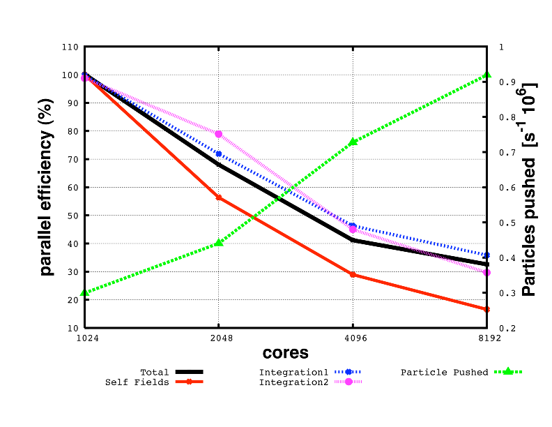
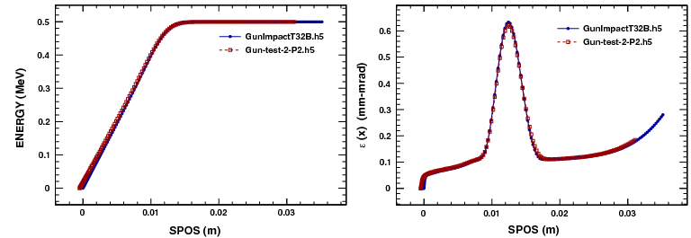

ifdef::env-gitlab[]
include::Manual.attributes[]
include::env-gitlab.attributes[]
{link_home}

toc::[]
endif::[]

[[chp.introduction]]
== Introduction
include::stylesheets/Toggle[]

[[sec.introduction.aim-of-opal-and-history]]
=== History

opal-begin
Using the _MAD_ language with extensions, _OPAL_ is
derived from _MAD9P_ and is based on the _CLASSIC_ <<bib.classic>> class library, which
was started in 1995 by an international collaboration. IPPL (Independent
Parallel Particle Layer) is the framework which provides parallel
particles and fields using data parallel approach. IPPL was inspired by the POOMA <<bib.pooma>>.

_OPAL-t_ can be used to model guns, injectors, ERLs and complete XFELs.
opal-end

opalx-begin
_OPALX_ also uses an extended _MAD_ language. 
opalx-end

[[sec.introduction.project-resources]]
=== Project Resources and Getting Started

The public project pages at {link_opal_pages} collect the current landing-page
material for both _OPAL_ and _OPALX_. The published manual is available at
{link_public_manual}[{link_public_manual}], and the _OPAL_ mailing list
{mail_mailing_list} can be joined via
{link_mailing_list}[the subscription page]. Please use the mailing list for
questions, bug reports, and feature requests. For a broader overview of current
use cases and publications, see {link_opal_references}[papers and presentations].

If you are starting with example problems, the following entry points are the
most useful:

* link:Examples/cyclotron.html[Cyclotron examples]
* link:Examples/RFPhotoInjector.html[RF photo injector examples]
* link:Examples/AWAEEXBeamline.html[AWA EEX beamline examples]
* link:Examples/AWADriveLinac.html[AWA drive linac examples]
* link:Examples/regressiontestexamples.html[Regression-test examples]
* link:Examples/FFA.html[FFA examples]
* <<chp.tutorial,Tutorial>>

Users working at PSI can additionally consult
link:Using-OPAL-at-PSI.html[Using _OPAL_ at PSI].

opalx-begin
For _OPALX_, user-facing material is still sparse. The current public entry
point for execution and build instructions is
{link_merlin7_opalx}[Run/compile _OPALX_ on Merlin7].

The user-level distributions page currently referenced from the project landing
page is link:For-Users/Distributions.html[Distributions].
opalx-end

[[sec.introduction.tools]]
=== Tools

The project pages list a small set of supporting tools around the core
simulation codes:

* link:runOPAL.html[runOPAL] provides Python scripts to launch and
  automate multiple jobs, including parameter scans.
* {link_pyopaltools}/[pyOPALTools] provides pre-processing, post-processing,
  analysis, and plotting utilities for simulation data.
* link:OPAL-conversion-utilities.html[_OPAL_ conversion utilities]
  provide format-conversion helpers.

opalx-begin
For _OPALX_, these tools are still evolving; the most stable interfaces remain
the manual, the source repositories, and the regression and documentation pages
listed in the developer appendix.
opalx-end

[[sec.introduction.parallel-processing-capabilities]]
=== Parallel Processing Capabilities

_OPAL_ is built to harness the power of parallel processing for an
improved quantitative understanding of particle accelerators. This goal
can only be achieved with detailed 3D modelling capabilities and a
sufficient number of simulation particles to obtain meaningful
statistics on various quantities of the particle ensemble such as
emittance, slice emittance, halo extension etc.

The following example is exemplifying this fact:

.Parameters Parallel Performance Example
[[tab_pex1,Table {counter:tab-cnt}]]
|===
|Distribution | Particles | Mesh | Greens Function | Time steps

|Gauss 3D | latexmath:[10^8] | latexmath:[1024^3] | Integrated | 10
|===

<<fig_walldrift>> shows the parallel efficiency time as a function of
used cores for a test example with parameters given in <<tab_pex1>>. The
data were obtained on a Cray XT5 at the Swiss Center for Scientific
Computing.

.Parallel efficiency and particles pushed per latexmath:[\mu s] as a function of cores
[[fig_walldrift,Figure {counter:fig-cnt}]]

[[sec.introduction.quality-management]]
=== Quality Management

Documentation and quality assurance are given our highest attention
since we are convinced that adequate documentation is a key factor in
the usefulness of a code like _OPAL_ to study present and future
particle accelerators. Using tools such as a source code version control
system (https://git-scm.com[git]), source code documentation using
Doxygen (found {link_doxygen_doc}[here]) and the
extensive user manual you are now enjoying, we are committed to
providing users as well as co-developers with state-of-the-art
documentation to _OPAL_.

One example of an non trivial test-example is the PSI DC GUN. In
<<fig_guncomp1>> the comparison between _Impact-t_ and _OPAL-t_ is
shown. This example is part of the regression test suite that is run
every night. The input file is found in
<<sec.tutorial.examplesbeamlines,Examples of Particle Accelerators and Beamlines>>.

Misprints and obscurity are almost inevitable in a document of this
size. Comments and _active contributions_ from readers are therefore
most welcome. They may be sent to mailto:andreas.adelmann@psi.ch[Andreas Adelmann].

.Comparison of energy and emittance in latexmath:[x] between _Impact-t_ and _OPAL-t_
[[fig_guncomp1,Figure {counter:fig-cnt}]]

[[sec.introduction.output]]
=== Output

The phase space is stored in the H5hut file-format <<bib.howison2010_intro>>
and can be analyzed using e.g. H5root <<bib.h5root_intro>>, <<bib.schietinger_intro>>.
The frequency of the data output (phase space and some statistical quantities)
can be controlled using the  (see <<sec.control.option,Option Statement>>),
with the flag `PSDUMPFREQ`. The file is named like in input file but with the extension _.h5_.

A SDDS compatible ASCII file with statistical beam parameters is written
to a file with extension .stat. The frequency with which this data is
written can be controlled with the <<sec.control.option,`OPTION` statement>>
with the flag `STATDUMPFREQ`.

For postprocessing we recommend to use the {link_pyOPALTools}[pyOPALTools]
Python package which contains many tools for pre- and postprocessing, and analysing and plotting output data.

In addition to the output files, note that important information is displayed on the _stdout_ i.e. the _terminal_.
The user is advised to consult the stdout frequently.

opalx-begin
The level of stdout can be tuned with the `--info <level>` argument.

- `level == 1`: Highest-priority, coarse status and rare/critical events that should be visible even at very low verbosity.
- `level == 2`: Normal progress and key run summaries (per-track or per-run), printed infrequently during typical production runs.
- `level == 3`: Detailed algorithm progress and important but more frequent state changes (e.g. `dt` updates, repartitioning, binning setup).
- `level == 4`: Fine-grained implementation details inside algorithms, normally hidden in production but useful for debugging.
- `level ==  5`: Full debug/trace output, including very chatty per-step or per-bin diagnostics and internal binning/solver details.

For production runs we suggest `level==1` or `level==2` i.e.
....
opalx inputfile.in --info 1
....
opalx-end

[[sec.introduction.change-history]]
=== Change History

See link:ReleaseNotes/ReleaseNotes.html[Release Notes]
for a detailed list of changes in _OPAL_.

[[sec.introduction.known-issues-and-limitations]]
=== Known Issues and Limitations

See the {link_OPAL_issue_tracker}[issue list] in the repository.

See also <<chp.pitfalls,pitfalls and limitations>>.

[[sec.introduction.acknowledgments]]
=== Acknowledgments

The contributions of various individuals and groups are acknowledged in
the relevant chapters, however a few individuals have or had
considerable influence on the development of _OPAL_, namely

The following individuals are acknowledged for past contributions:

Chris Iselin,
John Jowett,
Julian Cummings,
Ji Qiang,
Robert Ryne,
Stefan Adam,
Christian Baumgarten,
J. Scott Berg,
Yuanjie Bi,
David Bruhwiler,
Chris Cortes,
Martin Duy Tat,
Matthias Frey,
Philippe Ganz,
Colwyn Gulliford,
Yves Ineichen,
Tulin Kaman,
Christopher Mayes,
Xiaoying Pang,
Valeria Rizzoglio,
Chuan Wang,
Jianjun Yang,
Hao Zha.

[[sec.introduction.citation]]
=== Citation

opal-begin
Please cite _OPAL_ in the following way:

....
@ARTICLE{2019arXiv190506654A,
       author = {{Adelmann}, Andreas and {Calvo}, Pedro and {Frey}, Matthias and
         {Gsell}, Achim and {Locans}, Uldis and {Metzger-Kraus}, Christof and
         {Neveu}, Nicole and {Rogers}, Chris and {Russell}, Steve and
         {Sheehy}, Suzanne and {Snuverink}, Jochem and {Winklehner}, Daniel},
        title = "{OPAL a Versatile Tool for Charged Particle Accelerator Simulations}",
      journal = {arXiv e-prints},
     keywords = {Physics - Accelerator Physics},
         year = "2019",
        month = "May",
          eid = {arXiv:1905.06654},
        pages = {arXiv:1905.06654},
archivePrefix = {arXiv},
       eprint = {1905.06654},
 primaryClass = {physics.acc-ph},
       adsurl = {https://ui.adsabs.harvard.edu/abs/2019arXiv190506654A},
      adsnote = {Provided by the SAO/NASA Astrophysics Data System}
}

....
opal-end

opalx-begin
no citation yet!
opalx-end

[[sec.introduction.bibliography]]
=== References

anchor:bib.classic[[{counter:bib-cnt}\]]
<<bib.classic>> F. C. Iselin, https://cds.cern.ch/record/311682/files/sl-96-061.pdf[_The classic project_], Tech. Rep. CERN/SL/96-061, European Organization for Nuclear Research (1996).

anchor:bib.qiang2005_intro[[{counter:bib-cnt}\]]
<<bib.qiang2005_intro>> J. Qiang et al., http://repositories.cdlib.org/lbnl/LBNL-59098[_A three-dimensional quasi-static model for high brightness beam dynamics simulation_], Tech. Rep. LBNL-59098, Lawrence Berkeley National Laboratory (2005).

anchor:bib.howison2010_intro[[{counter:bib-cnt}\]]
<<bib.howison2010_intro>> M. Howison et al., http://dx.doi.org/10.1109/CLUSTERWKSP.2010.5613098[_H5hut: A High-Performance I/O Library for Particle-based Simulations_], in 2010 IEEE International Conference on Cluster Computing Workshops and Posters, vol. 1, pp. 1–8 (Heraklion, Crete, 2010).

anchor:bib.h5root_intro[[{counter:bib-cnt}\]]
<<bib.h5root_intro>> link:h5root.html[_H5root: a ROOT Based Graphical User Interface for H5hut_].

anchor:bib.schietinger_intro[[{counter:bib-cnt}\]]
<<bib.schietinger_intro>> T. Schietinger, https://accelconf.web.cern.ch/ICAP2009/papers/thpsc049.pdf[_H5PartROOT - A visualization and post-processing tool for accelerator simulations_], in Proceedings of the 10th International Computational Accelerator Physics conference (ICAP09), pp. 343-346 (San Francisco, CA, USA, 2009).

anchor:bib.pooma[[{counter:bib-cnt}\]]
<<bib.pooma>> R. Günther, http://www.nongnu.org/freepooma/[_Parallel Object-Oriented Methods and Applications_] (2005).

// EOF
