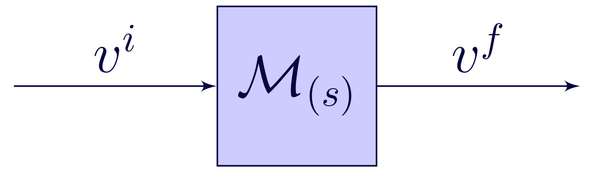

ifdef::env-gitlab[]
include::Manual.attributes[]
include::env-gitlab.attributes[]
{link_home}

toc::[]
endif::[]

[[chp.opalmap]]
== _OPAL-map_

[[sec.opalmap.introduction]]
=== Introduction

_OPAL-map_ is a map tracking beam optics code. This type computes maps for each beam line element to describe the action of the system.

The map creation is done by applying the Lie Operator on the element Hamiltonian and calculated in the Truncated Power Series Algebra (TPSA)<<bib.berz1999_opalmap>>. The TPSA is a Differential Algebra (DA), which uses the Taylor expansion as the equivalent function. In _OPAL-map_ the TPSA gets provided from the own _OPAL_ DA package.

In contrast to time latexmath:[t] dependent tracking codes, as OPAL-t, map tracking codes use the longitudinal bunch position latexmath:[s] as independent variable. Furthermore, map tracking codes do not use numerical integrators for the determination of the particle trajectory, which can be a computationally very expensive.

The main advantage in map tracking codes lies in the ''map'' itself. These do not only contain valuable information about the beam line, but also can be accumulated to reduce the computational effort in the particle tracking.

[[sec.opalmap.variablesopalmap]]
=== Variables in _OPAL-map_
For in and outputs, the units as in `<<sec.opalt.variablesopalt,Variables in OPAL-t>>` are used.

_OPAL-map_ uses an Frenet-Serret coordinate system, referring on a reference particle. This particle has the ideal properties, ergo follows the design path. The following canonical variables to describe the motion of particles. The physical units are listed in square brackets.

X::
  Horizontal position latexmath:[x] of a particle relative to the reference particle [m].
PX::
  latexmath:[\frac{p_x}{P_0}] Normalized horizontal canonical momentum [1].
(Where latexmath:[p_x] is the momentum of the particle and latexmath:[P_0] is the momentum of the reference particle)

Y::
  Vertical position latexmath:[y] of a particle relative to the reference particle [m].
PY::
  latexmath:[\frac{p_y}{P_0}] Normalized vertical canonical momentum [1].
Z::
  Longitudinal position latexmath:[z] of a particle relative to the reference particle [m].
DELTA::
  latexmath:[\frac{E}{P_0 c}-\frac{1}{\beta_0}] Energy derivation [1]. 
(Where latexmath:[E] is the total energy of the particle and latexmath:[\beta_0 = \frac{u}{c}] the speed relative to the speed of light latexmath:[c] of the reference particle)

The independent variable is position of the reference particle *s* [m].

[[sec.opalmap.mapTracking]]
=== Principle of Map Tracking

The particle motion gets calculated by applying the map on the particle parameter.

.Flow chart of map tracking.
[[fig_MapTracking,Figure {counter:fig-cnt}]]

[latexmath]
++++
v^f = \mathbf{\mathcal{M}} \circ v^i
++++
Where latexmath:[v] denotes the final (latexmath:[v^f]) and initial (latexmath:[v^i]) six dimensional phase space vector of each particle.
latexmath:[\mathbf{\mathcal{M}}] is the map. This map can represent either a beam element slice, the whole element, a beam line section or the whole system.

[[sec.opalmap.creationOfMap]]
==== Creation of map

The creation of the element map is based on the Hamiltonian Mechanic, more specifically on the Lie Operator.

[latexmath]
++++
\begin{aligned}
    H &= T + V\\
    \frac{d\mathbf{q_i}}{ds} &= \frac{\partial H}{\partial p_i} \; , \;  \frac{d\mathbf{p_i}}{ds} = - \frac{\partial H}{\partial q_i}
\end{aligned}
++++

Here latexmath:[H], the time dependent Hamiltonian represents the total energy, consisting of the kinetic latexmath:[T] and potential latexmath:[V] energy.
The lower equations are the Hamiltonian equations of motion, where the momenta latexmath:[p_i] and the positions latexmath:[q_i] form the canonical pairs.
Using canonical transformations, the Hamiltonian can be adjusted to use the path length latexmath:[s] as independent and the particle parameters as dependent variable(s).

Introducing the Lie operator, which acts similar to a "waiting" Poisson Bracket:
[latexmath]
++++
\begin{aligned}
    :\!f\!:  = \left[ f, \circ \right] = \sum_{i=1}^{n} \left( \frac{\partial f}{\partial q_i}\frac{\partial \circ}{\partial p_i} - \frac{\partial f}{\partial p_i}\frac{\partial \circ}{\partial q_i} \right)
\end{aligned}
++++

If a function latexmath:[f:= f \left( \mathbf{q_{(s)}},\mathbf{p_{(s)}}\right) ] describes one of the phase space variables latexmath:[v] its total derivative to the independent variable, combined with the Hamiltonian equations of motions, is similar to the Lie operator times the indepedent variable, i. e. latexmath:[s].

[latexmath]
++++
\begin{aligned}
    \frac{df}{ds}&= \sum_{i=1}^{n} \left( \frac{dq_i}{ds}\frac{\partial f}{\partial q_i} +\frac{dp_i}{ds}\frac{\partial f}{\partial p_i} \right) \\
    \frac{df}{ds}&= \sum_{i=1}^{n} \left( \frac{\partial H}{\partial p_i}\frac{\partial f}{\partial q_i} -\frac{\partial H}{\partial q_i}\frac{\partial f}{\partial p_i} \right)  \equiv -:\!H\!: f
\end{aligned}
++++

The integral over the independent variable latexmath:[\int \cdot ds]:

[latexmath]
++++
\begin{aligned}
    f(s)&= e^{-:\!H\!: s} f(s_0) \\
        \mathcal{M} &= e^{-:\!H\!: s}
\end{aligned}
++++

Where latexmath:[e^{-:\!H\!: s}] is the Lie expansion. 

[[sec.opalmap.Implementation]]
==== Implementation of map tracking
For the derivative of the Hamiltonian, a Differential Algebra (DA) was used, in particular the Truncated Power Series Algebra (TPSA).
This algebra uses the Taylor expansion as the equivalent function, which also is responsible for its name by creating truncated power series.
Just form the definition of the Taylor expansion, it can be seen that a finite, to the order latexmath:[\Omega], expansion is an approximation of the actual function, due to the error term latexmath:[\mathcal{O}\left( \mathbf{v}^{\,\Omega +1}\left( \Delta s\right)\right) ].

[latexmath]
++++
\begin{aligned}
     f = \mathbf{\mathcal{M}} = {\sum_{n=0}^{\Omega} \frac{f^{\left(n\right)}}{n !} \left( \mathbf{v}\left( \Delta s\right) \right)^n} + {\mathcal{O}\left( \mathbf{v}^{\,\Omega +1}\left( \Delta s\right)\right) }
\end{aligned}
++++

In _OPAL-map_ the Hamiltonian gets Taylor expanded and its map derived (`<<sec.opalmap.creationOfMap,Creation of Map>>`) in the TPSA using the _OPAL_ DA package. The truncation length gets defined in `TRACK` setting the `MAP_ORDER` attribute.
----
TRACK, LINE= QUADTEST, BEAM=BEAM1, MAXSTEPS=10000, DT=1.0e-10, ZSTOP=4.0, MAP_ORDER=2;
---- 

[[sec.opalmap.newParams]]
=== Additional Parameter in _OPAL-map_

.Additional Parameter.
[cols="<2,^1,^1,^1,<3",options="header",]
[[tab_opal_map_parameters,{counter:tab-cnt}]]
|=======================================================================
| Attribute Name | set in | Default Value | Units | Description

|`MAP_ORDER` |`TRACK`|`1` | [ ] | defines the map order ( = order TPSA - 1).

|`NSlices` |beam line element| `1` |[ ] | defines the number of steps inside the element.

|=======================================================================

[[sec.opalmap.Limitations]]
==== Limitations
_OPAL-map_ is the new flavour of _OPAL_ and currently just contains the fundamental beam line elements:

* Drift (`<<sec.elements.drift,Drift>>`),
* Dipole (`<<sec.elements.SBend,Sbend>>`),
* Quadrupole (`<<sec.elements.quadrupole,Quadrupole>>`)

[[sec.opalmap.example]]
=== Example

FODO lattice: https://github.com/OPALX-project/regression-tests/blob/master/RegressionTests/MAP-FODO/MAP-FODO.in[MAP-FODO.in]

Input distribution (to be put in directory `data`): https://github.com/OPALX-project/regression-tests/blob/master/RegressionTests/MAP-FODO/data/FODO_DIST.dat[FODO_DIST.dat]

To `RUN` _OPAL-map_, the `METHOD` attribute gets set to `THICK`.
----
RUN, METHOD = "THICK", BEAM=BEAM1, FIELDSOLVER=FS1, DISTRIBUTION=DIST1;
----

The maximal order of the beam line maps get defined with the `MAP_ORDER` attribute.
----
TRACK, LINE= QUADTEST, BEAM=BEAM1, MAXSTEPS=10000, DT=1.0e-10, ZSTOP=4.0, MAP_ORDER=2;
----

As an optional parameter for the beam line elements `NSlices=<x>` provides the opportunity to split one element in `<x>` smaller steps. Otherwise, the default value is defined with `1`.

----
D1:  DRIFT,             L=1.,                ELEMEDGE=0.000, NSLICES=10;
QP1: QUADRUPOLE,        L=0.3,  K1= 8.64195, ELEMEDGE=1.000, NSLICES=15;
----

[[sec.opalmap.output]]
=== Output

In addition to the progress report that _OPAL-map_ writes to the standard
output (stdout) it also writes different files for various purposes.

[[sec.opalmap.input_file_name-.stat]]
==== Statistics output

The file structure is analogous to
<<sec.opalt.input_file_name-.stat,_OPAL-t_ Statistics output file>>.

[[sec.opalmap.datainput_file_name.dispersion]]
==== _data/<input_file_name >.dispersion_

_OPAL-map_ computes the dispersion of the beam line according to:

[latexmath]
++++
\begin{aligned}
  \begin{pmatrix} \eta_{i} \\ \eta_{p_i} \end{pmatrix}_{s_1}
  =
  \begin{pmatrix} R_{11} & R_{12} \\ R_{21} & R_{22} \end{pmatrix}
  \cdot
  \begin{pmatrix} \eta_{i} \\ \eta_{p_i} \end{pmatrix}_{s_0}
  +
  \begin{pmatrix} R_{16} \\ R_{26} \end{pmatrix}
\end{aligned}
++++
where latexmath:[R] is the Transfermatrix and latexmath:[\eta] is the dispersion.

[cols="<1,<1,<1,<5",options="header",]
|=======================================================================
|Column Nr. |Name |Units |Meaning
|1 |position |m |Longitudinal position

|2 |latexmath:[\eta_x] |m |Spatial dispersion in x

|3 |latexmath:[\eta_{px}] |1 |Momentum dispersion in x

|4 |latexmath:[\eta_y] |m |Spatial dispersion in x

|5 |latexmath:[\eta_{py}] |1 |Momentum dispersion in y
positions
|=======================================================================

[[sec.opalmap.datainput_file_name.map]]
==== _data/<input_file_name >.map_

Here the transfer map of the whole beamline gets printed.
Its format is analogous to a DA- `FVPs` (src/Classic/FixedAlgebra), where the polynomials (DA- `FTPs`) get represented in a 6 dimensional vector.
The first number describes the coefficient and the following 6 the variables of the monomial.

[cols="<1,<1,<1,<5",options="header",]
|=======================================================================
|Column Nr. |Name |Units |Meaning
|1 |coefficient |1 |coefficient of monomial

|2 |latexmath:[x] |1 |latexmath:[x] in monomial

|3 |latexmath:[p_x] |1 |latexmath:[p_x] in monomial

|4 |latexmath:[y] |1 |latexmath:[y] in monomial

|5 |latexmath:[p_y] |1 |latexmath:[p_y] in monomial

|6 |latexmath:[z] |1 |latexmath:[z] in monomial

|7 |latexmath:[\delta] |1 |latexmath:[\delta] in monomial
|=======================================================================

[[sec.opalmap.bibliography]]
=== References
anchor:bib.berz1999_opalmap[[{counter:bib-cnt}\]]
<<bib.berz1999_opalmap>> M. Berz, _Modern map methods in particle beam physics_, Academic Press (1999).

// EOF
