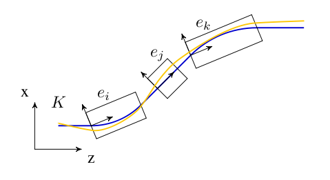
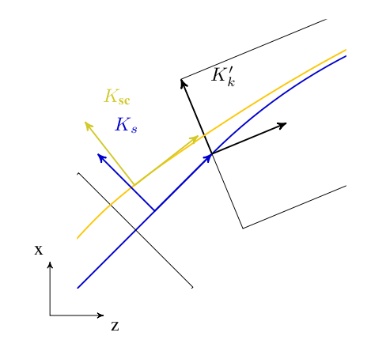
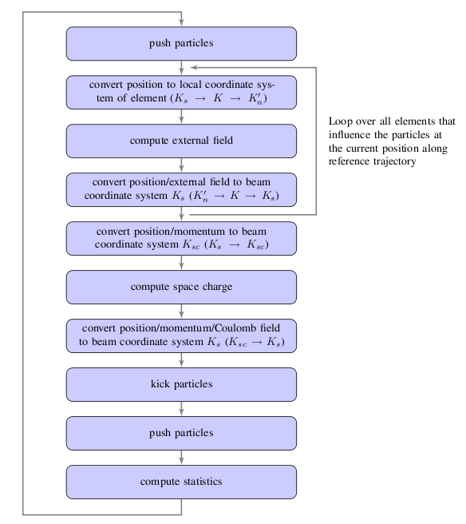
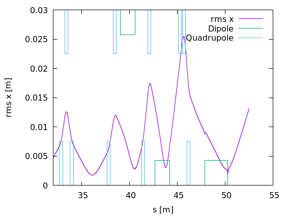

ifdef::env-gitlab[]
include::Manual.attributes[]
include::env-gitlab.attributes[]
{link_home}

toc::[]
endif::[]

[[chp.opalt]]
== _OPAL-t_

[[sec.opalt.introduction]]
=== Introduction

_OPAL-t_ is a fully three-dimensional program to track in time,
relativistic particles taking into account space charge forces,
self-consistently in the electrostatic approximation, and short-range
longitudinal and transverse wake fields. _OPAL-t_ is one of the few
codes that is implemented using a parallel programming paradigm from the
ground up. This makes _OPAL-t_ indispensable for high statistics
simulations of various kinds of existing and new accelerators. It has a
comprehensive set of beamline elements, and furthermore allows arbitrary
overlap of their fields, which gives _OPAL-t_ a capability to model both
the standing wave structure and traveling wave structure. Beside
IMPACT-T it is the only code making use of space charge solvers based on
an integrated Green <<bib.qiang2005_opalt>>, <<bib.qiang2006-1_opalt>>,
<<bib.qiang2006-2_opalt>> function to efficiently and accurately treat beams
with large aspect ratio, and a shifted Green function to efficiently treat
image charge effects of a cathode <<bib.fubiani2006>>, <<bib.qiang2005_opalt>>,
<<bib.qiang2006-1_opalt>>,<<bib.qiang2006-2_opalt>>. For
simulations of particles sources i.e. electron guns _OPAL-t_ uses the
technique of energy binning in the electrostatic space charge
calculation to model beams with large energy spread. In the very near
future a parallel Multigrid solver taking into account the exact
geometry will be implemented.

[[sec.opalt.variablesopalt]]
=== Variables in _OPAL-t_

_OPAL-t_ uses the following canonical variables to
describe the motion of particles. The physical units are listed in
square brackets.

X::
  Horizontal position latexmath:[x] of a particle relative to the axis
  of the element [m].
PX::
  latexmath:[\beta_x\gamma] Horizontal canonical momentum [<<sec.distribution.unitsdistattributes,Units>>].
Y::
  Vertical position latexmath:[y] of a particle relative to the axis
  of the element [m].
PY::
  latexmath:[\beta_y\gamma] Vertical canonical momentum [<<sec.distribution.unitsdistattributes,Units>>].
Z::
  Longitudinal position latexmath:[z] of a particle in floor
  co-ordinates [m].
PZ::
  latexmath:[\beta_z\gamma] Longitudinal canonical momentum [<<sec.distribution.unitsdistattributes,Units>>].

The independent variable is *t* [s].

[[sec.opalt.integration-of-the-equation-of-motion]]
=== Integration of the Equation of Motion

_OPAL-t_ integrates the relativistic Lorentz equation
[latexmath]
++++
\frac{\mathrm{d}\gamma\mathbf{v}}{\mathrm{d}t} =   \frac{q}{m}[\mathbf{E}_{ext} + \mathbf{E}_{sc} + \mathbf{v} \times (\mathbf{B}_{ext} + \mathbf{B}_{sc})]
++++
where latexmath:[\gamma] is the relativistic factor, latexmath:[q]
is the charge, and latexmath:[m] is the rest mass of the particle.
latexmath:[\mathbf{E}] and latexmath:[\mathbf{B}] are abbreviations
for the electric field latexmath:[\mathbf{E}(\mathbf{x},t)] and
magnetic field latexmath:[\mathbf{B}(\mathbf{x},t)]. To update the
positions and momenta _OPAL-t_ uses the Boris-Buneman algorithm
<<bib.langdon>>.

[[sec.opalt.positioning-of-elements]]
=== Positioning of Elements

Since _OPAL_ version 2.0 of _OPAL_ elements can be placed in space using
3D coordinates `X`, `Y`, `Z`, `THETA`, `PHI` and `PSI`, see
<<sec.elements.common,Common Attributes for all Elements>>.
The old notation using `ELEMEDGE` is still
supported. _OPAL-t_ then computes the position in 3D using `ELEMDGE`,
`ANGLE` and `DESIGNENERGY`. It assumes that the trajectory consists of
straight lines and segments of circles. Fringe fields are ignored. For
cases where these simplifications aren’t justifiable the user should use
3D positioning. For a simple switchover _OPAL_ writes a file __3D.opal_
where all elements are placed in 3D.

Beamlines containing guns should be supplemented with the element
`SOURCE`. This allows _OPAL_ to distinguish the cases and adjust the
initial energy of the reference particle.

Prior to _OPAL_ version 2.0 elements needed only a defined length. The
transverse extent was not defined for elements except when combined with
2D or 3D field maps. An aperture had to be designed to give elements a
limited extent in transverse direction since elements now can be placed
freely in three-dimensional space.
See <<sec.elements.common,Common Attributes for all Elements>>
for how to define an aperture.

[[sec.opalt.CoordinateSystems]]
=== Coordinate Systems

The motion of a charged particle in an accelerator can be described by
relativistic Hamilton mechanics. A particular motion is that of the
reference particle, having the central energy and traveling on the
so-called reference trajectory. Motion of a particle close to this
fictitious reference particle can be described by linearized equations
for the displacement of the particle under study, relative to the
reference particle. In _OPAL-t_, the time latexmath:[t] is used as
independent variable instead of the path length latexmath:[s]. The
relation between them can be expressed as
[latexmath]
++++
\frac{\mathrm{d}}{\mathrm{d} t} = \frac{\mathrm{d}}{\mathrm{d}\mathbf{s}}\frac{\mathrm{d}\mathbf{s}}{\mathrm{d} t} = \mathbf{\beta}c\frac{\mathrm{d}}{\mathrm{d}\mathbf{s}}.
++++

[[sec.opalt.global-cartesian-coordinate-system]]
==== Global Cartesian Coordinate System

We define the global cartesian coordinate system, also known as floor
coordinate system with latexmath:[K], a point in this coordinate
system is denoted by latexmath:[(X, Y, Z) \in K]. In <<fig_KS1>> of
the accelerator is uniquely defined by the sequence of physical elements
in latexmath:[K]. The beam elements are numbered
latexmath:[e_0, \ldots , e_i, \ldots e_n].

.Illustration of local and global coordinates.
[[fig_KS1,Figure {counter:fig-cnt}]]

[[sec.opalt.local-cartesian-coordinate-system]]
==== Local Cartesian Coordinate System

A local coordinate system latexmath:[K'_i] is attached to each element
latexmath:[e_i]. This is simply a frame in which latexmath:[(0,0,0)]
is at the entrance of each element. For an illustration see
<<fig_KS1>>. The local reference system
latexmath:[(x, y, z) \in K'_n] may thus be referred to a global
Cartesian coordinate system latexmath:[(X, Y, Z) \in K].

The local coordinates latexmath:[(x_i, y_i, z_i)] at element
latexmath:[e_i] with respect to the global coordinates
latexmath:[(X, Y, Z)] are defined by three displacements
latexmath:[(X_i, Y_i, Z_i)] and three angles
latexmath:[(\Theta_i, \Phi_i, \Psi_i)].

latexmath:[\Psi] is the roll angle about the global
latexmath:[Z]-axis. latexmath:[\Phi] is the yaw angle about the
global latexmath:[Y]-axis. Lastly, latexmath:[\Theta] is the pitch
angle about the global latexmath:[X]-axis. All three angles form
right-handed screws with their corresponding axes. The angles
(latexmath:[\Theta,\Phi,\Psi]) are the Tait-Bryan angles
<<bib.tait-bryan_opalt>>.

The displacement is described by a vector latexmath:[\mathbf{v}] and
the orientation by a unitary matrix latexmath:[\mathcal{W}]. The
column vectors of latexmath:[\mathcal{W}] are unit vectors spanning
the local coordinate axes in the order latexmath:[(x, y, z)].
latexmath:[\mathbf{v}] and latexmath:[\mathcal{W}] have the values:
[latexmath]
++++
\mathbf{v} =\left(\begin{array}{c}
    X \\
    Y \\
    Z
  \end{array}\right),
\qquad
\mathcal{W}=\mathcal{S}\mathcal{T}\mathcal{U}
++++
where
[latexmath]
++++
\mathcal{S}=\left(\begin{array}{ccc}
    \cos\Theta &  0 &  \sin\Theta \\
    0         &  1 &   0 \\
    -\sin\Theta &  0 &  \cos\Theta
  \end{array}\right),
\quad
\mathcal{T}=\left(\begin{array}{ccc}
    1 &  0        &  0 \\
    0 &  \cos\Phi &  \sin\Phi \\
    0 & -\sin\Phi &  \cos\Phi
  \end{array}\right),
\quad
\mathcal{U}=\left(\begin{array}{ccc}
    \cos\Psi & -\sin\Psi &  0 \\
    \sin\Psi &  \cos\Psi &  0 \\
    0        &  0        &  1
  \end{array}\right).
++++

We take the vector latexmath:[\mathbf{r}_i] to be the displacement and
the matrix latexmath:[\mathcal{S}_i] to be the rotation of the local
reference system at the exit of the element latexmath:[i] with respect
to the entrance of that element.

Denoting with latexmath:[i] a beam line element, one can compute
latexmath:[\mathbf{v}_i] and latexmath:[\mathcal{W}_i] by the
recurrence relations 

[latexmath]
++++
\mathbf{v}_i = \mathcal{W}_{i-1}\mathbf{r}_i + \mathbf{v}_{i-1}, \qquad
\mathcal{W}_i = \mathcal{W}_{i-1}\mathcal{S}_i,
++++
where
latexmath:[\mathbf{v}_0] corresponds to the origin of the `LINE` and
latexmath:[\mathcal{W}_0] to its orientation. In _OPAL-t_ they can be
defined using either `X`, `Y`, `Z`, `THETA`, `PHI` and `PSI` or `ORIGIN`
and `ORIENTATION`, see <<sec.lines.simple-beam-lines,Simple Beam Lines>>.

[[sec.opalt.space-charge-coordinate-system]]
==== Space Charge Coordinate System

In order to calculate space charge in the electrostatic approximation,
we introduce a co-moving coordinate system latexmath:[K_{\text{sc}}],
in which the origin coincides with the mean position of the particles
and the mean momentum is parallel to the z-axis.

[[sec.opalt.curvilinear-coordinate-system]]
==== Curvilinear Coordinate System

In order to compute statistics of the particle ensemble,
latexmath:[K_s] is introduced. The accompanying tripod (Dreibein) of
the reference orbit spans a local curvilinear right handed system
latexmath:[(x,y,s)]. The local latexmath:[s]-axis is the tangent to
the reference orbit. The two other axes are perpendicular to the
reference orbit and are labelled latexmath:[x] (in the bend plane)
and latexmath:[y] (perpendicular to the bend plane).

.Illustration of latexmath:[K_\text{sc}] and latexmath:[K_s]
[[fig_KS2,Figure {counter:fig-cnt}]]

Both coordinate systems are described in <<fig_KS2>>.

[[sec.opalt.design-or-reference-orbit]]
==== Design or Reference Orbit

The reference orbit consists of a series of straight sections and
circular arcs and is *computed* by the Orbit Threader i.e. deduced from
the element placement in the floor coordinate system.

[[sec.opalt.compatibility-mode]]
==== Compatibility Mode

To facilitate the change for users we will provide a compatibility mode.
The idea is that the user does not have to change the input file.
Instead _OPAL-t_ will compute the positions of the elements. For this it
uses the bend angle and chord length of the dipoles and the position of
the elements along the trajectory. The user can choose whether effects
due to fringe fields are considered when computing the path length of
dipoles or not. The option to toggle _OPAL-t_’s behavior is called
`IDEALIZED`. _OPAL-t_ assumes per default that provided `ELEMEDGE` for
elements downstream of a dipole are computed without any effects due to
fringe fields.

Elements that overlap with the fields of a dipole have to be handled
separately by the user to position them in 3D.

We split the positioning of the elements into two steps. In a first step
we compute the positions of the dipoles. Here we assume that their
fields don’t overlap. In a second step we can then compute the positions
and orientations of all other elements.

The accuracy of this method is good for all elements except for those
that overlap with the field of a dipole.

[[sec.opalt.sec.orbitthreader]]
==== Orbit Threader and Autophasing

The `OrbitThreader` integrates a design particle through the lattice and
setups up a multi map structure (`IndexMap`). Furthermore when the
reference particle hits an rf-structure for the first time then it
auto-phases the rf-structure, see Appendix <<appendix.autophasing,Auto-phasing Algorithm>>. The multi map
structure speeds up the search for elements that influence the particles
at a given position in 3D space by minimizing the looping over elements
when integrating an ensemble of particles. For each time step,
`IndexMap` returns a set of elements
latexmath:[\mathcal{S}_{\text{e}} \subset {e_0 \ldots e_n}] in case of
the example given in <<fig_KS1>>. An implicit drift is modelled as an
empty set latexmath:[\emptyset].
opalx-begin
The `IndexMap` therefore represents an occupancy model on the reference
  coordinate: each interval stores the set of elements whose field-support
  extents are active on that interval. This is distinct from the geometric
  placement of the corresponding element bodies. In overlapping regions
  the design particle sees the superposition of all active fields, and the
  reference path is determined by integrating this combined field.
opalx-end

[[sec.opalt.flow-diagram-of-opal-t]]
=== Flow Diagram of _OPAL-t_

.Schematic workflow of _OPAL-t_’s execute method.
[[fig_OPALTSchemeSimple,Figure {counter:fig-cnt}]]

A regular time step in _OPAL-t_ is sketched in
<<fig_OPALTSchemeSimple>>. In order to compute the coordinate system
transformation from the reference coordinate system latexmath:[K_s] to
the local coordinate systems latexmath:[K'_n] we join the
transformation from floor coordinate system latexmath:[K] to
latexmath:[K'_n] to the transformation from latexmath:[K_s] to
latexmath:[K]. All computations of rotations which are involved in the
computation of coordinate system transformations are performed using
quaternions. The resulting quaternions are then converted to the
appropriate matrix representation before applying the rotation operation
onto the particle positions and momenta.

As can be seen from <<fig_OPALTSchemeSimple>> the integration of the
trajectories of the particles are integrated and the computation of the
statistics of the six-dimensional phase space are performed in the
reference coordinate system.

[[sec.opalt.opalt-output]]
=== Output

In addition to the progress report that _OPAL-t_ writes to the standard
output (stdout) it also writes different files for various purposes.

[[sec.opalt.input_file_name-.stat]]
==== Statistics output

This file is used to log the statistical properties of the bunch in the
ASCII variant of the SDDS format <<bib.borland1995_opalt>>. It can be viewed
with the SDDS Tools <<bib.borland2016>> or GNUPLOT. The frequency with
which the statistics are computed and written to file can be controlled
With the option `STATDUMPFREQ` (see <<sec.control.option,Option Statement>>).
The name of the output file is _<input_file_name >.stat_.
The information that is stored are found in <<tab_opal_t_stat>>. Additionally,
more statistical information about the beam can be saved. The option
`COMPUTEPERCENTILES` allow whether the 68.27 (1 sigma for normal distribution),
the 95.45 (2 sigmas), the 99.73 (3 sigmas) and the 99.994 (4 sigmas)
percentiles for the beam size and the normalized emittance should be computed
(see <<tab_stat_percentiles>>)). Whereas, `DUMPBEAMMATRIX` control whether to
write the 6-dimensional beam matrix (upper triangle only) to statatistic file
(see <<tab_stat_beammatrix>>)).

.Data stored in statistics output file in _OPAL-t_.
[cols="<1,<1,<1,<5",options="header",]
[[tab_opal_t_stat,Table {counter:tab-cnt}]]
|=======================================================================
|Column Nr. |Name |Units |Meaning
|1 |t |ns |Time

|2 |s |m |Path length

|3 |numParticles |1 |Number of macro particles

|4 |charge |C |Bunch charge

|5 |energy |MeV |Mean bunch energy

|6 |rms_x |m |RMS beamsize in x

|7 |rms_y |m |RMS beamsize in y

|8 |rms_s |m |RMS beamsize in s

|9 |rms_px |1 |RMS beamsize normalised momentum in x

|10 |rms_py |1 |RMS beamsize normalised momentum in y

|11 |rms_ps |1 |RMS beamsize normalised momentum in s

|12 |emit_x |mrad |Normalized emittance in x

|13 |emit_y |mrad |Normalized emittance in y

|14 |emit_s |mrad |Normalized emittance in s

|15 |mean_x |m |X-component of mean position relative to reference
particle

|16 |mean_y |m |Y-component of mean position relative to reference
particle

|17 |mean_s |m |S-component of mean position relative to reference
particle

|18 |ref_x |m |X-component of reference particle in floor coordinate
system

|19 |ref_y |m |Y-component of reference particle in floor coordinate
system

|20 |ref_z |m |Z-component of reference particle in floor coordinate
system

|21 |ref_px |1 |X-component of normalized momentum of reference particle
in floor coordinate system

|22 |ref_py |1 |Y-component of normalized momentum of reference particle
in floor coordinate system

|23 |ref_pz |1 |Z-component of normalized momentum of reference particle
in floor coordinate system

|24 |max_x |m |Max beamsize in x-direction

|25 |max_y |m |Max beamsize in y-direction

|26 |max_s |m |Max beamsize in s-direction

|27 |xpx |1 |Correlation between x-components of positions and momenta

|28 |ypy |1 |Correlation between y-components of positions and momenta

|29 |zpz |1 |Correlation between s-components of positions and momenta

|30 |Dx |m |Dispersion in x-direction

|31 |DDx |1 |Derivative of dispersion in x-direction

|32 |Dy |m |Dispersion in y-direction

|33 |DDy |1 |Derivative of dispersion in y-direction

|34 |Bx_ref |T |X-component of magnetic field at reference particle

|35 |By_ref |T |Y-component of magnetic field at reference particle

|36 |Bz_ref |T |Z-component of magnetic field at reference particle

|37 |Ex_ref |MVm^-1 |X-component of electric field at reference particle

|38 |Ey_ref |MVm^-1 |Y-component of electric field at reference particle

|39 |Ez_ref |MVm^-1 |Z-component of electric field at reference particle

|40 |dE |MeV |Energy spread of the bunch

|41 |dt |ns |Size of time step

|42 |partsOutside |1 |Number of particles outside
latexmath:[n \times gma] of beam, where latexmath:[n] is controlled
with `BEAMHALOBOUNDARY` (see <<sec.control.option,Option Statement>>)

|43 |DebyeLength |m |Debye length in the boosted frame

|44 |plasmaParameter |1 |Plasma parameter that gives no. of particles
in a Debye sphere

|45 |temperature |K |Temperature of the beam

|46 |rmsDensity |1 |RMS number density of the beam

|=======================================================================

.Additional data stored in statistics output file if `COMPUTEPERCENTILES=TRUE`.
[cols="<1,<1,<5",options="header",]
[[tab_stat_percentiles,Table {counter:tab-cnt}]]
|=======================================================================
|Name |Units |Meaning

|68_Percentile_x |m |68.27 percentile (1 sigma of normal distribution)
of x-component of position

|68_Percentile_y |m |68.27 percentile (1 sigma of normal distribution)
of y-component of position

|68_Percentile_z |m |68.27 percentile (1 sigma of normal distribution)
of z-component of position

|95_Percentile_x |m |95.45 percentile (2 sigma of normal distribution)
of x-component of position

|95_Percentile_y |m |95.45 percentile (2 sigma of normal distribution)
of y-component of position

|95_Percentile_z |m |95.45 percentile (2 sigma of normal distribution)
of z-component of position

|99_Percentile_x |m |99.73 percentile (3 sigma of normal distribution)
of x-component of position

|99_Percentile_y |m |99.73 percentile (3 sigma of normal distribution)
of y-component of position

|99_Percentile_z |m |99.73 percentile (3 sigma of normal distribution)
of z-component of position

|99_99_Percentile_x |m |99.994 percentile (4 sigma of normal distribution)
of x-component of position

|99_99_Percentile_y |m |99.994 percentile (4 sigma of normal distribution)
of y-component of position

|99_99_Percentile_z |m |99.994 percentile (4 sigma of normal distribution)
of z-component of position

|normalizedEps68Percentile_x |m |x-component of normalized emittance at 68
percentile (1 sigma of normal distribution)

|normalizedEps68Percentile_y |m |y-component of normalized emittance at 68
percentile (1 sigma of normal distribution)

|normalizedEps68Percentile_z |m |z-component of normalized emittance at 68
percentile (1 sigma of normal distribution)

|normalizedEps95Percentile_x |m |x-component of normalized emittance at 95
percentile (2 sigma of normal distribution)

|normalizedEps95Percentile_y |m |y-component of normalized emittance at 95
percentile (2 sigma of normal distribution)

|normalizedEps95Percentile_z |m |z-component of normalized emittance at 95
percentile (2 sigma of normal distribution)

|normalizedEps99Percentile_x |m |x-component of normalized emittance at 99
percentile (3 sigma of normal distribution)

|normalizedEps99Percentile_y |m |y-component of normalized emittance at 99
percentile (3 sigma of normal distribution)

|normalizedEps99Percentile_z |m |z-component of normalized emittance at 99
percentile (3 sigma of normal distribution)

|normalizedEps99_99Percentile_x |m |x-component of normalized emittance at 99.99
percentile (4 sigma of normal distribution)

|normalizedEps99_99Percentil_y |m |y-component of normalized emittance at 99.99
percentile (4 sigma of normal distribution)

|normalizedEps99_99Percentil_z |m |z-component of normalized emittance at 99.99
percentile (4 sigma of normal distribution)
|=======================================================================

.Additional data stored in statistics output file if `DUMPBEAMMATRIX=TRUE`.
[cols="<1,<1,<5",options="header",]
[[tab_stat_beammatrix,Table {counter:tab-cnt}]]
|=======================================================================
|Name |Units |Meaning

|S11 |m2 |Element 1,1 of 6D beam matrix

|S12 |m |Element 1,2 of 6D beam matrix

|S13 |m2 |Element 1,3 of 6D beam matrix

|S14 |m |Element 1,4 of 6D beam matrix

|S15 |m2 |Element 1,5 of 6D beam matrix

|S16 |m |Element 1,6 of 6D beam matrixn

|S22 |1 |Element 2,2 of 6D beam matrix

|S23 |m |Element 2,3 of 6D beam matrix

|S24 |1 |Element 2,4 of 6D beam matrixn

|S25 |m |Element 2,5 of 6D beam matrix

|S26 |1 |Element 2,6 of 6D beam matrix

|S33 |m2 |Element 3,3 of 6D beam matrix

|S34 |m |Element 3,4 of 6D beam matrix

|S35 |m2 |Element 3,5 of 6D beam matrix

|S36 |m |Element 3,6 of 6D beam matrix

|S44 |1 |Element 4,4 of 6D beam matrix

|S45 |m |Element 4,5 of 6D beam matrix

|S46 |1 |Element 4,6 of 6D beam matrix

|S55 |m2 |Element 5,5 of 6D beam matrix

|S56 |m |Element 5,6 of 6D beam matrix

|S66 |1 |Element 6,6 of 6D beam matrix
|=======================================================================

[[sec.opalt.datainput_file_name-_monitors.stat]]
==== Monitor statistics output

_OPAL-t_ computes the statistics of the bunch for every `MONITOR` that it
passes. The name of the output file is _data/<input_file_name >_Monitors.stat_.
The information that is written can be found in the following table.

.Data stored in `MONITOR` statistics output file in _OPAL-t_.
[cols="<1,<1,<1,<5",options="header",]
[[tab_opal_t_monitor_stat,{counter:tab-cnt}]]
|=======================================================================
|Column Nr. |Name |Units |Meaning
|1 |name |a string |Name of the monitor

|2 |s |m |Position of the monitor in path length

|3 |t |ns |Time at which the reference particle pass

|4 |numParticles |1 |Number of macro particles

|5 |rms_x |m |Standard deviation of the x-component of the particles
positions

|6 |rms_y |m |Standard deviation of the y-component of the particles
positions

|7 |rms_s |m |Standard deviation of the s-component of the particles
positions (only nonvanishing when type of `MONITOR` is `TEMPORAL`)

|8 |rms_t |ns |Standard deviation of the passage time of the particles
(zero if type is of `MONITOR` is `TEMPORAL`

|9 |rms_px |1 |Standard deviation of the x-component of the particles
momenta

|10 |rms_py |1 |Standard deviation of the y-component of the particles
momenta

|11 |rms_ps |1 |Standard deviation of the s-component of the particles
momenta

|12 |emit_x |mrad |X-component of the normalized emittance

|13 |emit_y |mrad |Y-component of the normalized emittance

|14 |emit_s |mrad |S-component of the normalized emittance

|15 |mean_x |m |X-component of mean position relative to reference
particle

|16 |mean_y |m |Y-component of mean position relative to reference
particle

|17 |mean_s |m |S-component of mean position relative to reference
particle

|18 |mean_t |ns |Mean time at which the particles pass

|19 |ref_x |m |X-component of reference particle in floor coordinate
system

|20 |ref_y |m |Y-component of reference particle in floor coordinate
system

|21 |ref_z |m |Z-component of reference particle in floor coordinate
system

|22 |ref_px |1 |X-component of normalized momentum of reference particle
in floor coordinate system

|23 |ref_py |1 |Y-component of normalized momentum of reference particle
in floor coordinate system

|24 |ref_pz |1 |Z-component of normalized momentum of reference particle
in floor coordinate system

|25 |max_x |m |Max beamsize in x-direction

|26 |max_y |m |Max beamsize in y-direction

|27 |max_s |m |Max beamsize in s-direction

|28 |xpx |1 |Correlation between x-components of positions and momenta

|29 |ypy |1 |Correlation between y-components of positions and momenta

|40 |zpz |1 |Correlation between s-components of positions and momenta
|=======================================================================

[[sec.opalt.datainput_file_name-_3d.opal]]
==== Input file transcription

_OPAL-t_ copies the input file into this file and replaces all
occurrences of `ELEMEDGE` with the corresponding position using `X`,
`Y`, `Z`, `THETA`, `PHI` and `PSI`. The name of the output file is
_data/<input_file_name >_3D.opal_.

[[sec.opalt.datainput_file_name-_elementpositions]]
==== Element positions output files

[[sec.opalt.datainput_file_name-_elementpositions.txt]]
===== _data/<input_file_name >_ElementPositions.txt_

_OPAL-t_ stores for every element the position of the entrance and the
exit. Additionally the reference trajectory inside dipoles is stored. On
the first column the name of the element is written prefixed with
``BEGIN: '', ``END: '' and ``MID: '' respectively. The remaining columns
store the z-component then the x-component and finally the y-component
of the position in floor coordinates.

[[sec.opalt.datainput_file_name-_elementpositions.py]]
===== _data/<input_file_name >_ElementPositions.py_

This Python script can be used to generate visualizations of the beam
line in different formats. Beside an ASCII file that can be printed
using GNUPLOT a VTK file and an HTML file can be generated. The VTK file
can then be opened in e.g. ParaView <<bib.paraview>>, <<bib.paraview2>> or VisIt
<<bib.visit>>. The HTML file can be opened in any modern web browser. Both
the VTK and the HTML output are three-dimensional. For the ASCII format
on the other hand you have provide the normal of a plane onto which the
beam line is projected.

The script is not directly executable. Instead one has to pass it as
argument to `python`:

----
python myinput_ElementPositions.py --export-web
----

The following arguments can be passed

* `-h` or `--help` for a short help
* `--export-vtk` to export to the VTK format
* `--export-web` to export for the web
* `--background r g b` to specify background color of web canvas where `0 <= r|g|b <= 1`
* `--project-to-plane` to project the beam line to the plane (default zx plane)
* `--normal x y z` specify the normal for projection with the components `x`, `y` and `z`

[[sec.opalt.datainput_file_name-_elementpositions.sdds]]
===== _data/<input_file_name >_ElementPositions.sdds_

This file can be used when plotting the statistics of the bunch to
indicate the positions of the magnets. It is written in the SDDS format.
The information that is written can be found in the following table.

.Data stored in the element position output file in _OPAL-t_.
[cols="<1,<1,<1,<5",options="header",]
[[tab_opal_t_elem_out,{counter:tab-cnt}]]
|=======================================================================
|Column Nr. |Name |Units |Meaning
|1 |s |m |The position in path length

|2 |dipole |0.333 |Whether the field of a dipole is present

|3 |quadrupole |1 |Whether the field of a quadrupole is present

|4 |sextupole |0.5 |Whether the field of a sextupole is present

|5 |octupole |0.25 |Whether the field of a octupole is present

|6 |decapole |1 |Whether the field of a decapole is present

|7 |multipole |1 |Whether the field of a general multipole is present

|8 |solenoid |1 |Whether the field of a solenoid is present

|9 |rfcavity |latexmath:[\pm]1 |Whether the field of a cavity is
present

|10 |monitor |1 |Whether a monitor is present

|11 |element_names |a string |The names of the elements that are present
|=======================================================================

In the example below this file is used to indicate the positions of dipoles and quadrupoles in a plot of RMS x

----
plot '70MeV_Gantry2.stat' u 2:6 w l t 'rms x'
repl 'data/70MeV_Gantry2_ElementPositions.sdds' u 1:(-$2/0.45 + 1.6) w l axis x1y2 lc 2 t 'Dipole'
repl 'data/70MeV_Gantry2_ElementPositions.sdds' u 1:(-$2/0.45 - 1.6) w l axis x1y2 lc 2 notitle
repl 'data/70MeV_Gantry2_ElementPositions.sdds' u 1:(-$3 + 1.6) w l axis x1y2 lc 3 t 'Quadrupole'
repl 'data/70MeV_Gantry2_ElementPositions.sdds' u 1:(-$3 - 1.6) w l axis x1y2 lc 3 notitle
set xrange[32:]
set y2range[-1.2:1.2]
----

This produces a plot as found in <<fig_elementIndicator>>

.Plot of RMS x supplemented with an indicator of the element positions
[[fig_elementIndicator,{counter:fig-cnt}]]

[[sec.opalt.datainput_file_name-_designpath.dat]]
==== Reference particle trajectory output

The trajectory of the reference particle is stored in this ASCII file.
The name of the output file is _data/<input_file_name >_DesignPath.dat_.
The content of the columns are listed in the following table.

.Data stored in the reference particle output file in _OPAL-t_.
[cols="<1,<1,<1,<5",options="header",]
[[tab_opal_t_ref_out,{counter:tab-cnt}]]
|========================================================
|Column Nr. |Name |Units |Meaning
|1  | |m |Position in path length
|2  | |m |X-component of position in floor coordinates
|3  | |m |Y-component of position in floor coordinates
|4  | |m |Z-component of position in floor coordinates
|5  | |1 |X-component of momentum in floor coordinates
|6  | |1 |Y-component of momentum in floor coordinates
|7  | |1 |Z-component of momentum in floor coordinates
|8  | |MV m^-1 |X-component of electric field at position
|9  | |MV m^-1 |Y-component of electric field at position
|10 | |MV m^-1 |Z-component of electric field at position
|11 | |T |X-component of magnetic field at position
|12 | |T |Y-component of magnetic field at position
|13 | |T |Z-component of magnetic field at position
|14 | |MeV |Kinetic energy
|15 | |s |Time
|========================================================

[[sec.opalt.multiple-species]]
=== Multiple Species

In the present version only one particle species can be defined
see Chapter <<chp.beam-command,Beam Command>>, however due to the underlying general structure, the
implementation of a true multi species version of _OPAL_ should be
simple to accomplish.

[[sec.opalt.multipoles-in-different-coordinate-systems]]
=== Multipoles in different Coordinate systems

In the following sections there are three models presented for the
fringe field of a multipole. The first one deals with a straight
multipole, while the second one treats a curved multipole, both starting
with a power expansion for the magnetic field. The last model tries to
be different by starting with a more compact functional form of the
field which is then adapted to straight and curved geometries.

[[sec.opalt.fringe-field-models]]
==== Fringe field models

_(for a straight multipole)_

Most accelerator modeling codes use the hard-edge model for magnets -
constant Hamiltonian. Real magnets always have a smooth transition at
the edges - fringe fields. To obtain a multipole description of a field
we can apply the theory of analytic functions.

[latexmath]
++++
\begin{aligned}
        \nabla \cdot \mathbf{B} & = 0 \Rightarrow \exists \quad \mathbf{A} \quad \text{with} \quad \mathbf{B} = \nabla \times \mathbf{A} \\
        \nabla \times \mathbf{B} & = 0 \Rightarrow \exists \quad V \quad \text{with} \quad \mathbf{B} = - \nabla V
    \end{aligned}
++++
Assuming that latexmath:[A] has only a non-zero
component latexmath:[A_s] we get 
[latexmath]
++++
\begin{aligned}
        B_x & = - \frac{\partial V}{\partial x} = \frac{\partial A_s}{\partial y} \\ \\
        B_y & = - \frac{\partial V}{\partial y} = - \frac{\partial A_s}{\partial x} 
    \end{aligned}
++++
These equations are just the Cauchy-Riemann
conditions for an analytic function
latexmath:[\tilde{A} (z) = A_s (x, y) + i V(x,y)]. So the complex
potential is an analytic function and can be expanded as a power series

[latexmath]
++++
\tilde{A} (z) = \sum_{n=0}^{\infty} \kappa_n z^n, \quad \kappa_n = \lambda_n + i \mu_n
++++

with latexmath:[\lambda_n, \mu_n] being real constants. It is
practical to express the field in cylindrical coordinates
latexmath:[(r, \varphi, s)]
[latexmath]
++++
\begin{aligned}
        x & = r \cos \varphi \quad y = r \sin \varphi  \\
        z^n & = r^n ( \cos n \varphi + i \sin n \varphi )
    \end{aligned}
++++

From the real and imaginary parts of equation () we obtain

[latexmath]
++++
\begin{aligned}
        V(r, \varphi) & = \sum_{n=0}^{\infty} r^n ( \mu_n \cos n \varphi + \lambda_n \sin n \varphi ) \\
        A_s (r, \varphi) & = \sum_{n=0}^{\infty} r^n ( \lambda_n \cos n \varphi - \mu_n \sin n \varphi )
    \end{aligned}
++++

Taking the gradient of latexmath:[-V(r, \varphi)]
we obtain the multipole expansion of the azimuthal and radial field
components, respectively

[latexmath]
++++
\begin{aligned}
        B_{\varphi} & = - \frac{1}{r} \frac{\partial V}{\partial \varphi} = - \sum_{n=0}^{\infty} n r^{n-1} ( \lambda_n \cos n \varphi - \mu_n \sin n \varphi ) \\
        B_r & = - \frac{\partial V}{\partial r} = - \sum_{n=0}^{\infty} n r^{n-1} ( \mu_n \cos n \varphi + \lambda_n \sin n \varphi )
    \end{aligned}
++++
Furthermore, we introduce the normal multipole
coefficient latexmath:[b_n] and skew coefficient latexmath:[a_n]
defined with the reference radius latexmath:[r_0] and the magnitude of
the field at this radius latexmath:[B_0] (these coefficients can be a
function of s in a more general case as it is presented further on).
[latexmath]
++++
b_n = - \frac{n \lambda_n}{B_0} r_0^{n-1} \qquad a_n = \frac{n \mu_n}{B_0} r_0^{n-1}
++++

[latexmath]
++++
\begin{aligned}
        B_{\varphi}(r, \varphi) & = B_0 \sum_{n=1}^{\infty} ( b_n \cos n \varphi+ a_n \sin n \varphi ) \left( \frac{r}{r_0} \right) ^{n-1} \\
        B_r (r, \varphi) & = B_0 \sum_{n=1}^{\infty} ( -a_n \cos n \varphi+ b_n \sin n \varphi ) \left( \frac{r}{r_0} \right) ^{n-1}
    \end{aligned}
++++
To obtain a model for the fringe field of a
straight multipole, a proposed starting solution for a non-skew magnetic
field is

[latexmath]
++++
\begin{aligned}
        V & = \sum_{n=1}^{\infty} V_n (r,z) \sin n \varphi \\
        V_n & = \sum_{k=0}^{\infty} C_{n,k}(z) r^{n+2k}
    \end{aligned}
++++

It is straightforward to derive a relation between
coefficients

[latexmath]
++++
\nabla ^2 V = 0 \Rightarrow \frac{1}{r} \frac{\partial}{\partial r} \left( r \frac{\partial V_n}{\partial r} \right) + \frac{\partial^2 V_n}{\partial z^2} = \frac{n^2 V_n}{r^2} = 0
++++

[latexmath]
++++
V_n  = \sum_{k=0}^{\infty} C_{n,k}(z) r^{n+2k}
++++

[latexmath]
++++
\Rightarrow  \sum_{k=0}^{\infty} \left[ r^{n+2(k-1)} \left[ (n+2k)^2 - n^2 \right] C_{n,k}(z) + r^{n+2k} \frac{\partial^2 C_{n,k}(z)}{\partial z^2} \right] = 0
++++

By identifying the term in front of the same powers of latexmath:[r]
we obtain the recurrence relation

[latexmath]
++++
C_{n,k}(z) = - \frac{1}{4k(n+k)} \frac{d^2 C_{n,k-1}} {dz^2}, k = 1,2, \ldots
++++

The solution of the recursion relation becomes

[latexmath]
++++
C_{n,k} (z) = (-1)^k \frac{n!}{2^{2k} k! (n+k)!} \frac{d^{2k} C_{n,0}(z)}{dz^{2k}}
++++

Therefore
[latexmath]
++++
V_n = - \left( \sum_{k=0}^{\infty} (-1)^{k+1} \frac{n!}{2^{2k} k! (n+k)!} C_{n, 0}^{(2k)}(z) r^{2k} \right) r^n
++++

The transverse components of the field are 

[latexmath]
++++
\begin{aligned}
        B_r & = \sum_{n=1}^{\infty} g_{rn} r^{n-1} \sin n \varphi \\
        B_{\varphi} & = \sum_{n=1}^{\infty} g_{\varphi n} r^{n-1} \cos n \varphi
    \end{aligned}
++++

where the following gradients determine the entire
potential and can be deduced from the function latexmath:[C_{n,0}(z)]
once the harmonic latexmath:[n] is fixed.

[latexmath]
++++
\begin{aligned}
        g_{rn} (r,z) & = \sum_{k=0}^{\infty} (-1)^{k+1} \frac{n! (n+2k)}{2^{2k} k! (n+k)!} C_{n,0}^{(2k)}(z)r^{2k} \\   
        g_{ \varphi n} (r,z) & = \sum_{k=0}^{\infty} (-1)^{k+1} \frac{n!n}{2^{2k} k! (n+k)!} C_{n,0}^{(2k)}(z)r^{2k}
    \end{aligned}
++++

The z-directed component of the filed can be
expressed in a similar form

[latexmath]
++++
\begin{aligned}
        B_z & = - \frac{\partial V}{\partial z} =  \sum_{n=1}^{\infty} g_{zn} r^n \sin n \varphi \\
        g_{zn} & = \sum_{k=0}^{\infty} (-1)^{k+1} \frac{n!}{2^{2k} k! (n+k)!} C_{n,0}^{2k+1} r^{2k}
    \end{aligned}
++++

The gradient functions
latexmath:[g_{rn}, g_{\varphi n}, g_{zn}] are obtained from

[latexmath]
++++
\begin{aligned}
        B_{r,n} & = - \frac{\partial V_n}{\partial r} \sin n \varphi = g_{rn} r^{n-1} \sin n \varphi \\
        B_{\varphi,n} & = - \frac{n}{r} V_n \cos n \varphi = g_{\varphi n} r^{n-1} \cos n \varphi \\
        B_{z,n} & = - \frac{\partial V_n}{\partial z} \sin n \varphi = g_{zn} r^{n} \sin n \varphi
    \end{aligned}
++++

One preferred model to approximate the gradient
profile on the central axis is the k-parameter Enge function

[latexmath]
++++
\begin{aligned}
        C_{n,0}(z) & = \frac{G_0}{1+exp[P(d(z))]}, \quad G_0 = \frac{B_0}{r_0^{n-1}} \\
        P(d) & = C_0 + C_1 \left( \frac{d}{\lambda} \right) + C_2 \left( \frac{d}{\lambda} \right)^2 + \ldots + C_{k-1} \left( \frac{d}{\lambda} \right)^{k-1}
    \end{aligned}
++++

where latexmath:[d(z)] is the distance to the
field boundary and latexmath:[\lambda] characterizes the fringe field
length.

[[sec.opalt.fringe-field-of-a-curved-multipole]]
==== Fringe field of a curved multipole

_(fixed radius)_

We consider the Frenet-Serret coordinate system
latexmath:[ ( \hat{\mathbf{x}}, \hat{\mathbf{s}}, \hat{\mathbf{z}} )]
with the radius of curvature latexmath:[ \rho ] constant and the scale
factor latexmath:[ h_s = 1 + x/ \rho]. A conversion to these
coordinates implies that

[latexmath]
++++
\begin{aligned}
        \nabla \cdot \mathbf{B} & = \frac{1}{h_s} \left[ \frac{\partial (h_s B_x )}{\partial x} + \frac{\partial B_s}{\partial s} + \frac{\partial (h_s B_z )}{\partial z} \right] \\ \\
        \nabla \times \mathbf{B} & = \frac{1}{h_s} \left[ \frac{\partial B_z}{\partial s} -  \frac{\partial (h_s B_s )}{\partial z} \right] \hat{\mathbf{x}} + \left[ \frac{\partial B_x}{\partial z} - \frac{\partial B_z}{\partial x} \right] \hat{\mathbf{s}} + \frac{1}{h_s} \left[ \frac{\partial (h_s B_s)}{\partial x} - \frac{\partial B_x}{\partial s} \right] \hat{\mathbf{z}}
\end{aligned}
++++

To simplify the problem, consider multipoles with
mid-plane symmetry, i.e.

[latexmath]
++++
b_z (z) = B_z (-z) \qquad B_x (z) = - B_x (-z) \qquad B_s (z) = - B_s (-z)
++++

The most general form of the expansion is

.General form
[latexmath%number#eq-generalform]
++++
\begin{aligned}
         B_z & =   \sum_{i,k=0}^{\infty} b_{i,k} x^i z^{2k} \\
         B_x & = z \sum_{i,k=0}^{\infty} a_{i,k} x^i z^{2k} \\
         B_s & = z \sum_{i,k=0}^{\infty} c_{i,k} x^i z^{2k}
\end{aligned}
++++

Maxwell’s equations
latexmath:[ \nabla \cdot \mathbf{B} = 0 ] and
latexmath:[ \nabla \times \mathbf{B} = 0 ] in the above coordinates
yield

[latexmath]
++++
\frac{\partial}{\partial x} \left( (1+x/ \rho) B_x \right) + \frac{\partial B_s}{\partial s} + (1+x/ \rho) \frac{\partial B_z}{\partial z} = 0
++++

.Maxwell equations
[latexmath%number#eq-Maxwell]
++++
\begin{aligned}
            \frac{\partial B_z}{\partial s} & = (1+x/ \rho) \frac{\partial B_s}{\partial z}  \\ \\
            \frac{\partial B_x}{\partial z} & = \frac{\partial B_z}{\partial s}   \\ \\
            \frac{\partial B_x}{\partial s} & = \frac{\partial}{\partial x} \left( (1+x/ \rho) B_s \right)
\end{aligned}
++++

The substitution of <<eq-generalform>>
into Maxwell’s equations allows for the derivation of
recursion relations. <<eq-Maxwell>> gives

[latexmath]
++++
\sum_{i,k=0}^{\infty} a_{i,k} (2k+1) x^i z^{2k} = \sum_{i,k=0}^{\infty} b_{i,k} i x^{i-1} z^{2k}
++++

Equating the powers in latexmath:[x^i z^{2k}]

.a factors
[latexmath%number#eq-a-factors]
++++
a_{i,k} = \frac{i+1}{2k+1} b_{i+1,k}
++++

A similar result is obtained from <<eq-Maxwell>>

.c factors
[latexmath%number#eq-c-factors]
++++
\begin{aligned}
        \sum_{i,k=0}^{\infty} \partial_s b_{i,k} x^i z^{2k} & = \left( 1+ \frac{x}{\rho} \right) \sum_{i,k=0}^{\infty} c_{i,k} (2k+1) x^i z^{2k} \\
        \Rightarrow c_{i,k}  & + \frac{1}{\rho} c_{i-1,k} = \frac{1}{2k+1} \partial_s b_{i,k}
    \end{aligned}
++++

The last equation from
latexmath:[\nabla \times \mathbf{B} = 0] should be consistent with the
two recursion relations obtained. <<eq-Maxwell>> implies

[latexmath]
++++
\sum_{i,k=0}^{\infty} \left[ \frac{i+1}{\rho} c_{i,k} x^i + c_{i,k} i x^{i-1} \right] z^{k+1} = \sum_{i,k=0}^{\infty} \partial_s a_{i,k} x^i z^{2k}
++++

[latexmath]
++++
\Rightarrow \frac{\partial_s a_{i,k}}{i+1} = \frac{1}{\rho} c_{i,k} + c_{i+1,k}
++++

This results follows directly from <<eq-a-factors>> and <<eq-c-factors>>; therefore
the relations are consistent. Furthermore, the last required relations
is obtained from the divergence of *B*

[latexmath]
++++
\sum_{i,k=0}^{\infty} \left[ \frac{a_{i,k} x^i z^{2k+1}}{\rho}  + i a_{i,k} x^{i-1} z^{2k+1} + \frac{i a_{i,k} x^i z^{2k+1}}{\rho}  + \partial_s c_{i,k} x^i z^{2k+1} + 2kb_{i,k}x^i z^{2k-1} \right] = 0
++++

[latexmath]
++++
\Rightarrow \partial_s c_{i,k} + \frac{2(k+1)}{\rho} b_{i-1,k+1} + 2(k+1) b_{i,k+1} + \frac{1}{\rho} a_{i,k} + (i+1) a_{i+1,k} + \frac{1}{\rho} a_{i,k} = 0
++++

Using the relation (<<eq-a-factors>>) to replace the latexmath:[a] coefficients
with latexmath:[b]’s we arrive at

[latexmath]
++++
\partial_s c_{i,k} + \frac{(i+1)^2}{\rho (2k+1)} b_{i+1,k} + \frac{(i+1)(i+2)}{2k+1} b_{i+2,k} + \frac{2(k+1)}{\rho} b_{i-1,k+1} + 2(k+1) b_{i,k+1} = 0
++++

All the coefficients above can be determined recursively provided the
field latexmath:[B_z] can be measured at the mid-plane in the form

[latexmath]
++++
B_z(z=0) = B_{0,0} + B_{1,0}x + B_{2,0} x^2 + B_{3,0} x^3 + \ldots
++++

where latexmath:[B_{i,0}] are functions of latexmath:[s] and they
can model the fringe field for each multipole term latexmath:[x^n]. As
an example, for a dipole magnet, the latexmath:[B_{1,0}] function can
be model as an Enge function or latexmath:[tanh].

[[sec.opalt.fringe-field-of-a-curved-multipole-1]]
==== Fringe field of a curved multipole

_(variable radius of curvature)_

The difference between this case and the above is that
latexmath:[\rho] is now a function of latexmath:[s],
latexmath:[\rho(s)]. We can obtain the same result starting with the
same functional forms for the field (<<eq-generalform>>). The
result of the previous section also holds in this case since no
derivative latexmath:[\frac{\partial}{\partial s}] is applied to the
scale factor latexmath:[h_s]. If the radius of curvature is set to be
proportional to the dipole filed observed by some reference particle
that stays in the centre of the dipole
[latexmath]
++++
\rho (s) \propto B(z=0, x=0, s) = B_x (z=0,x=0) = b_{0,0}(s)
++++

[[sec.opalt.fringe-field-of-a-multipole]]
==== Fringe field of a multipole

_This is a different, more compact treatment_ The derivation is more
clear if we gather the variables together in functions. We assume again
mid-plane symmetry and that the z-component of the field in the
mid-plane has the form 

[latexmath]
++++
B_z (x, z=0, s) = T(x) S(s)
++++
where
latexmath:[T(s)] is the transverse field profile and
latexmath:[S(s)] is the fringe field. One of the requirements of the
symmetry is that latexmath:[B_z(z) = B_z(-z)] which using a scalar
potential latexmath:[\psi] requires
latexmath:[\frac{\partial \psi}{\partial z}] to be an even function in
z. Therefore, latexmath:[\psi] is an odd function in z and can be
written as

[latexmath]
++++
\psi = z f_0(x,s) + \frac{z^3}{3!} f_1(x,s) + \frac{z^5}{5!} f_3(x,s) + \ldots
++++

The given transverse profile requires that
latexmath:[f_0(x,s) = T(x)S(s)], while latexmath:[\nabla^2 \psi = 0]
follows from Maxwell’s equations as usual, more explicitly

[latexmath]
++++
\frac{\partial}{\partial x} \left( h_s \frac{\partial \psi}{\partial x} \right) + \frac{\partial}{\partial s} \left( \frac{1}{h_s} \frac{\partial \psi}{\partial s} \right) + \frac{\partial}{\partial z} \left( h_s \frac{\partial \psi}{\partial z} \right) = 0
++++

For a straight multipole latexmath:[h_s = 1]. Laplace’s equation
becomes

[latexmath]
++++
\sum_{n=0} \frac{z^{2n+1}}{(2n+1)!} \left[ \partial_x^2 f_n(x,s) + \partial_s^2 f_n(x,s) \right] + \sum_{n=1} f_n(x,s) \frac{z^{n-1}}{(n-1)!} = 0
++++

By equating powers of latexmath:[z] we obtain the recursion relation

[latexmath]
++++
f_{n+1}(x,s) = - \left( \partial_x^2 + \partial_s^2 \right) f_n(x,s)
++++

The general expression for any latexmath:[f_n(x,s)] is then obtained
from the mid-plane field by 

[latexmath]
++++
\begin{aligned}
        f_n(x,s) & = (-1)^n \left( \partial_x^2 + \partial_s^2 \right)^n f_0(x,s) \\ \\
        f_n(x,s) & = (-1)^n \sum_{i=0}^n \binom{n}{i}T^{(2i)}(x) S^{(2n-2i)}(s)
    \end{aligned}
++++

For a curved multipole of constant radius
latexmath:[h_s = 1 + \frac{x}{\rho} \quad \text{with} \quad \rho = const.]
The corresponding Laplace’s equation is

[latexmath]
++++
\left( \frac{1}{\rho h_s} \partial_x + \partial_x^2 + \partial_z^2 + \frac{\partial_s^2}{h_s^2} \right) \psi = 0
++++

Again we substitute with the functional form of the potential to get the
recursion

[latexmath]
++++
\begin{aligned}
        f_{n+1}(x,s) & = - \left[ \frac{1}{\rho + x} \partial_x + \partial_x^2 + \frac{\partial_s^2}{(1+x/ \rho)^2} \right] f_n(x,s) \\ \\
        f_{n+1}(x,s) & = (-1)^n \left[ \frac{1}{\rho + x} \partial_x + \partial_x^2 + \frac{\partial_s^2}{(1+x/ \rho)^2} \right]^n f_0(x,s)
    \end{aligned}
++++

Finally consider what changes for
latexmath:[\rho = \rho (s)]. Laplace’s equation is

[latexmath]
++++
\left[ \frac{1}{\rho h_s} \partial_x + \partial_x^2 + \partial_z^2 + \frac{\partial_s^2}{h_s^2} + \frac{x}{\rho^2 h_s^3} (\partial_s \rho) \partial_s \right] \psi = 0
++++

The last step is again the substitution to get

[latexmath]
++++
\begin{aligned}
        f_{n+1}(x,s) & = - \left[ \frac{\partial_x}{\rho h_s} + \partial_x^2 + \partial_z^2 + \frac{1}{h_s^2}\partial_s^2 + \frac{x}{\rho^2 h_s^3} (\partial_s \rho) \partial_s \right] f_n(x,s) \\ \\
        f_{n}(x,s) & = (-1)^n \left[ \frac{\partial_x}{\rho h_s} + \partial_x^2 + \partial_z^2 + \frac{\partial_s^2}{h_s^2} + \frac{x}{\rho^2 h_s^3} (\partial_s \rho) \partial_s \right]^n f_0(x,s)
    \end{aligned}
++++

If the radius of curvature is proportional to the
dipole field in the centre of the multipole (the dipole component of the
transverse field is a constant latexmath:[T_{dipole}(x) = B_0] and

[latexmath]
++++
\rho(s) = B_0 \times S(s)
++++

This expression can be
replaced in ([eq.40]) to obtain a more explicit equation.

[[sec.opalt.bibliography]]
=== References

anchor:bib.qiang2005_opalt[[{counter:bib-cnt}\]]
<<bib.qiang2005_opalt>> J. Qiang et al., http://repositories.cdlib.org/lbnl/LBNL-59098[_A three-dimensional quasi-static model for high brightness beam dynamics simulation_], Tech. Rep. LBNL-59098, Lawrence Berkeley National Laboratory (2005).

anchor:bib.qiang2006-1_opalt[[{counter:bib-cnt}\]]
<<bib.qiang2006-1_opalt>> J. Qiang et al., https://journals.aps.org/prab/abstract/10.1103/PhysRevSTAB.9.044204[_Three-dimensional quasi-static model for high brightness beam dynamics simulation_], Phys. Rev. ST Accel. Beams 9, 044204 (2006).

anchor:bib.qiang2006-2_opalt[[{counter:bib-cnt}\]]
<<bib.qiang2006-2_opalt>> J. Qiang et al., https://journals.aps.org/prab/abstract/10.1103/PhysRevSTAB.10.129901[_Erratum: three-dimensional quasi-static model for high brightness beam dynamics simulation_], Phys. Rev. ST Accel. Beams 10, 12990 (2007).

anchor:bib.fubiani2006[[{counter:bib-cnt}\]]
<<bib.fubiani2006>> G. Fubaiani et al., https://journals.aps.org/prab/abstract/10.1103/PhysRevSTAB.9.064402[_Space charge modeling of dense electron beams with large energy spreads_], Phys. Rev. ST Accel. Beams 9, 064402 (2006).

anchor:bib.langdon[[{counter:bib-cnt}\]]
<<bib.langdon>> C.K. Birdsall and A.B Langdon, _Plasma physics via computer simulation_ (McGraw-Hill, New York, 1985).

anchor:bib.tait-bryan_opalt[[{counter:bib-cnt}\]]
<<bib.tait-bryan_opalt>> https://en.wikipedia.org/wiki/Euler_angles#Tait.E2.80.93Bryan_angles[_Tait-bryan angles_].

anchor:bib.borland1995_opalt[[{counter:bib-cnt}\]]
<<bib.borland1995_opalt>> M. Borland,  http://accelconf.web.cern.ch/AccelConf/p95/ARTICLES/WAE/WAE11.PDF[_A self-describing file protocol for simulation integration and shared postprocessors_], in Proceedings of the Particle Accelerator Conference (PAC'95), vol. 4, pp. 2184–2186 (Dallas, TX, USA, 1995).

anchor:bib.borland2016[[{counter:bib-cnt}\]]
<<bib.borland2016>> M. Borland et al., http://www.aps.anl.gov/Accelerator_Systems_Division/Accelerator_Operations_Physics/manuals/SDDStoolkit/SDDStoolkit.pdf[_User’s guide for SDDS toolkit version 2.8_].

anchor:bib.paraview[[{counter:bib-cnt}\]]
<<bib.paraview>> U. Ayachit, _The ParaView Guide: A Parallel Visualization Application_ (Kitware, 2015).

anchor:bib.paraview2[[{counter:bib-cnt}\]]
<<bib.paraview2>> http://www.paraview.org[_ParaView_].

anchor:bib.visit[[{counter:bib-cnt}\]]
<<bib.visit>> https://wci.llnl.gov/simulation/computer-codes/visit/[_VisIt_].

// EOF
