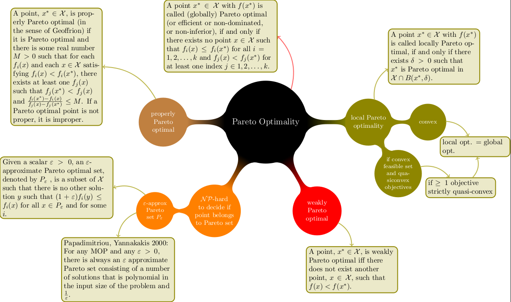

ifdef::env-gitlab[]
include::Manual.attributes[]
include::env-gitlab.attributes[]
{link_home}

toc::[]
endif::[]

[[chp.optimiser]]
[.feature-opal]
== Multi Objective Optimization
include::stylesheets/Toggle[]

Optimization methods deal with finding a feasible set of solutions
corresponding to extreme values of some specific criteria. Problems
consisting of more than one criterion are called _multi-objective
optimization problems_. Multiple objectives arise naturally in many real
world optimization problems, such as portfolio optimization, design,
planning and many more <<bib.pgnl06>>, <<bib.zepv00>>, <<bib.gala98>>, 
<<bib.yrss09>>, <<bib.basi05>>. It is important to stress that
multi-objective problems are in general harder and more expensive to solve
than single-objective optimization problems.

In this chapter we introduce multi-objective optimization problems and
discuss techniques for their solution with an emphasis on evolutionary
algorithms.

NOTE: For multi-objective optimization _OPAL_ uses
`opt-pilot`, developed by Y. Ineichen. `opt-pilot`
has been fully integrated into _OPAL_. The public project-specific wiki
that was previously linked here is no longer available; current usage is
best understood from the _OPAL_ source tree and optimization examples.

[[sec.optimiser.definition]]
=== Definition

As with single-objective optimization problems, multi-object
optimization problems consist of a solution vector and optionally a
number of equality and inequality constraints. Formally, a general
multi-objective optimization problem has the form

[latexmath]
++++
\begin{aligned}
  \mathrm{min}  \quad & \quad f_m(\mathbf{x}),        & m &= \{1, \ldots, M\} \\
  \mathrm{subject\, to} \quad & \quad g_j(\mathbf{x}) \geq 0, & j &= \{1, \ldots, J\} \\
  \quad & \quad  -\infty \leq x_i^L \leq \mathbf{x}=x_i \leq x_i^U \leq \infty,& i &= \{0, \ldots, n \}.
\end{aligned}
++++

The latexmath:[M] objectives are minimized, subject to latexmath:[J]
inequality constraints. An latexmath:[n]-vector contains all the
design variables with appropriate lower and upper bounds, constraining
the design space.

In contrast to single-objective optimization the objective functions
span a multi-dimensional space in addition to the design variable space
– for each point in design space there exists a point in objective
space. The mapping from the latexmath:[n] dimensional design space to
the latexmath:[M] dimensional objective space visualized in
<<fig_des_to_obj>> is often non-linear. This impedes the search for
optimal solutions and increases the computational cost as a result of
expensive objective function evaluation. Additionally, depending in
which of the two spaces the algorithm uses to determine the next step,
it can be difficult to assure an even sampling of both spaces
simultaneously.

.The (often non-linear) mapping latexmath:[f : \mathbb{R}^n \rightarrow \mathbb{R}^M] from design to objective space. The dashed lines represent the constraints in design space and the set of solutions (Pareto front) in objective space.
[[fig_des_to_obj,Figure {counter:fig-cnt}]]
image::figures/optimiser/design_objective_space.png[scaledwidth=10cm,width=70%]

A special subset of multi-objective optimization problems where all
objectives and constraints are linear, called _Multi-objective linear
programs_, exhibit formidable theoretical properties that facilitate
convergence proofs. In this thesis we strive to address arbitrary
multi-objective optimization problems with non-linear constraints and
objectives. No general convergence proofs are readily available for
these cases.

[[sec.optimiser.pareto-optimality]]
=== Pareto Optimality

In most multi-objective optimization problems we have to deal with
conflicting objectives. Two objectives are conflicting if they possess
different minima. If all the mimima of all objectives coincide the
multi-objective optimization problem has only one solution. To
facilitate comparing solutions we define a partial ordering relation on
candidate solutions based on the concept of dominance. A solution is
said to dominate another solution if it is no worse than the other
solution in all objectives and if it is strictly better in at least one
objective. A more formal description of the dominance relation is given
in <<bib.deb09>>.

The properties of the dominance relation include transitivity

[latexmath]
++++
x_1 \preceq x_2 \wedge x_2 \preceq x_3 \Rightarrow x_1 \preceq x_3 ,
++++

and asymmetricity, which is necessary for an unambiguous order relation

[latexmath]
++++
x_1 \preceq x_2 \Rightarrow x_2 \npreceq x_1 .
++++

Using the concept of dominance, the sought-after set of Pareto optimal
solution points can be approximated iteratively as the set of
non-dominated solutions.

The problem of deciding if a point truly belongs to the Pareto set is
NP-hard. As shown in <<fig_pareto-def>> there exist "weaker"
formulations of Pareto optimality. Of special interest is the result
shown in <<bib.paya01>>, where the authors present a polynomial (in the input
size of the problem and latexmath:[1/\varepsilon]) algorithm for
finding an approximation, with accuracy latexmath:[\varepsilon], of
the Pareto set for database queries.

.Various definitions regarding Pareto optimality.
[[fig_pareto-def,Figure {counter:fig-cnt}]]



[[sec.optimiser.opt-MOGA-theory]]
=== MOGA Theory

Some links to "What is the tradeoff between population size and the number of generations in genetic algorithms":

1. https://cstheory.stackexchange.com/questions/5156/what-is-the-tradeoff-between-population-size-and-the-number-of-generations-in-ge

2. https://www.researchgate.net/post/What_is_the_optimal_recommended_population_size_for_differential_evolution2

3. http://ieeexplore.ieee.org/stamp/stamp.jsp?arnumber=1688360


[[sec.optimiser.opt-pilot-commands]]
=== Optimiser OPAL Commands

==== Basic Syntax

One needs to define the design variables, objectives and constraints one by one:

```
d1: DVAR, VARIABLE="x1", LOWERBOUND=-1.0, UPPERBOUND=1.0;
d2: DVAR, VARIABLE="x2", LOWERBOUND=-1.0, UPPERBOUND=1.0;
d3: DVAR, VARIABLE="x3", LOWERBOUND=-1.0, UPPERBOUND=1.0;
```

This defines three design variables named `d1`, `d2` and `d3`.
For every variable name e.g. `x1` a corresponding variable with underscores `$$_x1_$$` has to exist in the template input file,
see also the example input file.
////
The variables `d1`, `d2` and `d3` can be used in objectives and constraints.
////
Bounds for design variables should always be given.

```
obj1: OBJECTIVE, EXPR="-statVariableAt('energy', 1.0)";
obj2: OBJECTIVE, EXPR="statVariableAt('emit_x', 1.0)";
```

This defines two objectives named `obj1` and `obj2` maximizing the energy and minimizing the emittance in x-direction. The function `statVariableAt` accecpts as first argument the name of a variable form the `.stat` output file. As second argument it accepts the location where the variable should be evaluated in s-coordinates.
The optimiser knows several mathematical functions and methods to access output files (see below).

Note that objectives are always minimised, so in this case a solution where the final energy is maximal and the final horizontal emittance is minimal is looked for.

```
con1: CONSTRAINT, EXPR="statVariableAt('rms_x', 1.0) < 1.0";
con2: CONSTRAINT, EXPR="statVariableAt('numParticles', 1.0) > 1000";
```

This defines two constraints. The syntax is similar to the `OBJECTIVE` syntax.

The first constraint consists of only design variables and will be evaluated before the simulation.
The second constraint will be evaluated after the simulation.

==== OPTIMIZE Command

The `OPTIMIZE` command initiates optimization.

.Attributes for the `OPTIMIZE` command.
[[tab_OPTIMIZE_Attributes,Table {counter:tab-cnt}]]
[cols="<1,<2",options="header",]
|=======================================================================
| Attribute                   | Description
| `INPUT`                     | Path to input file.
| `OUTPUT`                    | Name used in output file generation.
| `OUTDIR`                    | Name of directory used to store generation output files.
| `OBJECTIVES`                | List of objectives to be used.
| `DVARS`                     | List of optimization variables to be used.
| `CONSTRAINTS`               | List of constraints to be used.
| `INITIALPOPULATION`         | Size of the initial population.
| `STARTPOPULATION`           | A generation file (JSON format) to be started from (optional).
                                In case the number of individuals of the provided file is lower than `INITIALPOPULATION`, it creates the remaining individuals randomly within the bounds of the DVARS.
                                In case the number of individuals is greater it takes the first `INITIALPOPULATION` individuals.
| `NUM_MASTERS`               | Number of master nodes.
| `NUM_COWORKERS`             | Number processors per worker.
| `DUMP_DAT`                  | Dump old generation data format with frequency, default: false.
| `DUMP_FREQ`                 | Dump generation data format with frequency, default: 1
| `DUMP_OFFSPRING`            | Dump offspring (instead of parent population), default: true.
| `NUM_IND_GEN`               | Number of individuals in a generation.
| `MAXGENERATIONS`            | Number of generations to run.
| `EPSILON`                   | Tolerance of hypervolume criteria, default: 0.001.
| `EXPECTED_HYPERVOL`         | The reference hypervolume, default: 0.
| `HYPERVOLREFERENCE`         | The reference point (real array) for the hypervolume, default: origin.
| `CONV_HVOL_PROG`            | Converge if change in hypervolume is smaller, default: 0.
| `ONE_PILOT_CONVERGE`        | default: false
| `SOL_SYNCH`                 | Solution exchange frequency, default: 0.
| `INITIAL_OPTIMIZATION`      | Optimize speed of first generation creation (useful when number of infeasible solutions large), default: false
| `BIRTH_CONTROL`             | Enforce strict population sizes, default: false.
                                If true, population sizes and generations are strictly as defined by `INITIALPOPULATION`, `NUM_IND_GEN` and the classic genetic algorithm.
                                If false, optimisation is done to keep all workers busy at all times. This means that population sizes can be larger (in case `INITIAL_OPTIMIZATION` is true) and individuals might have been created in a previous generation.
| `MUTATION_PROBABILITY`      | Mutation probability of individual, default: 0.5.
| `MUTATION`                  | Mutation type of an individual (`ONEBIT` (single gene), `INDEPENDENTBIT` (default, multiple genes)).
| `GENE_MUTATION_PROBABILITY` | Mutation probability of single gene (used in `INDEPENDENTBIT` mutation only), default: 0.5.
| `RECOMBINATION_PROBABILITY` | Probability for individuals to combine (crossover), default: 0.5.
| `CROSSOVER`                 | Method of child generation based on two individuals (`BLEND` (default), `NAIVEONEPOINT`, `NAIVEUNIFORM` or `SIMULATEDBINARY`)
| `SIMBIN_CROSSOVER_NU`       | Simulated binary crossover parameter latexmath:[\nu], default: 2.0.
| `SIMTMPDIR`                 | Directory where simulations are run.
| `TEMPLATEDIR`               | Directory where templates are stored.
| `FIELDMAPDIR`               | Directory where field maps are stored.
| `DISTDIR`                   | Directory where distributions are stored (optional).
| `RESTART_FILE`              | H5 file to restart the _OPAL_ simulations from (optional).
                                Each individual copies the H5 to its simulation directory in
                                order to avoid overwriting of the original file. This attributes
                                is used together with `RESTART_STEP`.
| `RESTART_STEP`              | Restart from given H5 step (optional). Used together with `RESTART_FILE`.
|=======================================================================

[[sec.optimiser.dvar-command]]
==== DVAR Command

The `DVAR` command defines a variable for optimization.

.Attributes for the command `DVAR`.
[[tab_DVAR_Attributes,Table {counter:tab-cnt}]]
[cols="<2,<5",options="header",]
|=======================================================================
|Attribute     | Description
| `VARIABLE`   | Variable name that should be varied during optimization.
| `LOWERBOUND` | Lower limit of the range of values that the variable should assume.
| `UPPERBOUND` | Upper limit of the range of values that the variable should assume.
|=======================================================================

==== OBJECTIVE Command

The `OBJECTIVE` command defines an objective for optimization.

.Attributes for the command `OBJECTIVE`.
[[tab_OBJECTIVE_Attributes,Table {counter:tab-cnt}]]
[cols="<2,<5",options="header",]
|=======================================================================
|Attribute | Description
| `EXPR`   | Expression to minimize during optimization.
|=======================================================================

==== CONSTRAINT Command

The `CONSTRAINT` command defines a constraint for optimization.

.Attributes for the command `CONSTRAINT`.
[[tab_CONSTRAINT_Attributes,Table {counter:tab-cnt}]]
[cols="<2,<5",options="header",]
|=======================================================================
|Attribute | Description
| `EXPR`   | Expression that should be fulfilled during optimization.
|=======================================================================


==== Available Expressions
The following expressions are available:

The `EXPR` The optimiser parser knows the following mathematical functions
(which are mapped directly to the STL <cmath> functions with the same name):

* `sqrt(x)`  : square root of x
* `pow(x,k)` : x to the power k
* `exp(x)`   : _e_ to the power x
* `log(x)`   : natural logarithm of x
* `ceil(x)`  : round x upward to the smallest integral value that is not less than x
* `floor(x)` : round x downward to smallest integral value that is not greater than x
* `fabs(x)`  : absolute value of x
* `fmod(x,y)`: floating point remainder of x/y
* `sin(x)`   : sine of angle x (in radians)
* `asin(x)`  : the arcsin of x (return value in radians)
* `cos(x)`   : cosine of angle x (in radians)
* `acos(x)`  : the arc cosine of x (return value in radians)
* `tan(x)`   : tangent of angle x (in radians)
* `atan(x)`  : the arc tangent of x (return value in radians)

In addition the optimiser parser has one non-STL function:

* `sq(x)`    : square of x

There are several methods to access output data:

.Available functions for the `EXPR` attributes for `OBJECTIVE` and `CONSTRAINT`.
[[tab_EXPR_functions,Table {counter:tab-cnt}]]
[cols="<3,<5",options="header,breakable",]
|=======================================================================
| Function         | Description

| fromFile(<file>)
| Simple functor that reads vector data from a file. If the file
  contains more than one value the sum is returned.

| sddsVariableAt(<var>, <refpos>, <sdds_file>)

  sddsVariableAt(<var>, <refvar>, <refpos>, <sdds_file>)
| A simple expression to get SDDS value near a specific position <refpos> of <refvar>
  (default: spos) for a variable <var>.
  If another <refvar> is provided, the values should be monotonically increasing.

| statVariableAt(<var>, <refpos>)

  statVariableAt(<var>, <refvar>, <refpos>)
| The same as `sddsVariableAt`, uses OPALs statistics file.

| sumErrSq(<meas_file>, <var_name>, <sdds_file>)
| A simple expression computing the sum of all measurement errors
  (given as first and third argument) for a variable (second argument)
  according to latexmath:[result = \frac{1}{n} * \sqrt{\sum_{i=0}^n
  (measurement_i - value_i)^2}]

| radialPeak(<file>, <turn>)
| A simple expression to get the n-th peak of a radial probe {link_RRI2_0038Y1}.

| sumErrSqRadialPeak(<meas_file>, <sim_file>, <begin>, <end>)
| A simple expression computing the sum of all peak errors (given as
  first and second argument) for a range of peaks (third argument and
  fourth argument) latexmath:[result = \frac{1}{n} *
  \sqrt{\sum_{i=start}^{end} (measurement_i - value_i)^2}]

| probVariableWithID(<var>, <id>, <probe_file>)

| Returns the value of the variable (first argument) with a certain ID
  (second argument) from
  <<sec.elements.probe-opal-cycl,probe>> loss file (third
  argument).

| septum(<probe>)

| Returns the minimum bin count between the last and second last turn at the
  given probe. It uses the _<probe>.hist_ and _<probe>.peaks_ file
  (cf. <<sec.elements.probe-opal-cycl,Probe element>>).

|=======================================================================

==== Example Input File

.Example input file `05-DL_QN3.in` for the optimization using the template file `tmpl/05-DL_QN3.tmpl`:
----
OPTION, ECHO=FALSE;
OPTION, INFO=TRUE;

TITLE, STRING="OPAL Test MAB, 2016-10-13";

REAL up = 0.0000977;
REAL loc = 2.0;

dv0: DVAR, VARIABLE="QDX1_K1", LOWERBOUND=0, UPPERBOUND=35;
dv1: DVAR, VARIABLE="QDX2_K1", LOWERBOUND=0, UPPERBOUND=34;
dv2: DVAR, VARIABLE="QFX1_K1", LOWERBOUND=-35, UPPERBOUND=0;

drmsx:   OBJECTIVE, EXPR="fabs(statVariableAt('rms_x', ${loc}) - ${up})";
drmsy:   OBJECTIVE, EXPR="fabs(statVariableAt('rms_y', ${loc}) - 0.0001833)";
goalfun: OBJECTIVE, EXPR="statVariableAt('rms_x', 2.00)";

OPTIMIZE, INPUT="tmpl/05-DL_QN3.tmpl", OBJECTIVES = {drmsx, drmsy, goalfun},
          DVARS = {dv0, dv1, dv2}, INITIALPOPULATION=5, MAXGENERATIONS=3,
          NUM_IND_GEN=3, MUTATION_PROBABILITY=0.43,
          NUM_MASTERS=1, NUM_COWORKERS=1, SIMTMPDIR="simtmpdir",
          TEMPLATEDIR="tmpl", FIELDMAPDIR="fieldmaps", OUTPUT="optLinac",
          OUTDIR="results";

QUIT;
----

.Template file `tmpl/05-DL_QN3.tmpl`. Note that the design variables start and end with underscores:
----
OPTION, ECHO=FALSE;
OPTION, INFO=FALSE;
OPTION, PSDUMPFREQ=1000000;
OPTION, STATDUMPFREQ=20;
OPTION, CZERO=TRUE;
OPTION, IDEALIZED=TRUE;
OPTION, VERSION=10900;

TITLE, STRING="OPAL Test MAB, 2016-10-13";

//////////////////////////////
// Begin Content
//////////////////////////////

REAL SOL  = 2.9979246E8;
REAL Pcen = 100.0E6;
REAL BRho = Pcen/SOL;
REAL QK1  = 6.2519;
REAL QSTR = QK1*BRho/2.0;

QDX1: QUADRUPOLE, ELEMEDGE=0.0,  L=0.10, APERTURE="circle(0.1)",
                 K1=_QDX1_K1_ * BRho / 2;
QFX1: QUADRUPOLE, ELEMEDGE=0.91, L=0.20, APERTURE="circle(0.1)",
                 K1=_QFX1_K1_ * BRho / 2;
QDX2: QUADRUPOLE, ELEMEDGE=1.92, L=0.10, APERTURE="circle(0.1)",
                 K1=_QDX2_K1_ * BRho / 2;

FODO: LINE = (QDX1, QFX1, QDX2);

//////////////////////////////
// Begin Summary
//////////////////////////////

FODO_Full: LINE = (FODO), ORIGIN={0,0,0}, ORIENTATION={0.0, 0.0, 0.0};

//////////////////////////////
// End Summary
//////////////////////////////

// SC calculations on:
Fs1:FIELDSOLVER, FSTYPE = FFT, MX = 16, MY = 16, MT = 16,
                  PARFFTX = true, PARFFTY = true, PARFFTT = true,
                  BCFFTX = open, BCFFTY = open, BCFFTT = open,
                  BBOXINCR = 1, GREENSF = INTEGRATED;
Fs2:FIELDSOLVER, FSTYPE = NONE, MX = 16, MY = 16, MT = 16,
                 PARFFTX = true, PARFFTY = true, PARFFTT = true,
                 BCFFTX = open, BCFFTY = open, BCFFTT = open,
                 BBOXINCR = 1, GREENSF = INTEGRATED;


Dist2: DISTRIBUTION, TYPE="FROMFILE", FNAME="fodo_opal.in";


REAL MINSTEPFORREBIN = 500;

REAL qb=77.0e-12;
REAL bfreq=1300.0E6;
REAL bcurrent=qb*bfreq;

beam1: BEAM, PARTICLE = ELECTRON, pc = P0, NPART = 5000, BFREQ = bfreq,
             BCURRENT = bcurrent, CHARGE = -1;

SELECT, LINE=FODO_Full;

TRACK, LINE=FODO_Full, BEAM=beam1, MAXSTEPS={6e5}, DT={1e-12}, ZSTOP={2.02};

RUN, METHOD = "PARALLEL-T", BEAM = beam1, FIELDSOLVER = Fs2, DISTRIBUTION = Dist2;

ENDTRACK;

QUIT;
----

Run _OPAL_ with:

```
mpirun /path/to/opal --info 5 05-DL_QN3.in
```

// EOF

==== Output

The solutions for each generation will be saved in either a plain ASCII
(if `DUMP_DAT` true) and JSON format. The Pareto front of all individuals
is in a JSON file, `ParetoFront_.json`. There are three log files `opt.trace.0`,
`opt-progress.0` and `pilot.trace.0` that log the job management.
E.g. to count the total number of dispatched simulations:

```
cat opt.trace.0 | grep dispatched | wc -l
```

or to count all invalid simulations:

```
cat opt.trace.0 | grep invalid | wc -l
```

[.feature-opalx]
This feature is not yet avaidable in OPALX.


[[sec.optimiser.bibliography]]
=== References

anchor:bib.pgnl06[[{counter:bib-cnt}\]]
<<bib.pgnl06>> A. Persson et al., https://ieeexplore.ieee.org/document/4117810[_Simulation-based multi-objective optimization of a real-world scheduling problem_], in Proceedings of the 38th conference on Winter Simulation Conference (WSC’06), pp. 1757–1764 (Monterey, CA, USA, 2006).

anchor:bib.zepv00[[{counter:bib-cnt}\]]
<<bib.zepv00>> R. Zebulum, M. Pacheco, and M. Vellasco, _A novel multi-objective optimization methodology applied to the synthesis of cmos operational amplifiers_, J. Solid-State Dev. and Circ., pp. 10-15 (2000).

anchor:bib.gala98[[{counter:bib-cnt}\]]
<<bib.gala98>> M. Galante, https://onlinelibrary.wiley.com/doi/10.1002/(SICI)1097-0207(19960215)39:3%3C361::AID-NME854%3E3.0.CO;2-1[_Genetic algorithms as an approach to optimize real-world trusses_], Int. J. Numer. Methods Eng., 39, 361 (1998).

anchor:bib.yrss09[[{counter:bib-cnt}\]]
<<bib.yrss09>> L. Yang et al., https://www.sciencedirect.com/science/article/pii/S0168900209016040[_Global optimization of an accelerator lattice using multiobjective genetic algorithms_], Nucl. Instrum. Methods. Phys. Res. A, 609, 50 (2009).

anchor:bib.basi05[[{counter:bib-cnt}\]]
<<bib.basi05>> I. Bazarov and C. Sinclair, https://journals.aps.org/prab/pdf/10.1103/PhysRevSTAB.8.034202[_Multivariate optimization of a high brightness dc gun photoinjector_], Phys. Rev. ST Accel. Beams, 8, 034202 (2005).

anchor:bib.deb09[[{counter:bib-cnt}\]]
<<bib.deb09>> K. Deb, _Multi-Objective Optimization Using Evolutionary Algorithms_, Wiley (2009).

anchor:bib.paya01[[{counter:bib-cnt}\]]
<<bib.paya01>> C. Papadimitriou and M. Yannakakis, https://dl.acm.org/doi/10.1145/375551.375560[_Multiobjective query optimization_], in Proceedings of the twentieth ACM SIGMOD-SIGACT-SIGART symposium on Principles of database systems, pp. 52–59 (Santa Barbara, CA, USA, 2001).
