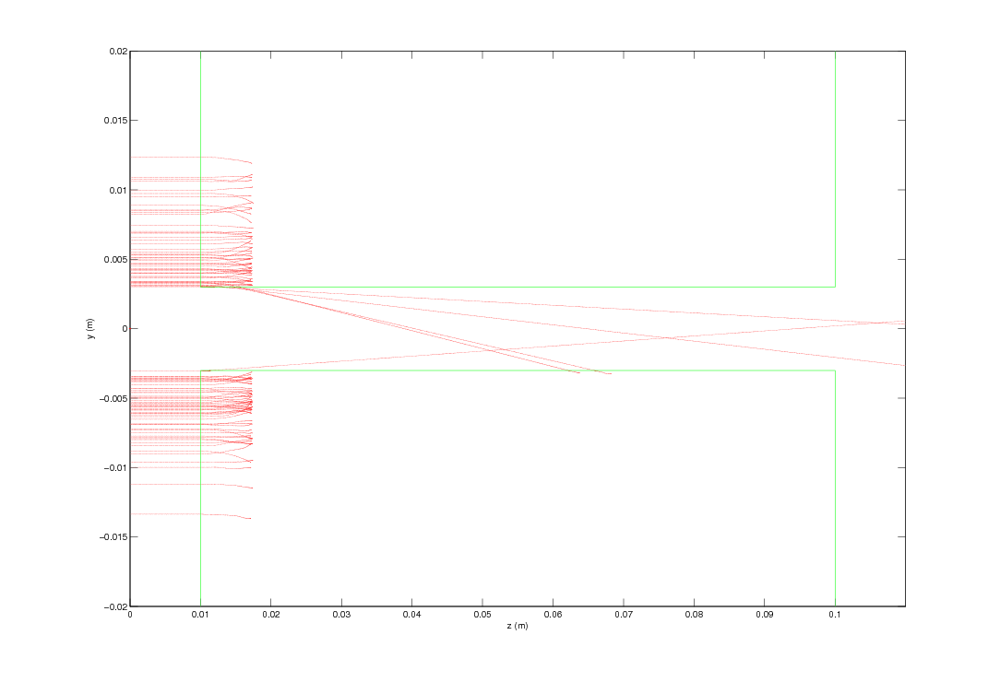
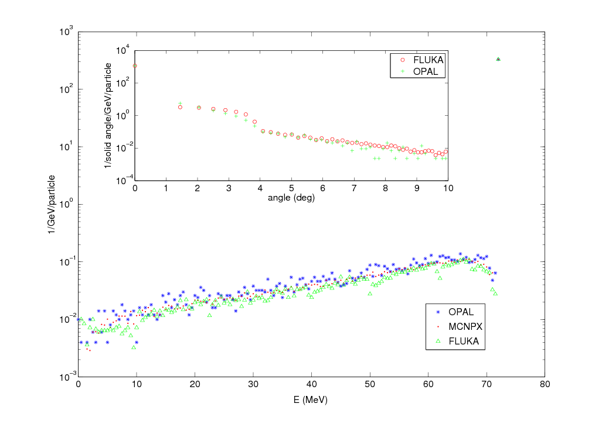

ifdef::env-gitlab[]
include::Manual.attributes[]
include::env-gitlab.attributes[]
{link_home}

toc::[]
endif::[]

[[chp.partmatter]]
== Physics Models Used in the Particle Matter Interaction Model
include::stylesheets/Toggle[]

The command to define particle-matter interactons is
`PARTICLEMATTERINTERACTION`.

TYPE::
  Specifies the particle-matter interaction handler.
  Currently, there are the two following implemented methods:
  `SCATTERING` for physical processes of beam scattering and energy loss
  by heavy charged particles and `BEAMSTRIPPING` for interactions
  with residual gas and Lorentz stripping.
MATERIAL::
  The material of the surface (see <<sec.partmatter.available-materials-in-opal,Available Materials in _OPAL_>>).
ENABLERUTHERFORD::
  Switch to disable Rutherford scattering (default: true).
LOWENERGYTHR::
  Low-energy threshold [MeV] for energy loss calculation.
  Particles with lower energy will be removed (default: 0.01 MeV). 

The so defined instance has then to be added to an element using the
attribute.

[[sec.partmatter.the-energy-loss]]
=== The Energy Loss

The energy loss is simulated using the Bethe-Bloch equation.

[latexmath]
++++
-\frac{\mathrm{d} E}{\mathrm{d} x}=\frac{K z^2 Z}{A \beta^2}\left[\frac{1}{2} \ln{\frac{2 m_e c^2\beta^2 \gamma^2 Tmax}{I^2}}-\beta^2 \right],
++++

where latexmath:[Z] is the atomic number of absorber, latexmath:[A]
is the atomic mass of absorber, latexmath:[m_e] is the electron mass,
latexmath:[z] is the charge number of the incident particle,
latexmath:[K=4\pi N_Ar_e^2m_ec^2], latexmath:[r_e] is the classical
electron radius, latexmath:[N_A] is the Avogadro’s number,
latexmath:[I] is the mean excitation energy. latexmath:[\beta] and
latexmath:[\gamma] are kinematic variables. latexmath:[T_{max}] is
the maximum kinetic energy which can be imparted to a free electron in a
single collision.

[latexmath]
++++
T_{max}=\frac{2m_ec^2\beta^2\gamma^2}{1+2\gamma m_e/M+(m_e/M)^2},
++++

where latexmath:[M] is the incident particle mass.

This expression is valid for energies from 600 keV to 10 GeV for 
incident beams (see <<sec.beam-command.particle-definition,`PARTICLE` definition>>)
of `PROTON`, `DEUTERON`, `MUON`, `HMINUS` and `H2P`;
and also for `ALPHA` particles from 10 MeV to 1 GeV.

The stopping power is compared with PSTAR program of NIST in
<<fig_PSTAR>>.

.The comparison of stopping power with PSTAR.
[[fig_PSTAR,Figure {counter:fig-cnt}]]
image::figures/partmatter/dEdx.png[scaledwidth=12cm,width=70%]

The energy loss in the low-energy region is calculated using
semi-empirical fitting formulas of Andersen and Ziegler <<bib.icru49>>.

[latexmath]
++++
-\frac{\mathrm{d} E}{\mathrm{d} x}=10^{-21}\frac{N_A}{A} \cdot \epsilon,
++++

where the energy loss is in MeV cm^2/g and latexmath:[\epsilon] is 
a fitted function of the stopping cross section.

[latexmath]
++++
\epsilon = \frac{\epsilon_{low}\cdot\epsilon_{high}}{\epsilon_{low}+\epsilon_{high}}
++++

In case of incident protons in the material for energies from 10 keV to 600 keV,
the fitting functions are given by:

[latexmath]
++++
\epsilon_{low} = A2 \cdot T_s^{0.45}
++++

[latexmath]
++++
\epsilon_{high} = \frac{A3}{T_s} \ln{\left(1 + \frac{A4}{T_s} + A5 \cdot T_s\right)}
++++

where latexmath:[T_s] is the kinetic energy (in keV) divided by
the proton mass (in amu). For latexmath:[T_s] between 1 and 10 keV,
the fitted function is given by:

[latexmath]
++++
\epsilon = A1 \cdot T_s^{0.5}
++++

In case of incident alpha particles for energies from 1 keV to 10 MeV,
the stopping power functions is expressed as:

[latexmath]
++++
\epsilon_{low} = B1\cdot(1000T)^{B2}
++++

[latexmath]
++++
\epsilon_{high} = \frac{B3}{T} \ln{\left(1 + \frac{B4}{T} + B5 \cdot T\right)}
++++

where latexmath:[T] is the kinetic energy in MeV. The numerical values
of coefficients of the empirical formulas are showed in <<tab_AZ_coeff>>.

The particles lost due to excessive energy loss (final energy null
or lower than `LOWENERGYTHR`) are recorded in a HDF5 file
(or ASCII if <<sec.control.option,`ASCIIDUMP`>> is true).
The loss file name is compound by the associated element name
and the `PARTICLEMATTERINTERACTION` name.

Energy straggling: For relatively thick absorbers such that the number
of collisions is large, the energy loss distribution is shown to be
Gaussian in form. For non-relativistic heavy particles the spread
latexmath:[\sigma_0] of the Gaussian distribution is calculated by:

[latexmath]
++++
\sigma_0^2=4\pi N_Ar_e^2(m_ec^2)^2\rho\frac{Z}{A}\Delta s,
++++

where latexmath:[\rho] is the density, latexmath:[\Delta s] is the
thickness.

[[sec.partmatter.the-coulomb-scattering]]
=== The Coulomb Scattering

The Coulomb scattering is treated as two independent events: the
multiple Coulomb scattering and the large angle Rutherford scattering.
Using the distribution given in Classical Electrodynamics, by J. D.
Jackson <<bib.jackson>>, the multiple- and single-scattering distributions
can be written: 

[latexmath]
++++
P_M(\alpha) \;\mathrm{d} \alpha=\frac{1}{\sqrt{\pi}}e^{-\alpha^2}\;\mathrm{d}\alpha,
++++

[latexmath]
++++
P_S(\alpha) \;\mathrm{d} \alpha=\frac{1}{8 \ln(204 Z^{-1/3})} \frac{1}{\alpha^3}\;\mathrm{d}\alpha,
++++

where
latexmath:[\alpha=\frac{\theta}{<\Theta^2>^{1/2}}=\frac{\theta}{\sqrt 2 \theta_0}].

The transition point is
latexmath:[\theta=2.5 \sqrt 2 \theta_0\approx3.5 \theta_0],

[latexmath]
++++
\theta_0=\frac{{13.6}{MeV}}{\beta c p} z \sqrt{\Delta s/X_0} [1+0.038 \ln(\Delta s/X_0)],
++++

where latexmath:[p] is the momentum, latexmath:[\Delta s] is the
step size, and latexmath:[X_0] is the radiation length.

[[sec.partmatter.multiple-coulomb-scattering]]
==== Multiple Coulomb Scattering

Generate two independent Gaussian random variables with mean zero and
variance one: latexmath:[z_1] and latexmath:[z_2]. If
latexmath:[z_2 \theta_0>3.5 \theta_0], start over. Otherwise,

[latexmath]
++++
x=x+\Delta s p_x+z_1 \Delta s \theta_0/\sqrt{12}+z_2 \Delta s \theta_0/2,
++++

[latexmath]
++++
p_x=p_x+z_2 \theta_0.
++++

Generate two independent Gaussian random
variables with mean zero and variance one: latexmath:[z_3] and
latexmath:[z_4]. If latexmath:[z_4 \theta_0>3.5 \theta_0], start
over. Otherwise, 

[latexmath]
++++
y=y+\Delta s p_y+z_3 \Delta s \theta_0/\sqrt{12}+z_4 \Delta s \theta_0/2,
++++

[latexmath]
++++
p_y=p_y+z_4 \theta_0.
++++

[[sec.partmatter.large-angle-rutherford-scattering]]
==== Large Angle Rutherford Scattering

Generate a random number latexmath:[\xi_1], _if_
latexmath:[\xi_1 < \frac{\int_{2.5}^\infty P_S(\alpha)d\alpha}{\int_{0}^{2.5} P_M(\alpha)\;\mathrm{d}\alpha+\int_{2.5}^\infty P_S(\alpha)\;\mathrm{d}\alpha}=0.0047],
sampling the large angle Rutherford scattering.

The cumulative distribution function of the large angle Rutherford
scattering is 

[latexmath]
++++
F(\alpha)=\frac{\int_{2.5}^\alpha P_S(\alpha) \;\mathrm{d} \alpha}{\int_{2.5}^\infty P_S(\alpha) \;\mathrm{d} \alpha}=\xi,
++++

where latexmath:[\xi] is a random variable. So

[latexmath]
++++
\alpha=\pm 2.5 \sqrt{\frac{1}{1-\xi}}=\pm 2.5 \sqrt{\frac{1}{\xi}}.
++++

Generate a random variable latexmath:[P_3], +
_if_ latexmath:[P_3>0.5]

[latexmath]
++++
\theta_{Ru}=2.5 \sqrt{\frac{1}{\xi}} \sqrt{2}\theta_0,
++++

_else_

[latexmath]
++++
\theta_{Ru}=-2.5 \sqrt{\frac{1}{\xi}} \sqrt{2}\theta_0.
++++

The angle distribution after Coulomb scattering is shown in
<<fig_Jackson>>. The line is from Jackson’s formula, and the points are
simulations with Matlab. For a thickness of latexmath:[\Delta s=1e-4]
latexmath:[m], latexmath:[\theta=0.5349 \alpha] (in degree).

.The comparison of Coulomb scattering with Jackson’s book.
[[fig_Jackson,Figure {counter:fig-cnt}]]
image::figures/partmatter/10steps.png[scaledwidth=12cm,width=70%]

[[sec.partmatter.beam-stripping-physics]]
=== Beam Stripping physics

Beam stripping physics takes into account two different physical
processes: interaction with residual gas and electromagnetic stripping
(also called Lorentz stripping). Given the stochastic nature of
such interactions, the processes are modeled as a Monte Carlo method.

Both processes are described in the same way:
Assuming that particles are normally incident on a homogeneous medium
and that they are subjected to a process with a mean free path
latexmath:[\lambda] between interactions, the probability of suffering
an interaction before reaching a path length latexmath:[x] is:

[latexmath]
++++
P(x) = 1 - e^{-x/\lambda}
++++

where latexmath:[P(x)] is the statistic cumulative interaction
probability of the process.

<<fig_BstpPhysics>> summarizes the iterative steps evaluated by the algorithm.

.The diagram of BeamStrippingPhysics in _OPAL_.
[[fig_BstpPhysics,Figure {counter:fig-cnt}]]
image::figures/partmatter/OPALBSTP_flowchart.jpeg[{fig-width-default}]

[[sec.partmatter.residual-gas-interaction]]
==== Residual gas interaction

The mean free path of the interaction is related with the density of
interaction centers and the cross section: latexmath:[\lambda=1/N\sigma].
Assuming a beam flux incident in an ideal gas with density latexmath:[N]
(number of gas molecules per unit volume under the vacuum condition),
the number of particles interacting depends on the gas composition and
the different reactions to be considered. Thus, in agreement with
Dalton's law of partial pressures:

[latexmath]
++++
\frac{1}{\lambda_{total}}=\sum \frac{1}{\lambda_k}=N_{total}\cdot\sigma_{total}=\sum_jN_j\,\sigma^{j}_{total}=\sum_j\left(\sum_iN_j\,\sigma^{j}_{i}\right)
++++

where the first summation is over all gas components and the second
summation is over all processes for each component.

The fraction loss of the beam for unit of travelled length is:
latexmath:[f_g=1-e^{-\delta _s /\lambda_{total}}]. For a individual
particle, latexmath:[f_g] represents the interaction probability
and it is evaluated through an independent random variable
each step latexmath:[\delta _s].

Gas stripping could be applied for four different types of incoming
particles: negative hydrogen ions (`HMINUS`), protons
(`PROTON`), neutral hydrogen atoms (`HYDROGEN`), hydrogen
molecule ions (`H2P`) and deuterons (`DEUTERON`). Single / Double - electron
detachment or capture reactions are considered for each of them.

Cross sections are calculated according to energy of the particle employing
analytic expressions fitted to cross section experimental data. The suitable
function is selected in each case according to the type of incident particle
and the residual gas under consideration. There are different fitting expressions:

 *** Nakai function <<bib.nakai>>

[latexmath]
++++
\sigma_{qq'} = \sigma_0 \left[ f(E_1) + a_7\!\cdot\!f(E_1/a_8) \right]
++++

[latexmath]
++++
f(E) = \frac{ a_1\!\cdot\!\left(\!\displaystyle\frac{E}{E_R}\!\right)^{\!a_2} }{ 1+\left(\!\displaystyle\frac{E}{a_3}\!\right)^{\!a_2+a_4}\!\!+\left(\!\displaystyle\frac{E}{a_5}\!\right)^{\!a_2+a_6} }
++++

[latexmath]
++++
E_R = hcR_{\infty}\!\cdot\!\frac{m_H}{m_e}
++++

[latexmath]
++++
E_1 = E_0 - E_{th}
++++

where latexmath:[\sigma_0] is a convenient cross section unit
(latexmath:[\sigma_0 = 1\cdot 10^{-16}\,\text{cm}^2]), latexmath:[E_0] is the
incident projectile energy in keV, latexmath:[E_{th}] is the threshold energy
of reaction in keV, and the symbols latexmath:[a_i] denote adjustable parameters.

 *** Tabata function <<bib.tabata>>: A linear combination of the Nakai function,
latexmath:[f(E)], improved and fitted with a greater number of experimental data
and considering more setting parameters. The enhancement of the function makes it
possible to extrapolate the cross section data to some extent.

 *** Barnett function <<bib.barnett>>:

[latexmath]
++++
\ln{[\sigma(E)]}=\frac{1}{2}a_0 + \sum_{i=1}^{k} a_i \cdot T_i(X)
++++

[latexmath]
++++
X=\frac{(\ln{E}-\ln{E_{min}})-(\ln{E_{max}}-\ln{E})}{\ln{E_{max}}-\ln{E_{min}}}
++++

where latexmath:[T_i] are the Chebyshev orthogonal polynomials.

*** Bohr function <<bib.betz>>:

[latexmath]
++++
\sigma =
\left\{\begin{array}{l}
4\pi a_0^2 \displaystyle\frac{z_t+z_t^2}{z_i}\left(\frac{v_0}{v}\right)^2 \hspace{8mm} z_t < 15\\
\\
\pi a_0^2 \displaystyle\frac{z_t^{2/3}}{z_i}\left(\frac{v_0}{v}\right) \hspace{14mm} z_t > 15
\end{array}\right.
++++

where latexmath:[z_i] and latexmath:[z_t] are the charge of the incident
particle and the charge of the target nuclei, latexmath:[a_0] is the Bohr
radius, latexmath:[v_0=e^2/4\pi\varepsilon_0\hslash] is the characteristic
Bohr velocity and latexmath:[v] is the incident particle velocity.

[[sec.partmatter.electromagnetic-stripping]]
==== Electromagnetic stripping

In case of `HMINUS` particles, the second electron is slightly bounded, so
it is relevant to consider the detachement by the magnetic field. The
orthogonal component of the magnetic field to the median plane (read
from `CYCLOTRON` element), produces an electric field according to
Lorentz transformation, latexmath:[E\!=\!\gamma\beta cB]. The fraction
of particles dissociated by the electromagnetic field during a time
step latexmath:[\delta _t] is:

[latexmath]
++++
f_{em}=1-e^{\,-\,\delta _t/\gamma\tau}
++++

where latexmath:[\tau] is the particle lifetime in the rest frame, determined
theoretically <<bib.scherk>>:

[latexmath]
++++
\tau= \frac{4mz_T}{S_0N^2\hslash\,(1+p)^2\left(1-\displaystyle\frac{1}{2k_0z_t}\right)}\cdot\exp\!{\left(\frac{4k_0z_T}{3}\right)}
++++
where latexmath:[z_T\!=\!-\varepsilon_0/eE] is the outer classical turning radius,
latexmath:[\varepsilon_0] is the binding energy, latexmath:[p] is a polarization factor
of the ionic wave function, latexmath:[k_0^2\!=\!2m(-\varepsilon_0)/\hslash^2],
latexmath:[S_{\!0}] is a spectroscopy coefficient, and the normalization constant
is latexmath:[N=(2k_0(k_0+\alpha)(2k_0+\alpha))^{1/2} / \alpha], where
latexmath:[\alpha] is a parameter for the ionic potential function.

The electromagnetic stripping calculation is restricted to _OPAL-cycl_.

[[sec.partmatter.the-substeps]]
=== The _ScatteringPhysics_ Substeps

Small step is needed in the routine of ScatteringPhysics.

If a large step is given in the main input file, in the file
_ScatteringPhysics.cpp_, it is divided by a integer number
latexmath:[n] to make the step size using for the calculation of
scattering physics less than 1.01e-12 s. As shown by
<<fig_CollPhysics>> and <<fig_CollPhysics2>> in the following subsection,
first we track one step for the particles already in the element and the
newcomers, then another (n-1) steps to make sure the particles in the element
experience the same time as the ones in the main bunch.

Now, if the particle leave the element during the (n-1) steps, we
track it as in a drift and put it back to the main bunch when finishing
(n-1) steps.

[[sec.partmatter.the-flow-diagram-of-scatteringphysics-class-in-opal]]
==== The Flow Diagram of _ScatteringPhysics_ Class in OPAL

.The diagram of ScatteringPhysics in _OPAL_.
[[fig_CollPhysics,Figure {counter:fig-cnt}]]
image::figures/partmatter/diagram.png[scaledwidth=16cm,width=70%]

.The diagram of ScatteringPhysics in _OPAL_ (continued). 
[[fig_CollPhysics2,Figure {counter:fig-cnt}]]
image::figures/partmatter/Diagram2.png[scaledwidth=8cm,width=30%]

[[sec.partmatter.available-materials-in-opal]]
=== Available Materials in _OPAL_

Different materials have been implemented in _OPAL_ for scattering interactions
and energy loss calculation. The materials that are supported are listed
in <<tab_List_of_Materials>>, including the atomic number, latexmath:[Z],
the atomic weight, latexmath:[A], the mass density, latexmath:[\rho], 
the radiation lenght, latexmath:[X0], and the mean excitation energy,
latexmath:[I]. In addition, the coefficients of the Andersen-Ziegler
empirical formulas for the stopping power in the
low-energy region are illustrated in <<tab_AZ_coeff>>.

.List of materials with their atomic and nuclear properties <<bib.atomic>> <<bib.pdgdatabase>>.
[[tab_List_of_Materials,Table {counter:tab-cnt}]]
[cols="^2,^1,^1,^1,^1,^1",options="header",]
|=======================================================================
|Material (_OPAL_ Name) |Z |A |latexmath:[\rho] [latexmath:[g/cm^3]] |X0
[latexmath:[g/cm^2]] |I [latexmath:[eV]]

|`Air` |7 |14 |1.205E-3 |36.62 |85.7

|`Aluminum`|13 |26.9815384 |2.699 |24.01 |166.0

|`AluminaAl2O3` |50 |101.9600768 |3.97 |27.94 |145.2

|`Beryllium` |4 |9.0121831 |1.848 |65.19 |63.7

|`BoronCarbide` |26 |55.251 |2.52 |50.13 |84.7

|`Copper` |29 |63.546 |8.96 |12.86 |322.0

|`Gold` |79 |196.966570 |19.32 |6.46 |790.0

|`Graphite` |6 |12.0172 |2.210 |42.7 |78.0

|`GraphiteR6710` |6 |12.0172 |1.88 |42.7 |78.0

|`Kapton` |6 |12 |1.420 |40.58 |79.6

|`Molybdenum` |42 |95.95 |10.22 |9.80 |424.0

|`Mylar` |6.702 |12.88 |1.400 |39.95 |78.7

|`Titanium` |22 |47.867 |4.540 |16.16 |233.0

|`Water` |10 |18.0152 |1 |36.08 |75.0

|=======================================================================

.List of materials with the coefficients of the Andersen-Ziegler empirical formulas for the stopping power in the low-energy region <<bib.icru49>>.
[[tab_AZ_coeff,Table {counter:tab-cnt}]]
[cols="^2,^1,^1,^1,^1,^1,^1,^1,^1,^1,^1",options="header",]
|=======================================================================
|Material (_OPAL_ Name) |A1 |A2 |A3 |A4 |A5 |B1 |B2 |B3 |B4 |B5

|`Air` |2.954 |3.350 |1.683e3 |1.900e3 |2.513e-2 |1.9259 |0.5550 |27.15125 |26.0665 |6.2768

|`Aluminum` |4.154 |4.739 |2.766e3 |1.645e2 |2.023e-2 |2.5 |0.625 |45.7 |0.1 |4.359

|`AluminaAl2O3` |1.187e1 |1.343e1 |1.069e4 |7.723e2 |2.153e-2 |5.4 |0.53 |103.1 |3.931 |7.767

|`Beryllium` |2.248 |2.590 |9.660e2 |1.538e2 |3.475e-2 |2.1895 |0.47183 |7.2362 |134.30 |197.96

|`BoronCarbide` |3.519 |3.963 |6065.0 |1243.0 |7.782e-3 |5.013 |0.4707 |85.8 |16.55 |3.211

|`Copper` |3.969 |4.194 |4.649e3 |8.113e1 |2.242e-2 |3.114 |0.5236 |76.67 |7.62 |6.385

|`Gold` |4.844 |5.458 |7.852e3 |9.758e2 |2.077e-2 |3.223 |0.5883 |232.7 |2.954 |1.05

|`Graphite` |0.0 |2.601 |1.701e3 |1.279e3 |1.638e-2 |3.80133 |0.41590 |12.9966 |117.83 |242.28

|`GraphiteR6710` |0.0 |2.601 |1.701e3 |1.279e3 |1.638e-2 |3.80133 |0.41590 |12.9966 |117.83 |242.28

|`Kapton` |0.0 |2.601 |1.701e3 |1.279e3 |1.638e-2 |3.83523 |0.42993 |12.6125 |227.41 |188.97

|`Molybdenum` |6.424 |7.248 |9.545e3 |4.802e2 |5.376e-3 |9.276 |0.418 |157.1 |8.038 |1.29

|`Mylar` |2.954 |3.350 |1683 |1900 |2.513e-02 |1.9259 |0.5550 |27.15125 |26.0665 |6.2768

|`Titanium` |4.858 |5.489 |5.260e3 |6.511e2 |8.930e-3 |4.71 |0.5087 |65.28 |8.806 |5.948

|`Water` |4.015 |4.542 |3.955e3 |4.847e2 |7.904e-3 |2.9590 |0.53255 |34.247 |60.655 |15.153

|=======================================================================

[[sec.partmatter.example-of-an-input-file]]
=== Example of an Input File

link:examples/particlematterinteraction.in[particlematterinteraction.in]

FX5 is a slit in x direction, the `APERTURE` is *POSITIVE*, the first
value in `APERTURE` is the left part, the second value is the right
part. FX16 is a slit in y direction, the `APERTURE` is *NEGATIVE*, the
first value in `APERTURE` is the down part, the second value is the up
part.

[[sec.partmatter.a-simple-test]]
=== A Simple Test

A cold Gaussian beam with latexmath:[\sigma_x=\sigma_y=5] mm. The
position of the collimator is from 0.01 m to 0.1 m, the half aperture in
y direction is latexmath:[3] mm. <<fig_protonscoll>> shows the
trajectory of particles which are either absorbed or deflected by a
copper slit. As a benchmark of the collimator model in _OPAL_,
<<fig_spectrum>> shows the energy spectrum and angle deviation at
z=0.1 m after an elliptic collimator.

.The passage of protons through the collimator.
[[fig_protonscoll,Figure {counter:fig-cnt}]]

.The energy spectrum and scattering angle at z=0.1 m
[[fig_spectrum,Figure {counter:fig-cnt}]]

[[sec.partmatter.bibliography]]
=== References

anchor:bib.jackson[[{counter:bib-cnt}\]]
<<bib.jackson>> J. D. Jackson, _Classical Electrodynamics_, John Wiley & Sons, 3rd ed. (1999).

anchor:bib.nakai[[{counter:bib-cnt}\]]
<<bib.nakai>> Y. Nakai et al., https://doi.org/10.1016/0092-640X(87)90005-2[_Cross sections for charge transfer of hydrogen atoms and ions colliding with gaseous atoms and molecules_], At. Dat. Nucl. Dat. Tabl., 37, 69 (1987).

anchor:bib.tabata[[{counter:bib-cnt}\]]
<<bib.tabata>> T. Tabata and T. Shirai, https://doi.org/10.1006/adnd.2000.0835[_Analytic Cross Section for Collisions of H+, H2+, H3+, H, H2, and H- with Hydrogen Molecules_], At. Dat. Nucl. Dat. Tabl., 76, 1 (2000).

anchor:bib.barnett[[{counter:bib-cnt}\]]
<<bib.barnett>> C. F. Barnett, https://inis.iaea.org/collection/NCLCollectionStore/_Public/22/011/22011031.pdf[__Atomic Data for Fusion Vol. I: Collisions of H, H2, He and Li atoms and ions atoms and molecules__], Tech. Rep. ORNL-6086/V1, Oak Ridge National Laboratory (1990).

anchor:bib.betz[[{counter:bib-cnt}\]]
<<bib.betz>> H.-D. Betz, https://journals.aps.org/rmp/pdf/10.1103/RevModPhys.44.465[__Charge States and Charge-Changing Cross Sections of Fast Heavy Ions Penetrating Through Gaseous and Solid Media__], Rev. Mod. Phys. 44, 465 (1972).

anchor:bib.scherk[[{counter:bib-cnt}\]]
<<bib.scherk>> L. R. Scherk, https://cdnsciencepub.com/doi/10.1139/p79-077[__An improved value for the electron affinity of the negative hydrogen ion__], Can. J. Phys., 57, 558 (1979).

anchor:bib.atomic[[{counter:bib-cnt}\]]
<<bib.atomic>> https://www.qmul.ac.uk/sbcs/iupac/AtWt/[_Atomic Weights of the Elements 2019_], International Union of Pure and Applied Chemistry (IUPAC).

anchor:bib.pdgdatabase[[{counter:bib-cnt}\]]
<<bib.pdgdatabase>> Particle Data Group (PDG), https://pdg.lbl.gov/2020/AtomicNuclearProperties/[_Atomic and Nuclear Properties of Materials for more than 350 materials_].

anchor:bib.icru49[[{counter:bib-cnt}\]]
<<bib.icru49>> _Stopping Powers and Ranges for Protons and Alpha Particles_, Tech. Rep. ICRU-49, International Commission on Radiation Units and Measurements (1993).

// EOF
