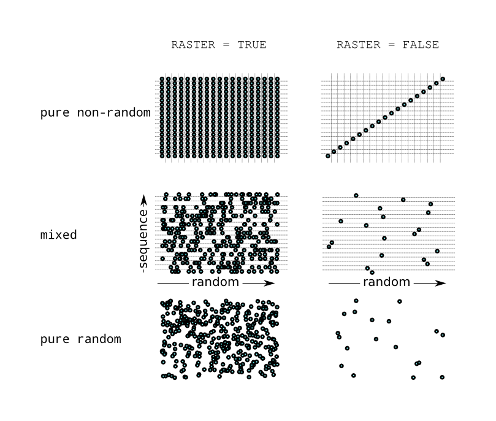

ifdef::env-gitlab[]
include::Manual.attributes[]
include::env-gitlab.attributes[]
{link_home}

toc::[]
endif::[]

[[chp.sampler]]
== Sampler
include::stylesheets/Toggle[]

This is a modification of the <<chp.optimiser,optimiser>>. Instead
of performing a multi-objective optimisation, it creates samples of the design
variables and runs those simulations. This feature can be used for example as
training / validation of neural networks or uncertainty quantification (UQ).

[[sec.sampler.sample-commands]]
=== Sampler OPAL Commands

It uses almost the same syntax as the optimiser
(see <<sec.optimiser.opt-pilot-commands,Optimiser OPAL commands>>).

==== Basic Syntax

One needs to define the design variables and their sampling method. The syntax for
design variables is described in the section <<sec.optimiser.dvar-command,DVAR Command>>.

==== SAMPLE Command

It allows *random* (`RASTER=FALSE`) and *raster* mode.

.Attributes for the command `SAMPLE`.
[[tab_SAMPLE_Attributes,Table {counter:tab-cnt}]]
[cols="<2,<5",options="header,breakable",]
|=======================================================================
| Attribute        | Description
| `RASTER`         | Boolean to choose how the sample spaces for the `DVARS` are combined, see below, (default: true).
| `INPUT`          | Path to input file.
| `OUTPUT`         | Name used for the output of the result.
| `OUTDIR`         | Name of directory where the simulations are run and the result file is stored.
| `DVARS`          | List of design variables to be used.
| `OBJECTIVES`     | List of objectives which are evaluated for each simulation. The results are stored to the result file.
| `SAMPLINGS`      | List of sample methods to be used.
| `NUM_MASTERS`    | Number of master nodes.
| `NUM_COWORKERS`  | Number processors per worker.
| `TEMPLATEDIR`    | Directory where templates are stored.
| `FIELDMAPDIR`    | Directory where field maps are stored.
| `DISTDIR`        | Directory where distributions are stored (optional).
| `KEEP`           | List of file extensions (e.g. STAT, H5) that shouldn't be deleted.
                     If nothing is specified, all files are kept. If objectives are
                     defined and list is empty all files are deleted.
| `RESTART_FILE`   | H5 file to restart the OPAL simulations from (optional).
                     Each individual copies the H5 to its simulation directory
                     in order to avoid overwriting of the original file. This
                     attributes is used together with `RESTART_STEP`.
| `RESTART_STEP`   | Restart from given H5 step (optional). Used together
                     with `RESTART_FILE`.
| `JSON_DUMP_FREQ` | Defines how often new individuals are appended to the final JSON file
                     i.e. every time `JSON_DUMP_FREQ` samples finished they are written
                     (default: All individuals are written at the end).
|=======================================================================

The difference between `RASTER=TRUE` and `RASTER=FALSE` can be depicted in the following figure.

.Sampling methods
[[fig_des_to_sampl,Figure {counter:fig-cnt}]]

The two sampling methods differ in the number of samples since with
`RASTER=TRUE` every combination of individual sampling is computed.
Thus the total number is latexmath:[N = N_1 \times N_2 \times \ldots \times N_n]
where latexmath:[n] is the number of `DVARS`. If for some `DVAR` a random
sampling is chosen then for every sampling point a new random number is
computed. With `RASTER=FALSE` the number of sampling points is
latexmath:[N = \min(N_1, N_2,\ldots, N_n)], each item of a sequence is used
only once.

==== SAMPLING Command

.Attributes for the command `SAMPLING`.
[[tab_SAMPLING_Attributes,Table {counter:tab-cnt}]]
[cols="<2,<5",options="header,breakable",]
|=======================================================================
| Attribute   | Description
| `VARIABLE`  | Name of the design variable.
| `TYPE`      | Sampling method (see <<sec.sampler.available-sampling-methods>>).
| `RANDOM`    | Boolean to control whether sampling mode is random or sequential. Default is sequential. 
| `SEED`      | Seed for random sampling (default: 42).
| `STEP`      | Increment for randomized sequences (default: 1).
| `FNAME`     | File to read the samples from.
| `N`         | Number of samples per this design variable. In case of random
                mode, the minimum value over all design variables is used.
|=======================================================================

[[sec.sampler.available-sampling-methods]]
==== Available Sampling Methods

.Available sampling methods.
[[tab_SAMPLE_Methods,Table {counter:tab-cnt}]]]
[cols="<2,<5",options="header,breakable"]
|=======================================================================
| Method              | Description
| `FROMFILE`          | The samples are provided by a file. A column represents the
                        values of a design variable. The first line is the header reading
                        the variable name. Not all variables need to be provided in the file.
                        This allows also reading variables from different files.
| `UNIFORM`           | In sequence mode: Generates an equidistant sequence taking the lower and upper
                        bound of the design variable command as limits.
                        In random mode: Uniform random sampling of floats. It takes the lower and upper
                        bound of the design variable command as limits.
| `UNIFORM_INT`       | In sequence mode: Generates an equidistant sequence of integers taking the lower
                        and upper bound of the design variable command as limits.
                        In random mode: Uniform random sampling of integers. It takes the lower and
                        upper bound of the design variable command.
| `GAUSSIAN`          | In sequence mode: Generates a sequence with a gaussian distribution taking
                        the difference between upper and lower bound of the design
                        variable as latexmath:[10\;\sigma].
                        In random mode: Gaussian random sampling of floats. The upper and lower bound
                        are the latexmath:[\pm 5\,\sigma] limits of the distribution.
| `LATIN_HYPERCUBE`   | In random mode only. Each dimension is discretized into `N`
                        (i.e. number of samples) equally distant bins. In order to sample a bin
                        in every dimension is randomly selected where the same bin in a dimension
                        occurs only once (exclusive sampling).
| `RANDOM_SEQUENCE_UNIFORM_INT` | In random mode only. Similar to `UNIFORM_INT` in sequence mode but
                                  the values are returned randomly and a value may occur several times
                                  or never. Together with the `STEP` attribute.
| `RANDOM_SEQUENCE_UNIFORM`     | In random mode only. Similar to UNIFORM in sequence mode but
                                  the values are returned randomly and a value may occur several times
                                  or never. Together with the `STEP` attribute.
|=======================================================================

=== Example Input File

[source]
----
OPTION, INFO=TRUE;

// Design variables
nstep:  DVAR, VARIABLE="nstep", LOWERBOUND=10,     UPPERBOUND=40;
MX:     DVAR, VARIABLE="MX",    LOWERBOUND=16,     UPPERBOUND=32;

// Sampling methods
SM1: SAMPLING, VARIABLE="nstep", TYPE="FROMFILE",    FNAME="samples.dat";
SM2: SAMPLING, VARIABLE="MX",    TYPE="UNIFORM_INT", SEED=122, N = 6;

SAMPLE,
    RASTER          = false,
    DVARS           = {nstep, MX},
    SAMPLINGS       = {SM1, SM2},
    INPUT           = "Ring.tmpl",
    OUTPUT          = "RingSample",
    OUTDIR          = "RingSample",
    TEMPLATEDIR     = "template",
    FIELDMAPDIR     = "Fieldmaps",
    NUM_MASTERS     = 1,
    NUM_COWORKERS   = 1;
QUIT;
----

The samples of `nstep` are provided by `samples.dat` that could look like this:
----
MX    nstep
16    10
17    11
18    12
19    13
20    14
21    15
22    16
23    17
24    18
25    19
----
Although the file contains samples for `MX`, too, they are not considered. The
corresponding template file `Ring.tmpl` reads:
----
OPTION, ECHO=FALSE;
OPTION, PSDUMPFREQ=100000;
OPTION, SPTDUMPFREQ = 10;
OPTION, PSDUMPEACHTURN=false;
OPTION, REPARTFREQ=20;
OPTION, ECHO=FALSE;
OPTION, STATDUMPFREQ=1;
OPTION, CZERO=FALSE;
OPTION, MEMORYDUMP=TRUE;
OPTION, TELL=TRUE;
OPTION, VERSION=10900;

Title,string="OPAL-cycl: the first turn acceleration in PSI 590MeV Ring";

REAL Edes=.072;
REAL gamma=(Edes+PMASS)/PMASS;
REAL beta=sqrt(1-(1/gamma^2));
REAL gambet=gamma*beta;
REAL P0 = gamma*beta*PMASS;
REAL brho = (PMASS*1.0e9*gambet) / CLIGHT;

//value,{gamma,brho,Edes,beta,gambet};

REAL phi01=139.4281;
REAL phi02=phi01+180.0;
REAL phi04=phi01;
REAL phi05=phi01+180.0;
REAL phi03=phi01+10.0;

REAL volt1st=0.9;
REAL volt3rd=0.9*4.0*0.112;

REAL turns = 1;
REAL nstep=_nstep_;

REAL frequency=50.650;
REAL frequency3=3.0*frequency;

ring: CYCLOTRON, TYPE=RING, CYHARMON=6, PHIINIT=0.0,
	PRINIT=-0.000174, RINIT=2130.0, SYMMETRY=8.0, RFFREQ=frequency,
	FMAPFN="s03av.nar";

rf0: RFCAVITY, VOLT=volt1st, FMAPFN="Cav1.dat", TYPE=SINGLEGAP,
	FREQ=frequency, RMIN = 1900.0, RMAX = 4500.0, ANGLE=35.0,  PDIS = 416.0,
	GAPWIDTH = 220.0, PHI0=phi01;

rf1: RFCAVITY, VOLT=volt1st, FMAPFN="Cav1.dat", TYPE=SINGLEGAP,
	FREQ=frequency, RMIN = 1900.0, RMAX = 4500.0, ANGLE=125.0, PDIS = 416.0,
	GAPWIDTH = 220.0, PHI0=phi02;

rf2: RFCAVITY, VOLT=volt3rd, FMAPFN="Cav3.dat", TYPE=SINGLEGAP,
	FREQ=frequency3,RMIN = 1900.0, RMAX = 4500.0, ANGLE=170.0, PDIS = 452.0,
	GAPWIDTH = 250.0, PHI0=phi03;

rf3: RFCAVITY, VOLT=volt1st, FMAPFN="Cav1.dat", TYPE=SINGLEGAP,
	FREQ=frequency, RMIN = 1900.0, RMAX = 4500.0, ANGLE=215.0, PDIS = 416.0,
	GAPWIDTH = 220.0, PHI0=phi04;

rf4: RFCAVITY, VOLT=volt1st, FMAPFN="Cav1.dat", TYPE=SINGLEGAP,
	FREQ=frequency, RMIN = 1900.0, RMAX = 4500.0, ANGLE=305.0, PDIS = 416.0,
	GAPWIDTH = 220.0, PHI0=phi05;

l1: LINE = (ring,rf0,rf1,rf2,rf3,rf4);

Dist1: DISTRIBUTION, TYPE=gauss,
	sigmax = 2.0e-03,
	sigmapx = 1.0e-7,
	corrx = 0.0,
	sigmay = 2.0e-03,
	sigmapy = 1.0e-7,
	corry = 0.0,
	sigmat = 2.0e-03,
	sigmapt = 3.394e-4,
	corrt=0.0;

Fs1: FIELDSOLVER, FSTYPE=FFT, MX=_MX_, MY=16, MT=16,
	 PARFFTX=true, PARFFTY=true, PARFFTT=true,
	 BCFFTX=open, BCFFTY=open, BCFFTT=open, BBOXINCR=2;

beam1: BEAM, PARTICLE=PROTON, PC=P0, NPART=8192, BCURRENT=1.0E-3, CHARGE=1.0,
             BFREQ= frequency;

SELECT, LINE=l1;

TRACK, LINE=l1, BEAM=beam1, MAXSTEPS=nstep*turns, STEPSPERTURN=360, TIMEINTEGRATOR=RK4;
RUN, METHOD="CYCLOTRON-T", BEAM=beam1, FIELDSOLVER=Fs1, DISTRIBUTION=Dist1;

ENDTRACK;
STOP;
----

// EOF

