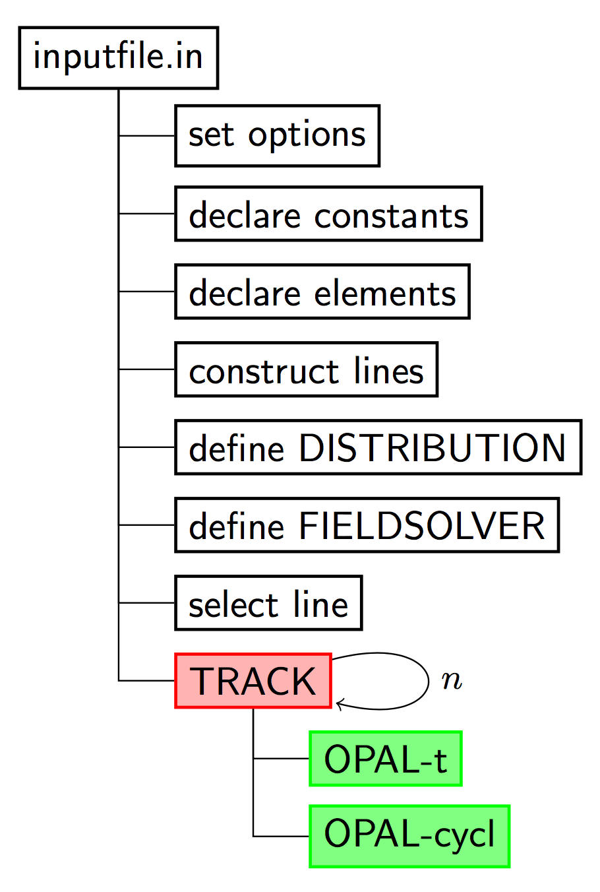
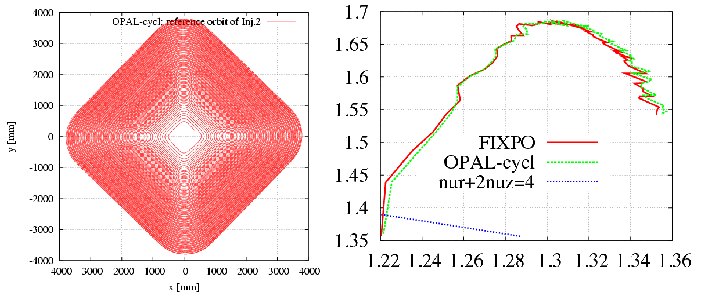
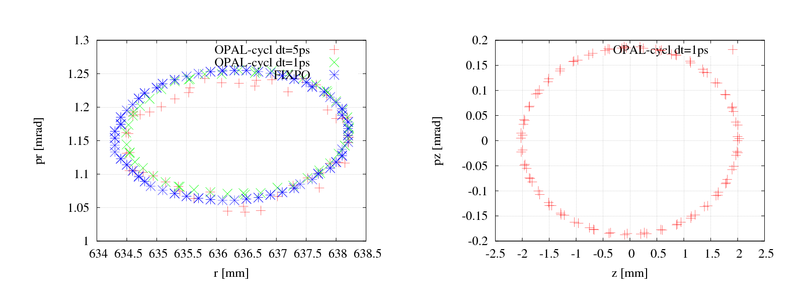
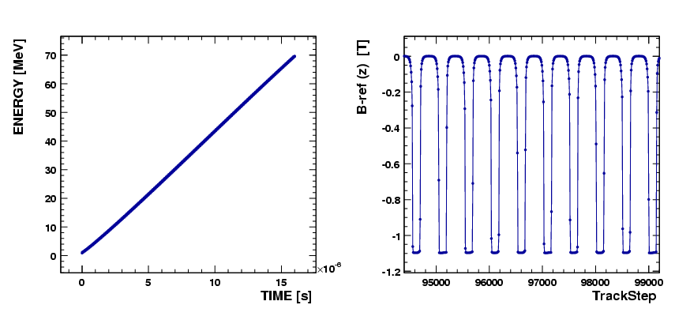
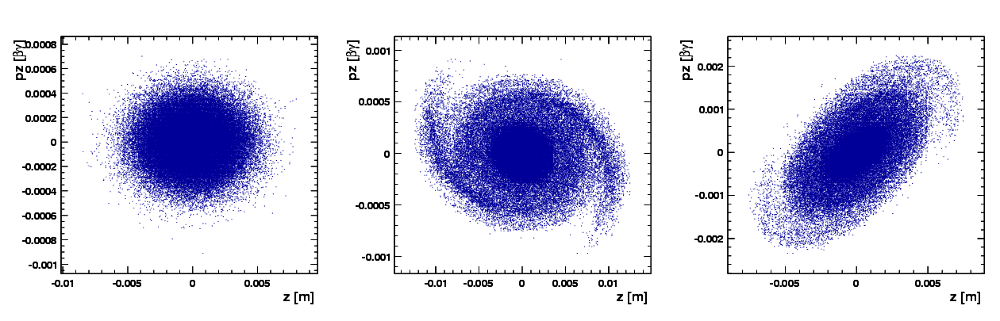
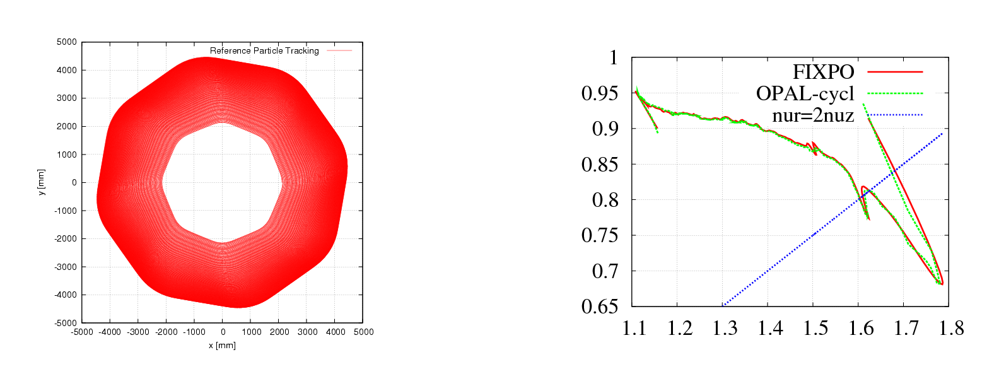

ifdef::env-gitlab[]
include::Manual.attributes[]
include::env-gitlab.attributes[]
{link_home}

toc::[]
endif::[]

[[chp.tutorial]]
== Tutorial
include::stylesheets/Toggle[]

This chapter will provide a jump start describing some of the most
common used features of _OPAL_. The complete set of examples can be
found in link:Examples/regressiontestexamples.html[the example pages bundled with this manual]. All
examples are requiring a small amount of computing resources and run on
a single core, but can be used efficiently on up to 8 cores. _OPAL_
scales in the weak sense, hence for a higher concurrency one has to
increase the problem size i.e. number of macro particles and the grid
size, which is beyond this tutorial.

[[sec.tutorial.simulation-cycle]]
=== The Simulation Cycle

.The simulation cycle
[[fig_simulation_cycle,Figure {counter:fig-cnt}]]

[[sec.tutorial.starting-opal]]
=== Starting _OPAL_

The name of the application is `opal`. When called without any argument
an interactive session is started.

----
\$ opal
Ippl> CommMPI: Parent process waiting for children ...
Ippl> CommMPI: Initialization complete.
>                ____  _____       ___
>               / __ \|  __ \ /\   | |
>              | |  | | |__) /  \  | |
>              | |  | |  ___/ /\ \ | |
>              | |__| | |  / ____ \| |____
>               \____/|_| /_/    \_\______|
OPAL >
OPAL > This is OPAL (Object Oriented Parallel Accelerator Library) Version 2.0.0 ...
OPAL >
OPAL > Please send cookies, goodies or other motivations (wine and beer ... )
OPAL > to the OPAL developers opal@lists.psi.ch
OPAL >
OPAL > Time: 16.43.23 date: 30/05/2017
OPAL > Reading startup file "/Users/adelmann/init.opal".
OPAL > Finished reading startup file.
==>
----

One can exit from this session with the command
`<<sec.control.stop,QUIT;>>` (including the semicolon).

For batch runs _OPAL_ accepts the command line arguments shown in <<tab_CommandLineArg>>:

.Command line arguments
[[tab_CommandLineArg,Table {counter:tab-cnt}]]
[cols="<1,<1,<4",options="header",]
|=======================================================================
|Argument |Values |Function
|--input |<file > |The input file. Using "--input" is optional.
Instead the input file can be provided either as first or as last
argument.

|--info |0 – 5 |Controls the amount of output to the command line. 0
means no or scarce output, 5 means a lot of output. Default: 1.

|--warn |0 – 5 |Controls the amount of output warning message. Default: 1.

|--restart |-1 – <Integer> |Restarts from given step in file with saved
phase space. Per default _OPAL_ tries to restart from a file <file>.h5
where <file>is the input file without extension. -1 stands for the last
step in the file. If no other file is specified to restart from and if
the last step of the file is chosen, then the new data is appended to
the file. Otherwise the data from this particular step is copied to a
new file and all new data appended to the new file.

|--restartfn |<file> |A file in H5hut format from which _OPAL_ should
restart.

|--help | |Displays a summary of all command-line arguments and then
quits.

|--help-command |<command> |Display the help for the _OPAL_ command <command>
and all the information about their attributes.

|--version | |Prints the curent version of _OPAL_ installed.

|--version-full | |Prints the version of _OPAL_ with additional informations.

|--git-revision | |Print the revision hash of the repository.

|--summary | |Print IPPL lib summary at start.

|--time | |Show total time used in execution.

|--notime | |Do not show timing info (default).

|--commlib <x> |mpi or serial |Selects a parallel comm. library.
|=======================================================================

Example:

----
opal input.in --restartfn input.h5 --restart -1 --info 3
----

[[sec.tutorial.trackautoph]]
=== Auto-phase Example

This is a partially complete example. First we have to set _OPAL_ in
`AUTOPHASE` mode, as described in <<sec.control.option,Option Statement>> and for example set
the nominal phase to latexmath:[-3.5^{\circ}]). The way how _OPAL_ is
computing the phases is explained in Appendix <<appendix.autophasing,Auto-phasing Algorithm>>.

----
Option, AUTOPHASE=4;

REAL FINSS_RGUN_phi= (-3.5/180*Pi);
----

The cavity would be defined like

----
FINSS_RGUN: RFCavity, L = 0.17493, VOLT = 100.0,
    FMAPFN = "FINSS-RGUN.dat",
    ELEMEDGE = 0.0, TYPE = STANDING, FREQ = 2998.0,
    LAG = FINSS_RGUN_phi;
----

with `FINSS_RGUN_phi` defining the off crest phase. Now a normal `TRACK`
command can be executed. A file containing the values of maximum phases
is created, and has the format like:

----
1
FINSS_RGUN
2.22793
----

with the first entry defining the number of cavities in the simulation.

[[sec.tutorial.examplesbeamlines]]
=== Examples of Particle Accelerators and Beamlines

[[sec.tutorial.obla]]
==== Laser emission, OBLA (SwissFEL test facility) 4 MeV Gun and Beamline

https://github.com/OPALX-project/regression-tests/blob/master/RegressionTests/LaserEmission-1/LaserEmission-1.in[LaserEmission-1.in]

All supplementary files can be found in https://github.com/OPALX-project/regression-tests/tree/master/RegressionTests/LaserEmission-1[the laser emission regression test].

[[sec.tutorial.inj2]]
==== PSI Injector II Cyclotron

Injector II is a separated sector cyclotron specially designed for
pre-acceleration (inject: 870 keV, extract: 72 MeV) of high intensity
proton beam for Ring cyclotron. It has 4 sector magnets, two double-gap
acceleration cavities (represented by 2 single-gap cavities here) and
two single-gap flat-top cavities.

Following is an input file of *Single Particle Tracking mode* for PSI
Injector II cyclotron.

link:examples/Injector2.in[Injector2.in]

The supplementary files should be placed in the same directory.

* link:examples/Fieldmaps/Cav1.dat[Cav1.dat]
* link:examples/Fieldmaps/Cav3.dat[Cav3.dat]
* link:examples/Fieldmaps/ZYKL9Z.NAR[ZYKL9Z.NAR]
* link:examples/Distribution/scdist.opal[scdist.opal]
* link:examples/Distribution/spdist.opal[spdist.opal]
* link:examples/Distribution/tdist.opal[tdist.opal]

To run _OPAL_ on a single node, just use this command:

----
 opal Injector2.in
----

Here shows some pictures using the resulting data from single particle
tracking using _OPAL-cycl_.

Left plot of <<fig_Inj2ref>> shows the
accelerating orbit of reference particle. After 106 turns, the energy
increases from 870 keV at the injection point to 72.16 MeV at the
deflection point.

.Reference orbit(left) and tune diagram(right) in Injector II
[[fig_Inj2ref,Figure {counter:fig-cnt}]]

From theoretic view, there should be an eigen ellipse for any given
energy in stable area of a fixed accelerator structure. Only when the
initial phase space shape matches its eigen ellipse, the oscillation of
beam envelop amplitude will get minimal and the transmission efficiency
get maximal. We can calculate the eigen ellipse by single particle
tracking using betatron oscillation property of off-centered particle as
following: track an off-centered particle and record its coordinates and
momenta at the same azimuthal position for each revolution.
<<fig_eigen>> shows the eigen ellipse at symmetric line of sector
magnet for energy of 2 MeV in Injector II.

.Radial and vertical eigenellipse at 2 MeV of Injector II
[[fig_eigen,Figure {counter:fig-cnt}]]

Right plot of <<fig_Inj2ref>> shows very good
agreement of the tune diagram by _OPAL-cycl_ and FIXPO. The trivial
discrepancy should come from the methods they used. In FIXPO, the tune
values are obtained according to the crossing points of the initially
displaced particle. Meanwhile, in _OPAL-cycl_, the Fourier analysis
method is used to manipulate orbit difference between the reference
particle and an initially displaced particle. The frequency point with
the biggest amplitude is the betatron tune value at the given energy.

Following is the input file for single bunch tracking with space charge
effects in Injector II.

link:examples/Injector2-sc.in[Injector2-sc.in]

For the supplementary files see above, <<sec.tutorial.inj2>>

To run _OPAL_ on single node, just use this command:

----
 opal Injector2-sc.in
----

To run _OPAL_ on N nodes in parallel environment interactively, use this
command instead:

----
 mpirun -np N opal Injector2-sc.in
----

If restart a job from the last step of an existing _.h5_ file, add a new
argument like this:

----
 mpirun -np N opal Injector2-sc.in --restart -1
----

<<fig_cyclParameters>> and <<fig_cyclPhasespace>> are simulation results, shown by
H5root code.

.Energy vs. time (left) and external B field vs. track step (Right, only show for about 2 turns)
[[fig_cyclParameters,Figure {counter:fig-cnt}]]

.Vertical phase at different energy from left to right: 0.87 MeV, 15 MeV and 35 MeV
[[fig_cyclPhasespace,Figure {counter:fig-cnt}]]

[[sec.tutorial.Ring]]
==== PSI Ring Cyclotron

From the view of numerical simulation, the difference between Injector
II and Ring cyclotron comes from two aspects:

B Field::
  The structure of Ring is totally symmetric, the field on median plain
  is periodic along azimuthal direction, _OPAL-cycl_ take this advantage
  to only store field data to save memory.
RF Cavity::
  In the Ring, all the cavities are typically single gap with some
  parallel displacement from its radial position._OPAL-cycl_ have an
  argument `PDIS` to manipulate this issue.

.Reference orbit(left) and tune diagram(right) in Ring cyclotron 
[[fig_Ringref,Figure {counter:fig-cnt}]]

<<fig_Ringref>> shows a single particle tracking
result and tune calculation result in the PSI Ring cyclotron. Limited by
size of the user guide, we don’t plan to show too much details as in
Injector II.

[[sec.tutorial.oldtonewdist]]
=== Translate Old to New Distribution Commands

As of _OPAL_ 1.2, the distribution command see Chapter <<chp.distribution,Distribution>>
was changed significantly. Many of the changes were internal to the
code, allowing us to more easily add new distribution command options.
However, other changes were made to make creating a distribution easier,
clearer and so that the command attributes were more consistent across
distribution types. Therefore, we encourage our users to refer to when
creating any new input files, or if they wish to update existing input
files.

With the new distribution command, we did attempt as much as possible to
make it backward compatible so that existing _OPAL_ input files would
still work the same as before, or with small modifications. In this
section of the manual, we will give several examples of distribution
commands that will still work as before, even though they have
antiquated command attributes. We will also provide examples of commonly
used distribution commands that need small modifications to work as they
did before.

*_An important point to note is that it is very likely you will see
small changes in your simulation even when the new distribution command
is nominally generating particles in exactly the same way._* This is
because random number generators and their seeds will likely not be the
same as before. These changes are only due to _OPAL_ using a different
sequence of numbers to create your distribution, and not because of
errors in the calculation. (Or at least we hope not.)

[[sec.tutorial.oldtonewdistgungaussandastra]]
==== `GUNGAUSSFLATTOPTH` and `ASTRAFLATTOPTH` Distribution Types

The <<sec.distribution.gungaussflattopthdisttype,`GUNGAUSSFLATTOPTH`>> and
<<sec.distribution.astraflattopthdisttype,`ASTRAFLATTOPTH`>> 
distribution types are two
common types previously implemented to simulate electron beams emitted
from photocathodes in an electron photoinjector. These are no longer
explicitly supported and are instead now defined as specialized
sub-types of the distribution type `FLATTOP`. That is, the _emitted_
distributions represented by `GUNGAUSSFLATTOPTH` and `ASTRAFLATTOPTH`
can now be easily reproduced by using the `FLATTOP` distribution type
and we would encourage use of the new command structure.

Having said this, however, old input files that use the
`GUNGAUSSFLATTOPTH` and `ASTRAFLATTOPTH` distribution types will still
work as before, with the following exception. Previously, _OPAL_ had a
Boolean `OPTION` command `FINEEMISSION` (default value was `TRUE`). This
`OPTION` is no longer supported. Instead you will need to set the
distribution attribute <<tab_distattremitteddist>> to a
value that is 10 latexmath:[\times] the value of the distribution
attribute <<tab_distattruniversal>> in order for your
simulation to behave the same as before.

[[sec.tutorial.fromfile-gauss-and-binomial-distribution-types]]
==== `FROMFILE`, `GAUSS` and `BINOMIAL` Distribution Types

The <<sec.distribution.fromfiledisttype,`FROMFILE`>>,
<<sec.distribution.gaussdisttype,`GAUSS`>> and
<<sec.distribution.binomialdisttype,`BINOMIAL`>>
distribution types have changed from
previous versions of _OPAL_. However, legacy distribution commands
should work as before as long as the momentum units are converted to
the current convention
(see section on <<sec.distribution.unitsdistattributes,`units`>>).

[[sec.tutorial.change-in-momentum-units]]
==== Change in Momentum Units

Input momentum can be given without units i.e. as
latexmath:[\beta\gamma], or in eV/c. Up until _OPAL_ 2.2,
eV was used instead of eV/c, but this was changed since
eV is a unit of energy rather than momentum. To adapt old files
with momentum in eV, such that they can work for the newer _OPAL_
versions, the following formula can be used:

[latexmath]
++++
P[{eV/c}]c = mc^2\sqrt{(\frac{P[{eV}]}{mc^2} + 1)^2 - 1}
++++
and you will need to set the distribution attribute
<<sec.distribution.unitsdistattributes,`INPUTMOUNITS`>> to:

----
INPUTMOUNITS = EVOVERC
----

// EOF
